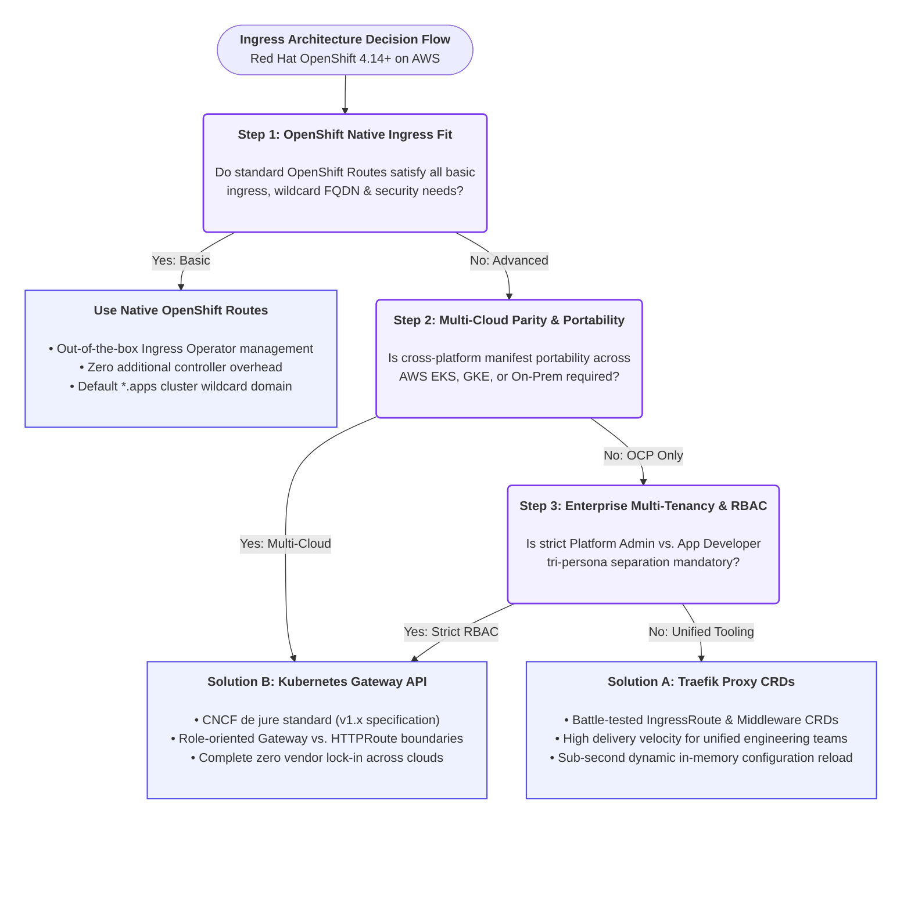
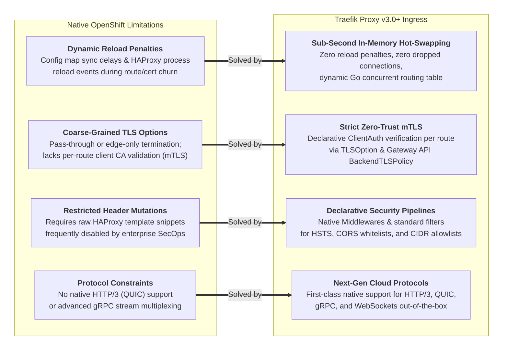

# Enterprise Architectural Guide: Traefik CRDs vs. Gateway API vs. OpenShift Routes

**Repository:** `https://github.com/nubenetes/traefik-fqdn-management-poc-openshift-aws`  
**Organization Context:** `://github.com/nubenetes`  
**Target Environment:** Red Hat OpenShift Container Platform v4.14+ (ROSA / OCP on AWS)  
**Author:** Principal Cloud-Native Solutions Architect & Platform Engineering Lead  
**Executive Editions:** 📰 [LinkedIn Newsletter (Español)](./LINKEDIN_NEWSLETTER_ES.md) | 📰 [LinkedIn Newsletter (English)](./LINKEDIN_NEWSLETTER_EN.md)  

---

> [!NOTE]
> **🤖 AI Generation & Architectural Disclaimer (Gemini 3.8 Flash):**  
> This comparative guide and the parent repository were generated by **Gemini 3.8 Flash** as a conceptual architectural reference and benchmark. They have **not been validated in a live cluster**. The artifacts provide a starting blueprint particularly useful for platform teams in **air-gapped or digital-sovereignty-constrained environments** where public internet access or cloud AI tooling is prohibited. Always audit manifests before actual cluster implementation.

---

## Executive Architectural Overview

Modern cloud-native platform engineering requires reconciling multi-tenant isolation, edge-to-pod security, and automated domain lifecycle management. In Red Hat OpenShift v4.14+ on AWS (ROSA), platform teams are faced with three prominent ingress and routing options:
1. **Solution A: Traefik v3.0+ Custom Resource Definitions (CRDs)** (`IngressRoute`, `Middleware`, `TLSOption`, `ServersTransport`)
2. **Solution B: Kubernetes Gateway API Specification (v1.x)** (`GatewayClass`, `Gateway`, `HTTPRoute`, `BackendTLSPolicy`) implemented natively by Traefik v3.0+
3. **Baseline: Red Hat OpenShift Native Routes** (HAProxy-based Ingress Controller managed by `ingresscontroller.operator.openshift.io`)

This document presents a comprehensive, comparative analysis of these paradigms to guide platform architecture decisions.

---

## 1. The Ultimate Routing Matrix Table

The following deep-dive matrix contrasts Solution A, Solution B, and Native OpenShift Routes across key enterprise evaluation axes.

| Evaluation Dimension | Solution A: Traefik CRD Stack (`IngressRoute`) | Solution B: Gateway API Stack (`Gateway` / `HTTPRoute`) | Native OpenShift Routes (HAProxy-based Ingress) |
| :--- | :--- | :--- | :--- |
| **Industry Standardization & Lock-in Risk** | **High Lock-in Risk.** Proprietary to Traefik Proxy. Migrating to another ingress controller (Envoy, Cilium, NGINX) requires a complete rewrite of all custom resources and automation templates. | **Zero Lock-in (De Jure Standard).** Official CNCF / Kubernetes SIG-Network specification (`gateway.networking.k8s.io`). Swapping underlying data planes (e.g., Traefik to Envoy Gateway) requires no changes to developer `HTTPRoute` definitions. | **Red Hat Specific Lock-in.** Proprietary to OpenShift (`route.openshift.io/v1`). While ubiquitous in OCP environments, it cannot be transferred to upstream Kubernetes (EKS, GKE, AKS) without third-party operators. |
| **Native AWS Cloud Integration (NLB & Route 53)** | **Direct / High Automation.** Exposed via Kubernetes Service of type `LoadBalancer` with AWS Load Balancer Controller annotations (NLB L4 with PROXY protocol v2). ExternalDNS automatically creates AWS Route 53 A/Alias records by inspecting `IngressRoute` annotations. | **First-Class Infrastructure Mapping.** The `Gateway` resource directly maps to the AWS NLB infrastructure. ExternalDNS v0.14+ natively watches `Gateway` and `HTTPRoute` objects to manage Route 53 records without auxiliary Service annotations. | **Turnkey AWS Integration.** Managed automatically by OpenShift Ingress Operator via AWS Classic ELB or NLB. AWS Route 53 private/public records are synced by the cluster operator for the `*.apps.<cluster-name>.<domain>` zone. Custom non-cluster FQDNs require manual DNS or external operators. |
| **Advanced Header / FQDN Mutation Capabilities** | **Extensive via Middleware CRD.** Declarative `Middleware` resources support advanced regex path rewrites, dynamic request/response header injection, IP allowlisting, rate limiting, and circuit breaking without controller reloads. | **Standardized Filter Pipeline.** Native declarative filters (`RequestHeaderModifier`, `ResponseHeaderModifier`, `URLRewrite`, `RequestRedirect`). Vendor-specific extensions plugged in cleanly via `ExtensionRef` filters. | **Limited / Restricted.** Basic path routing and target port selection. Header manipulation, URL rewrites, and CORS require non-declarative HAProxy configuration snippet annotations (`haproxy.router.openshift.io/rewrite-target`, custom HAProxy templates) which may be disabled in hardened environments. |
| **Multi-Tenancy & RBAC Isolation Boundaries** | **Fragmented Namespace Boundaries.** Requires cluster-wide RBAC or explicit `--providers.kubernetescrd.allowcrossnamespace` configuration. Developers can inadvertently override global middlewares unless strict OpenShift RBAC/ValidatingWebhooks are enforced. | **Role-Oriented Tri-Persona Separation.** Strict decoupling: <br>1. *Infrastructure Provider:* `GatewayClass` <br>2. *Cluster Platform Admin:* `Gateway` (listeners, TLS secrets, allowed namespaces) <br>3. *Application Developer:* `HTTPRoute` (path matching, backend refs). Prevents privilege escalation. | **Namespace-Centric, Developer-Friendly.** Developers deploy `Route` within their own project namespace. Cross-namespace routing is restricted by default. However, advanced ingress policies cannot be delegated independently from the route object itself. |
| **East-West Traffic Management & mTLS Overhead** | **Supported via TLSOption & ServersTransport.** Enables lightweight mesh-less internal mTLS. Client certificates are verified at the Traefik proxy boundary using `clientAuthType: RequireAndVerifyClientCert`. Low compute overhead, no sidecar injection needed. | **Standardized Zero-Trust Mesh Integration.** Supports declarative mTLS via `BackendTLSPolicy` (`gateway.networking.k8s.io/v1alpha3`). Standardized SAN/CA validation across internal unified service FQDNs (`*.company.com`). Compatible with upcoming Gateway API Service Mesh extensions (GAMMA). | **Not Designed for East-West.** OpenShift Routes are strictly North-South ingress constructs. Inter-service mTLS requires Red Hat OpenShift Service Mesh (Istio / Envoy sidecars) or internal service CA injection (`service.beta.openshift.io/serving-cert-secret-name`), introducing substantial CPU/memory sidecar overhead. |
| **Learning Curve & Operator Ecosystem Maturity** | **Mature & Widely Documented.** Traefik CRDs have been battle-tested since Traefik v2.0. Abundant community examples, Helm charts, and direct troubleshooting documentation. Low cognitive barrier for teams familiar with Traefik. | **Emerging Industry Standard.** Rapidly stabilizing (v1.0 GA released for Core APIs). Requires understanding listener attachments, route parents, and cross-namespace reference grants (`ReferenceGrant`). Steeper initial learning curve, but high future longevity. | **Immediate / Native.** Built into every OpenShift cluster since version 3.x. Integrated with OpenShift Web Console, `oc expose`, and developer catalogs. Zero installation overhead for OpenShift-focused teams. |

---

## 2. Decision Framework: Engineering Heuristics

Selecting between Traefik CRDs (Solution A) and Gateway API (Solution B) requires evaluating organization maturity, infrastructure roadmap, and operational tooling.



> [!TIP]
> **Diagram Sizing & GitHub Safe-Zone Architecture (Live Browser Profiling Insights):**
> This flowchart incorporates visual layout optimizations derived from live browser profiling against GitHub's markdown rendering engine (`viewscreen.githubusercontent.com`):
> 1. **Expanded Node Dimensioning (`wrappingWidth: 340, nodePadding: 24`):** Overrides Mermaid's default narrow 200px `foreignObject` text constraint with 24px of internal clearance on all sides. This guarantees that titles and descriptive architectural bullet points have ample room, preventing cramped multi-line pillars and border collisions across macOS (SF Pro), Windows (Segoe UI), and Linux (Noto/Liberation Sans) font engines.
> 2. **GitHub Pan/Zoom Control Safe-Zone (`~~~ Pad`):** When viewed in responsive viewports between 1024px and 1280px (or when GitHub's file tree sidebar is toggled open), GitHub automatically injects an 8-button floating navigation pan/zoom overlay widget anchored to `position: absolute; bottom: 8px; right: 8px;`. The non-rendered terminal spacer anchors (`PadA` and `PadB`) reserve an intentional vertical clearance buffer below `Solution A` and `Solution B`, preventing GitHub's floating controls from hovering over and obscuring node text.

### Heuristic 1: Choose Solution B (Gateway API) When:
- **Enterprise Multi-Tenancy is Critical:** Your platform team manages the cloud infrastructure (AWS NLB, global TLS certificates, DNS zones), while multiple application development teams manage their own service endpoints and canary releases independently.
- **Portability Across Kubernetes Distributions is Mandated:** Your enterprise operates OpenShift on AWS alongside AWS EKS or on-prem vanilla Kubernetes, and requires identical, portable manifest definitions across all clusters without vendor-specific CRDs.
- **Preparing for Service Mesh Alignment (GAMMA):** Your roadmap includes standardizing East-West service routing under the Gateway API Mesh specification, avoiding heavy, divergent service mesh control planes.

### Heuristic 2: Choose Solution A (Traefik CRDs) When:
- **Existing Investment in Traefik Ecosystem:** Your enterprise has extensive Helm charts, Terraform modules, or ArgoCD pipelines already built around Traefik's `IngressRoute` and `Middleware` specifications.
- **Specialized Traefik v3 Features Required:** You need immediate access to niche Traefik features (e.g., custom plugin ecosystem, distributed rate limiting via Redis, or specialized TCP/UDP multiplexing) that have not yet been normalized into Gateway API filter extensions.
- **Transitional Strategy:** Teams can adopt Solution A today for immediate operational stability while Traefik v3.0+ enables both providers (`providers.kubernetescrd=true` and `providers.kubernetesgateway=true`) simultaneously, allowing a phased, zero-downtime migration to Solution B.

---

## 3. The OpenShift Dilemma: When to Keep Native Routes vs. When to Bypass

Red Hat OpenShift's native `Route` object (backed by HAProxy) is an industry benchmark for developer-friendly ingress. However, enterprise platform architects frequently encounter architectural boundaries where OpenShift Routes must be bypassed in favor of an advanced ingress controller like Traefik.

### When to Stick with Native OpenShift Routes
Stick with native OpenShift Routes if your workloads satisfy the following criteria:
1. **Standard Ingress Patterns:** Your application only requires basic host-based or path-based routing terminating at a single backend Service.
2. **Default Wildcard FQDNs:** The workload operates under the platform's default wildcard DNS domain (`*.apps.<cluster-name>.<domain>`), fully integrated with the cluster's internal Certificate Authority.
3. **Operational Simplicity:** The platform team prefers zero auxiliary ingress controllers, relying entirely on Red Hat's automated operator upgrades and lifecycle management.

### When Bypassing OpenShift Routes for Traefik Becomes Strictly Necessary



> [!TIP]
> **Diagram Sizing & Layout Architecture:**
> Configured with `wrappingWidth: 340, nodePadding: 24, diagramPadding: 30`, expanding node boxes to ~380px with 24px of internal clearance on all sides and 30px diagram boundary margins. This ensures high readability, balanced side-by-side alignment, and zero text-to-border collision across GitHub viewports.


#### Detailed Technical Drivers for Bypassing OpenShift Routes:

1. **Granular mTLS and Client Certificate Inspection at the Route Level:**
   - *OpenShift Route Limitation:* OpenShift Routes support `edge`, `reencrypt`, and `passthrough` termination. In `edge` and `reencrypt` modes, the OpenShift router terminates TLS, but does not provide declarative, per-route client certificate validation (`RequireAndVerifyClientCert`) mapped to arbitrary corporate Root CAs. In `passthrough` mode, TLS is forwarded opaque to the pod, losing all L7 routing, path inspection, and header manipulation capabilities.
   - *Traefik Advantage:* Solution A (`TLSOption`) and Solution B (`BackendTLSPolicy` / listener clientAuth) allow terminating TLS, verifying client certificates against dedicated, namespace-isolated CA bundles, and forwarding validated L7 traffic with injected identity headers to upstream pods.

2. **Zero-Reload Dynamic Routing vs. HAProxy Configuration Regeneration:**
   - *OpenShift Route Limitation:* Although OpenShift's HAProxy router has evolved with dynamic endpoints, adding or updating complex route rules, SSL certificates, or custom annotations frequently triggers configuration regeneration and process reload events, causing connection drops or latency spikes under high connection volumes.
   - *Traefik Advantage:* Traefik was built from the ground up on Go's concurrent HTTP architecture with dynamic configuration loading. New `IngressRoute` or `HTTPRoute` resources are hot-swapped in memory within milliseconds with zero packet loss and zero TCP connection termination.

3. **Enterprise Security Headers & Declarative CORS Policies:**
   - *OpenShift Route Limitation:* Implementing custom security headers (Strict HSTS with preload, Content Security Policy, granular CORS allowlists) on OpenShift Routes requires enabling `haproxy.router.openshift.io/hsts_header` or dangerous HAProxy template snippets (`haproxy.router.openshift.io/snippet`). Many enterprise financial/healthcare OpenShift clusters disable route snippets entirely due to the risk of arbitrary HAProxy configuration injection.
   - *Traefik Advantage:* Traefik provides safe, strictly typed, declarative resources (`Middleware` in Solution A, `ResponseHeaderModifier` in Solution B) that enforce security standards natively without opening security vulnerabilities.

4. **East-West Zero-Trust Microservice Communication Without Sidecar Overhead:**
   - *OpenShift Route Limitation:* Native Routes cannot route internal inter-service traffic within the cluster. Platform teams are forced to install Red Hat OpenShift Service Mesh (Istio), which deploys an Envoy sidecar proxy into every application pod. In a 500-pod cluster, sidecars consume massive memory (e.g., 50-100 GB RAM overhead) and complicate pod lifecycle management.
   - *Traefik Advantage:* Traefik acts as a centralized, high-throughput internal gateway. Microservices call unified enterprise FQDNs (`*.company.com`) routed through Traefik's internal listeners, achieving mTLS encryption, certificate validation, and access logging without injecting a single sidecar container.

5. **Multi-Domain AWS Route 53 Automation via ExternalDNS:**
   - *OpenShift Route Limitation:* The OpenShift Ingress Operator natively manages only the default cluster wildcard DNS record. Exposing arbitrary corporate external FQDNs (`company.com`, `api.company.com`) requires external automation scripts or manual DNS provisioning in AWS Route 53.
   - *Traefik Advantage:* Native integration with ExternalDNS via standard annotations (`external-dns.alpha.kubernetes.io/hostname`) allows immediate, declarative synchronization of public and private AWS Route 53 hosted zones whenever a new `IngressRoute` or `Gateway` is deployed.

6. **Dual-Scope Canonical FQDNs & Split-Horizon Ingress (Avoiding Hairpinning & CoreDNS Modification):**
   - *OpenShift Route & CoreDNS Limitation:* OpenShift Routes strictly bind to an external IngressController. When internal microservices or SSR frontends call canonical public FQDNs (`api.company.com`), traffic hairpins out to the AWS NLB, incurring 15–40ms latency and billable AWS data egress charges. Modifying CoreDNS to fix this in OpenShift is unviable: the OpenShift DNS Operator (`dns.operator.openshift.io`) actively reconciles and overwrites the `dns-default` ConfigMap, patching `dnses.operator.openshift.io/default` requires `cluster-admin` RBAC permissions (which application development teams do not possess), and cluster-wide domain overrides introduce severe Split-Brain DNS failures for legitimate external subdomains.
   - *Traefik Advantage (Split-Horizon Ingress):* Traefik decouples routing into two Layer 7 horizons without modifying CoreDNS:
     - **Internal IngressRoute + Middleware Stack:** Microservices call unified enterprise FQDNs (`service-b.company.com`), private VPC domains, or internal split-horizon endpoints. Traefik's internal IngressRoute executes the `middleware-forwarded-host-mutation` ([`02-middleware-security.yaml`](./manifests/solution-a-traefik-crds/02-middleware-security.yaml)) to rewrite `Host` to `api.company.com` and inject `X-Forwarded-Host`, while `TLSOption` enforces strict mTLS (`RequireAndVerifyClientCert`) and `ipAllowList` restricts callers to OVN-Kubernetes pod CIDRs (`10.128.0.0/14`).
     - **Zero-Privilege Pod `hostAliases`:** For apps with hardcoded public URLs, application teams configure `spec.hostAliases` inside their own `Deployment` pointing `api.company.com` to Traefik's internal `ClusterIP`. The pod's local `/etc/hosts` routes directly to Traefik internally, achieving zero hairpinning with zero `cluster-admin` privileges.

---

## 4. Multi-Cloud Companion Case Study: Feature-Flagged Intra-Cluster Security & FQDNs in nubenetes/jenkins-2026 (GKE)

To understand how modern Platform Engineering solves the tension between **sidecar-free simplicity** and **comprehensive Zero-Trust mTLS** on other cloud providers, examine the companion production repository:  
👉 [**github.com/nubenetes/jenkins-2026**](https://github.com/nubenetes/jenkins-2026)

While this repository demonstrates bypassing OpenShift's native routing on AWS ROSA via Traefik Proxy v3, `jenkins-2026` standardizes on **Kubernetes Gateway API** (`gke-l7-global-external-managed`) on **Google Kubernetes Engine (GKE)** and governs its intra-cluster security and FQDN lifecycle via **declarative Feature Flags**.

### The FQDN Architectural Model in `jenkins-2026`

1. **North-South Edge FQDNs:**
   - Public hostnames (`app.jenkins2026.nubenetes.com`, `jenkins.jenkins2026.nubenetes.com`) are mapped via standard `HTTPRoute` resources to a single Google Cloud Global External L7 Gateway.
   - Cloud DNS maps hostnames to a single Anycast static IP, while Google-managed wildcard certificates terminate edge TLS alongside Identity-Aware Proxy (IAP) user authentication.

2. **Internal Service FQDNs as the Dual Cryptographic Anchor:**
   - In `jenkins-2026`, the internal Kubernetes Service FQDN (`<service>.<namespace>.svc.cluster.local`, e.g., `headlamp.headlamp.svc.cluster.local`) plays a critical dual role in the Gateway API `BackendTLSPolicy` (`validation.hostname`):
     - **SNI (Server Name Indication):** The Google L7 LB injects the Service FQDN in the TLS ClientHello during the backend hop.
     - **SAN (Subject Alternative Name):** The LB cryptographically validates that the pod's certificate (minted by `cert-manager` from the internal cluster CA) explicitly includes this FQDN, matching against the CA trust bundle ConfigMap (`ca.crt`).
   - This eliminates cross-namespace service impersonation on the ingress hop **with zero sidecars**.

### East-West Inter-Service Traffic Across the 3 Feature Flag States

| State | Feature Flag Setting | North-South (LB → Pod) | East-West (Pod ↔ Pod over Service FQDN) | Cryptographic Identity | Sidecars |
| :--- | :--- | :--- | :--- | :--- | :--- |
| **Nivel 0: `none`** (Default) | `gateway.backendTls.enabled: false`<br>`serviceMesh.mode: none` | Plain HTTP over private VPC | Plain HTTP over `<svc>.<ns>.svc.cluster.local`<br>Protected by Dataplane V2 (eBPF Cilium) + WireGuard | Node-level only (WireGuard); no workload identity | **0 sidecars** |
| **Nivel 1: `backend-tls`** | `gateway.backendTls.enabled: true`<br>`serviceMesh.mode: none` | Re-encrypted HTTPS validated against internal CA via `BackendTLSPolicy` | Optional HTTPS over Service FQDN by mounting CA bundle.<br>**Server-auth only** (unidirectional) | Cluster CA (`cert-manager`); server authentication only | **0 sidecars** |
| **Nivel 2: `cloud-service-mesh`** | `gateway.backendTls.enabled: false`<br>`serviceMesh.mode: cloud-service-mesh` | Ingress port in `PERMISSIVE` mode | **Strict Mutual mTLS** intercepted by Envoy.<br>Layer 7 `AuthorizationPolicy` rules per route | **Workload SPIFFE Identity** per ServiceAccount (Google Mesh CA) | **Yes** (`istio-proxy` per pod) |

### Key Operational Lessons from `jenkins-2026`:
- **The Non-Mesh Caller Trap (`curl exit 56`):** Non-meshed callers (such as the GKE ingress LB or CI smoke-test runners in non-meshed namespaces) attempting to call a meshed Service FQDN will be rejected by `PeerAuthentication STRICT`. `jenkins-2026` solves this with port-level `PERMISSIVE` exceptions on edge ingress/health ports, while preserving `STRICT` on inter-service traffic.
- **Strict Mutual Exclusivity:** `backend-tls` and `cloud-service-mesh` cannot be active simultaneously (a mesh subsumes the LB→pod hop; running `BackendTLSPolicy` against cert-manager at the same time causes dual-handshake conflicts and 502 Bad Gateway errors).
- **Architectural Takeaway:** OpenShift on AWS can achieve mesh-less East-West mTLS using Traefik as an internal Layer 7 gateway over unified canonical FQDNs (`*.company.com`), while GKE platforms can use declarative Feature Flags to choose between sidecar-free server TLS and full managed Istio service mesh as compliance needs evolve.

---

## 5. Multi-Engine Companion Laboratory: Transparent FQDN Routing & Service Mesh Lab (`nubenetes/cloudnative-ingress-mesh-lab`)

While this repository focuses on an **AWS-native production implementation** on Red Hat OpenShift (ROSA) using Traefik Proxy v3 and Kubernetes Gateway API v1, platform engineering teams evaluating multi-cloud, multi-engine ingress and service mesh alternatives should consult our companion laboratory:  
👉 [**github.com/nubenetes/cloudnative-ingress-mesh-lab**](https://github.com/nubenetes/cloudnative-ingress-mesh-lab)

### 5.1 Architectural Relationship & Shared Foundation
* **The OpenShift DNS Constraint**: Both repositories address the same core platform limitation on **Red Hat OpenShift 4.14 – 4.20+**: the **Cluster DNS Operator reconciles and locks the cluster Corefile (`dns-default`)**, strictly preventing manual in-place DNS rewrites.
* **Dual-Plane (N-S & E-W) Scope**: Both projects reject reliance on ephemeral pod IPs or cluster-local short-names (`service.namespace`), enforcing canonical FQDNs across North-South edge entry and East-West inter-service transit.
* **Gateway API v1 Standardization**: Both codebases implement the modern CNCF Kubernetes Gateway API v1 standard (`GatewayClass`, `Gateway`, `HTTPRoute`).

### 5.2 The Core Architectural Distinction: Two Paradigms for East-West FQDNs

```
┌────────────────────────────────────────────────────────────────────────────────────────────┐
│  PARADIGM A: Split-Horizon Ingress via Unified FQDN (This Repository)                      │
├────────────────────────────────────────────────────────────────────────────────────────────┤
│  • Calling Syntax: `curl -H "Host: service-b.company.com" https://traefik-internal:8443`   │
│                    or `curl https://service-b.company.com:8443/api/v1/internal`            │
│  • Unified FQDN: Canonical corporate domain `service-b.company.com` (no `cluster.local`).  │
│  • L3/L4 Resolution: The caller connects to Traefik's internal ingress or Route 53 zone.   │
│    AWS Route 53 Private Zone or internal VIP resolves this with ZERO cluster patches.      │
│  • L7 Policy Enforcement: Traefik inspects HTTP `Host`, validates client certs             │
│    (`TLSOption` with `RequireAndVerifyClientCert`), checks OVN-Kubernetes CIDR             │
│    allowlists, and proxies to upstream pods.                                               │
│  • Result: 0% DNS Operator patches, 0 secondary forwarders, 0 pod `hostAliases`.           │
└────────────────────────────────────────────────────────────────────────────────────────────┘

┌────────────────────────────────────────────────────────────────────────────────────────────┐
│  PARADIGM B: Transparent In-Cluster DNS Interception (cloudnative-ingress-mesh-lab)        │
├────────────────────────────────────────────────────────────────────────────────────────────┤
│  • Calling Syntax: `curl https://service-b.company.com/api`                                │
│  • Unified FQDN: Workloads use the exact corporate domain with transparent DNS capture.    │
│  • L3/L4 Socket Establishment: The client pod literally requests the business FQDN.        │
│    Requires underlying name resolution before TCP SYN can be emitted.                      │
│  • Interception Mechanics:                                                                 │
│    1. OpenShift DNS Operator zone forward (`spec.servers`) to an in-cluster secondary      │
│       CoreDNS forwarder (`infra-dns`) executing regular expression rewrites.               │
│    2. Pod-level `hostAliases` injecting static `/etc/hosts` mappings.                      │
│    3. In-kernel eBPF socket proxy (Cilium) or node-level ztunnel capture (Ambient).        │
│  • Result: Microservices are 100% cloud/gateway-agnostic; no custom headers needed.        │
└────────────────────────────────────────────────────────────────────────────────────────────┘
```

### 5.3 Cross-Repository Comparative Matrix

| Evaluation Dimension | `traefik-fqdn-management-poc-openshift-aws` (This Repository) | `cloudnative-ingress-mesh-lab` (Companion Laboratory) |
| :--- | :--- | :--- |
| **Architectural Scope** | **Deep-Dive Production Blueprint**: Red Hat OpenShift on AWS (ROSA v4.14+) with Traefik Proxy v3 and Gateway API. | **Multi-Engine Comparative Laboratory**: 6-way benchmark (Traefik v3 vs. Cilium eBPF vs. Istio Ambient vs. Linkerd vs. Envoy Gateway vs. Kong/Kuma). |
| **East-West Transit Model** | **Unified FQDN Split-Horizon Ingress**: Targeting corporate domain (`service-b.company.com`) via Traefik internal ingress or Route 53 Private Zones. | **Transparent In-Cluster Interception**: Microservices call `service-b.company.com` directly; intercepted via forwarder, eBPF, or ztunnel. |
| **DNS Operator Intervention** | **Zero (0%) Changes**: Resolves via AWS Route 53 Private Hosted Zone or internal VIP with zero modifications to OpenShift CoreDNS. | Pattern A patches `dns.operator.openshift.io/default` `spec.servers`; Pattern B uses pod `hostAliases`. |
| **Multi-Cloud Portability** | **AWS Cloud-Native**: Leverages AWS NLB (L4 PROXY protocol v2), ExternalDNS with Route 53, and AWS VPC networking. | **Distribution-Agnostic**: Identical behavior on Bare-Metal, Kind, OpenShift, AWS EKS, Azure AKS, Google GKE, and SUSE RKE2. |
| **mTLS / Zero-Trust Plane** | Gateway-level mTLS via Traefik `TLSOption` (`RequireAndVerifyClientCert`) and Gateway API `BackendTLSPolicy` (v1alpha3). | In-kernel socket maps (Cilium eBPF), node-level ztunnel HBONE (Istio Ambient), or Traefik hairpin. |
| **When to Choose** | When running OpenShift on AWS and platform teams require mesh-less mTLS without modifying cluster DNS or application pod specs. | When microservices cannot change their calling syntax and require transparent DNS interception across any Kubernetes distribution. |
| **Reference Document** | [`README.md`](./README.md) & manifests in [`solution-a-traefik-crds`](./manifests/solution-a-traefik-crds/). | [`docs/FQDN_ROUTING.md`](https://github.com/nubenetes/cloudnative-ingress-mesh-lab/blob/main/docs/FQDN_ROUTING.md). |

---

## Navigation & Manifest References

- 🏠 **Main Architecture & Deployment Guide:** [README.md](./README.md)
- 📁 **Solution A Manifests (Traefik CRDs):** [manifests/solution-a-traefik-crds/](./manifests/solution-a-traefik-crds/)
- 📁 **Solution B Manifests (Gateway API):** [manifests/solution-b-gateway-api/](./manifests/solution-b-gateway-api/)
- 📁 **Common Manifests (OpenShift RBAC & Controller):** [manifests/common/](./manifests/common/)

---

## 🎬 YouTube Video Masterclasses & Architectural Sessions (@nubenetes)

> [!NOTE]
> **Multilingual Audio Settings:** All video masterclasses and shorts support **YouTube Multilingual Audio Tracks** / auto-dubbing (up to 21 languages available via **Settings (⚙️) ➔ Audio track**). Content with English titles has **original English audio 🇺🇸**, and content with Spanish titles has **original Spanish audio 🇪🇸**.

- 🚀 [**OpenShift con FQDN en north-south y east-west: Traefik vs Gateway API** (9:06)](https://www.youtube.com/watch?v=kIEqhHRf-Ks) *(Original: Spanish 🇪🇸 • Multilingual Audio ⚙️)*  
  *Walkthrough of this repository: Traefik CRDs vs. Gateway API, AWS NLB PROXY Protocol v2, strict mTLS (TLS 1.3), and restricted-v2 SCC.*
- 🎯 [**FQDN unificado en OpenShift para north-south y east-west con Traefik y Gateway API** (9:25)](https://www.youtube.com/watch?v=zUq_CYC7vM8) *(Original: Spanish 🇪🇸 • Multilingual Audio ⚙️)*  
  *Solving the OpenShift CoreDNS immutability barrier with Traefik Proxy v3: Pattern A vs. Pattern B.*
- 🎙️ [**Unified FQDN Routing with Traefik alternatives** (8:14)](https://www.youtube.com/watch?v=xuDtcUZYeHU) *(Original: English 🇺🇸 • Multilingual Audio ⚙️)*  
  *In-kernel Cilium eBPF vs. Istio Ambient mode for Unified FQDN routing without sidecars, and L4 vs. L7 packet flow analysis.*
- 🎙️ [**Gateway API y FQDNs** (8:44)](https://www.youtube.com/watch?v=vay32AcPJ9Q) *(Original: Spanish 🇪🇸 • Multilingual Audio ⚙️)*  
  *Kubernetes Gateway API v1.1 GA standard, dual-plane FQDN resolution, and eliminating environment drift across multi-cloud distros.*
- 🎙️ [**Podcast: FQDN Unificado y el Futuro de Ingress/Service Mesh** (15:55)](https://www.youtube.com/watch?v=pUilWzKDgFQ) *(Original: Spanish 🇪🇸 • Multilingual Audio ⚙️ • Technical Audio Podcast / Audio-only)*  
  *Technical audio podcast (audio-only, no video/slides) on the dual URL anti-pattern, Unified FQDN with Traefik v3 and Gateway API, and engineering culture.*
- 🎙️ [**Podcast: Beyond Ingress with Dual Plane FQDN** (59:29)](https://www.youtube.com/watch?v=ID0YEJzv_4E) *(Original: English 🇺🇸 • Multilingual Audio ⚙️ • Technical Audio Podcast / Audio-only)*  
  *Comprehensive 1-hour audio podcast (audio-only, no video/slides) dissecting Dual Plane FQDN, sidecarless data plane efficiency, Split-Horizon DNS, and platform engineering integrity.*

### ⚡ YouTube Video Shorts (Quick Architectural Concepts)

- ⚡ [**How to Route East West unified FQDNs on OpenShift with Traefik or Gateway API** (1:23)](https://www.youtube.com/shorts/_YufQ7kv2xM) *(Original: English 🇺🇸 • Multilingual Audio ⚙️)*  
  *Layer 7 split-horizon routing on OpenShift 4.x, avoiding hairpinning out to public AWS NLB, and overcoming CoreDNS immutability.*
- ⚡ [**Cómo Enrutar Dominios Internos con Traefik con FQDN unificado** (1:34)](https://www.youtube.com/shorts/ZNo0BCIXlbA) *(Audio Original: Español 🇪🇸 • Pistas Multilingües ⚙️)*  
  *Enrutamiento de microservicios internos con dominio canónico idéntico al externo usando Traefik y Gateway API sin costes de sidecar.*
- ⚡ [**The Ghost in the Server: East-West & Split-Brain DNS on Red Hat OpenShift 4.x** (0m 58s)](https://www.youtube.com/shorts/LX_SLw5ovVo) *(Original: English 🇺🇸 • Multilingual Audio ⚙️)*  
  *Unveils the hidden hairpinning problem when internal pods query canonical domains, adding 15–40ms latency and AWS egress bills.*
- ⚡ [**How Split Brain DNS Keeps Traffic Hidden** (1m 09s)](https://www.youtube.com/shorts/moT_HjQsuF4) *(Original: English 🇺🇸 • Multilingual Audio ⚙️)*  
  *Explains split-horizon DNS: external callers traverse public WAF/NLB while internal cluster pods resolve directly to private ClusterIP.*
- ⚡ [**Routing Internal URLs With Service Mesh** (1m 17s)](https://www.youtube.com/shorts/go_sCgyASe4) *(Original: English 🇺🇸 • Multilingual Audio ⚙️)*  
  *How Layer 7 transparent proxying intercepts Host headers and rewrites destinations to in-cluster services without DNS hacks.*
- ⚡ [**Traefik CRDs vs Gateway API on OpenShift** (1m 16s)](https://www.youtube.com/shorts/ZykBWmE9Gd8) *(Original: English 🇺🇸 • Multilingual Audio ⚙️)*  
  *60-second showdown between Traefik native CRDs (IngressRoute) and Kubernetes Gateway API (HTTPRoute) on OpenShift ROSA.*


