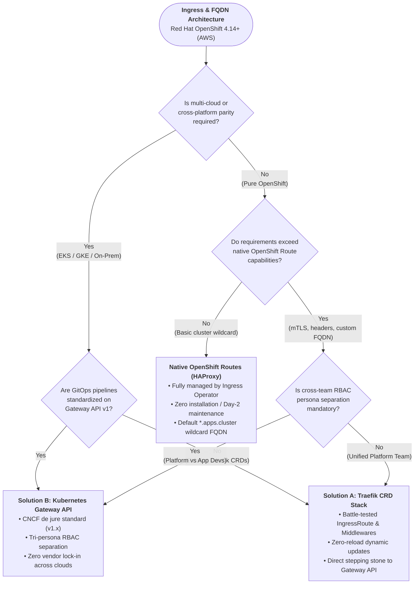
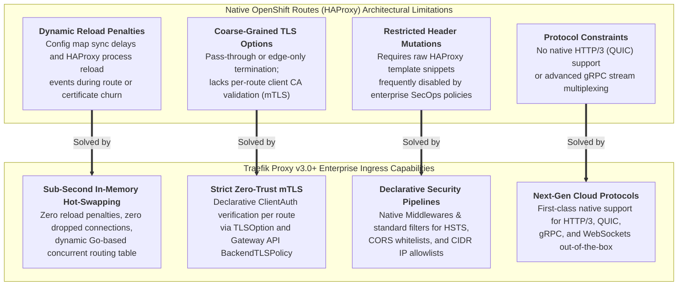

# Enterprise Architectural Guide: Traefik CRDs vs. Gateway API vs. OpenShift Routes

**Repository:** `https://github.com/nubenetes/traefik-fqdn-management-poc-openshift-aws`  
**Organization Context:** `://github.com/nubenetes`  
**Target Environment:** Red Hat OpenShift Container Platform v4.14+ (ROSA / OCP on AWS)  
**Author:** Principal Cloud-Native Solutions Architect & Platform Engineering Lead  

---

## Executive Architectural Overview

Modern cloud-native platform engineering requires reconciling multi-tenant isolation, edge-to-pod security, and automated domain lifecycle management. In Red Hat OpenShift v4.14+ on AWS (ROSA), platform teams are faced with three prominent ingress and routing options:
1. **Solution A: Traefik v3.0+ Custom Resource Definitions (CRDs)** (`IngressRoute`, `Middleware`, `TLSOption`, `ServersTransport`)
2. **Solution B: Kubernetes Gateway API Specification (v1.x)** (`GatewayClass`, `Gateway`, `HTTPRoute`, `BackendTLSPolicy`) implemented natively by Traefik v3.0+
3. **Baseline: Red Hat OpenShift Native Routes** (HAProxy-based Ingress Controller managed by `ingresscontroller.operator.openshift.io`)

This document presents a comprehensive, comparative analysis of these paradigms to guide platform architecture decisions.

---

## 1. The Ultimate Routing Matrix Table

The following deep-dive matrix contrasts Solution A, Solution B, and Native OpenShift Routes across key enterprise evaluation axes.

| Evaluation Dimension | Solution A: Traefik CRD Stack (`IngressRoute`) | Solution B: Gateway API Stack (`Gateway` / `HTTPRoute`) | Native OpenShift Routes (HAProxy-based Ingress) |
| :--- | :--- | :--- | :--- |
| **Industry Standardization & Lock-in Risk** | **High Lock-in Risk.** Proprietary to Traefik Proxy. Migrating to another ingress controller (Envoy, Cilium, NGINX) requires a complete rewrite of all custom resources and automation templates. | **Zero Lock-in (De Jure Standard).** Official CNCF / Kubernetes SIG-Network specification (`gateway.networking.k8s.io`). Swapping underlying data planes (e.g., Traefik to Envoy Gateway) requires no changes to developer `HTTPRoute` definitions. | **Red Hat Specific Lock-in.** Proprietary to OpenShift (`route.openshift.io/v1`). While ubiquitous in OCP environments, it cannot be transferred to upstream Kubernetes (EKS, GKE, AKS) without third-party operators. |
| **Native AWS Cloud Integration (NLB & Route 53)** | **Direct / High Automation.** Exposed via Kubernetes Service of type `LoadBalancer` with AWS Load Balancer Controller annotations (NLB L4 with PROXY protocol v2). ExternalDNS automatically creates AWS Route 53 A/Alias records by inspecting `IngressRoute` annotations. | **First-Class Infrastructure Mapping.** The `Gateway` resource directly maps to the AWS NLB infrastructure. ExternalDNS v0.14+ natively watches `Gateway` and `HTTPRoute` objects to manage Route 53 records without auxiliary Service annotations. | **Turnkey AWS Integration.** Managed automatically by OpenShift Ingress Operator via AWS Classic ELB or NLB. AWS Route 53 private/public records are synced by the cluster operator for the `*.apps.<cluster-name>.<domain>` zone. Custom non-cluster FQDNs require manual DNS or external operators. |
| **Advanced Header / FQDN Mutation Capabilities** | **Extensive via Middleware CRD.** Declarative `Middleware` resources support advanced regex path rewrites, dynamic request/response header injection, IP allowlisting, rate limiting, and circuit breaking without controller reloads. | **Standardized Filter Pipeline.** Native declarative filters (`RequestHeaderModifier`, `ResponseHeaderModifier`, `URLRewrite`, `RequestRedirect`). Vendor-specific extensions plugged in cleanly via `ExtensionRef` filters. | **Limited / Restricted.** Basic path routing and target port selection. Header manipulation, URL rewrites, and CORS require non-declarative HAProxy configuration snippet annotations (`haproxy.router.openshift.io/rewrite-target`, custom HAProxy templates) which may be disabled in hardened environments. |
| **Multi-Tenancy & RBAC Isolation Boundaries** | **Fragmented Namespace Boundaries.** Requires cluster-wide RBAC or explicit `--providers.kubernetescrd.allowcrossnamespace` configuration. Developers can inadvertently override global middlewares unless strict OpenShift RBAC/ValidatingWebhooks are enforced. | **Role-Oriented Tri-Persona Separation.** Strict decoupling:  1. *Infrastructure Provider:* `GatewayClass`  2. *Cluster Platform Admin:* `Gateway` (listeners, TLS secrets, allowed namespaces)  3. *Application Developer:* `HTTPRoute` (path matching, backend refs). Prevents privilege escalation. | **Namespace-Centric, Developer-Friendly.** Developers deploy `Route` within their own project namespace. Cross-namespace routing is restricted by default. However, advanced ingress policies cannot be delegated independently from the route object itself. |
| **East-West Traffic Management & mTLS Overhead** | **Supported via TLSOption & ServersTransport.** Enables lightweight mesh-less internal mTLS. Client certificates are verified at the Traefik proxy boundary using `clientAuthType: RequireAndVerifyClientCert`. Low compute overhead, no sidecar injection needed. | **Standardized Zero-Trust Mesh Integration.** Supports declarative mTLS via `BackendTLSPolicy` (`gateway.networking.k8s.io/v1alpha3`). Standardized SAN/CA validation across internal service FQDNs (`*.apps.cluster.local`). Compatible with upcoming Gateway API Service Mesh extensions (GAMMA). | **Not Designed for East-West.** OpenShift Routes are strictly North-South ingress constructs. Inter-service mTLS requires Red Hat OpenShift Service Mesh (Istio / Envoy sidecars) or internal service CA injection (`service.beta.openshift.io/serving-cert-secret-name`), introducing substantial CPU/memory sidecar overhead. |
| **Learning Curve & Operator Ecosystem Maturity** | **Mature & Widely Documented.** Traefik CRDs have been battle-tested since Traefik v2.0. Abundant community examples, Helm charts, and direct troubleshooting documentation. Low cognitive barrier for teams familiar with Traefik. | **Emerging Industry Standard.** Rapidly stabilizing (v1.0 GA released for Core APIs). Requires understanding listener attachments, route parents, and cross-namespace reference grants (`ReferenceGrant`). Steeper initial learning curve, but high future longevity. | **Immediate / Native.** Built into every OpenShift cluster since version 3.x. Integrated with OpenShift Web Console, `oc expose`, and developer catalogs. Zero installation overhead for OpenShift-focused teams. |

---

## 2. Decision Framework: Engineering Heuristics

Selecting between Traefik CRDs (Solution A) and Gateway API (Solution B) requires evaluating organization maturity, infrastructure roadmap, and operational tooling.

### Heuristic 1: Choose Solution B (Gateway API) When:
- **Enterprise Multi-Tenancy is Critical:** Your platform team manages the cloud infrastructure (AWS NLB, global TLS certificates, DNS zones), while multiple application development teams manage their own service endpoints and canary releases independently.
- **Portability Across Kubernetes Distributions is Mandated:** Your enterprise operates OpenShift on AWS alongside AWS EKS or on-prem vanilla Kubernetes, and requires identical, portable manifest definitions across all clusters without vendor-specific CRDs.
- **Preparing for Service Mesh Alignment (GAMMA):** Your roadmap includes standardizing East-West service routing under the Gateway API Mesh specification, avoiding heavy, divergent service mesh control planes.

### Heuristic 2: Choose Solution A (Traefik CRDs) When:
- **Existing Investment in Traefik Ecosystem:** Your enterprise has extensive Helm charts, Terraform modules, or ArgoCD pipelines already built around Traefik's `IngressRoute` and `Middleware` specifications.
- **Specialized Traefik v3 Features Required:** You need immediate access to niche Traefik features (e.g., custom plugin ecosystem, distributed rate limiting via Redis, or specialized TCP/UDP multiplexing) that have not yet been normalized into Gateway API filter extensions.
- **Transitional Strategy:** Teams can adopt Solution A today for immediate operational stability while Traefik v3.0+ enables both providers (`providers.kubernetescrd=true` and `providers.kubernetesgateway=true`) simultaneously, allowing a phased, zero-downtime migration to Solution B.

---

## 3. The OpenShift Dilemma: When to Keep Native Routes vs. When to Bypass

Red Hat OpenShift's native `Route` object (backed by HAProxy) is an industry benchmark for developer-friendly ingress. However, enterprise platform architects frequently encounter architectural boundaries where OpenShift Routes must be bypassed in favor of an advanced ingress controller like Traefik.

### When to Stick with Native OpenShift Routes
Stick with native OpenShift Routes if your workloads satisfy the following criteria:
1. **Standard Ingress Patterns:** Your application only requires basic host-based or path-based routing terminating at a single backend Service.
2. **Default Wildcard FQDNs:** The workload operates under the platform's default wildcard DNS domain (`*.apps.<cluster-name>.<domain>`), fully integrated with the cluster's internal Certificate Authority.
3. **Operational Simplicity:** The platform team prefers zero auxiliary ingress controllers, relying entirely on Red Hat's automated operator upgrades and lifecycle management.

### When Bypassing OpenShift Routes for Traefik Becomes Strictly Necessary

#### Detailed Technical Drivers for Bypassing OpenShift Routes:

1. **Granular mTLS and Client Certificate Inspection at the Route Level:**
   - *OpenShift Route Limitation:* OpenShift Routes support `edge`, `reencrypt`, and `passthrough` termination. In `edge` and `reencrypt` modes, the OpenShift router terminates TLS, but does not provide declarative, per-route client certificate validation (`RequireAndVerifyClientCert`) mapped to arbitrary corporate Root CAs. In `passthrough` mode, TLS is forwarded opaque to the pod, losing all L7 routing, path inspection, and header manipulation capabilities.
   - *Traefik Advantage:* Solution A (`TLSOption`) and Solution B (`BackendTLSPolicy` / listener clientAuth) allow terminating TLS, verifying client certificates against dedicated, namespace-isolated CA bundles, and forwarding validated L7 traffic with injected identity headers to upstream pods.

2. **Zero-Reload Dynamic Routing vs. HAProxy Configuration Regeneration:**
   - *OpenShift Route Limitation:* Although OpenShift's HAProxy router has evolved with dynamic endpoints, adding or updating complex route rules, SSL certificates, or custom annotations frequently triggers configuration regeneration and process reload events, causing connection drops or latency spikes under high connection volumes.
   - *Traefik Advantage:* Traefik was built from the ground up on Go's concurrent HTTP architecture with dynamic configuration loading. New `IngressRoute` or `HTTPRoute` resources are hot-swapped in memory within milliseconds with zero packet loss and zero TCP connection termination.

3. **Enterprise Security Headers & Declarative CORS Policies:**
   - *OpenShift Route Limitation:* Implementing custom security headers (Strict HSTS with preload, Content Security Policy, granular CORS allowlists) on OpenShift Routes requires enabling `haproxy.router.openshift.io/hsts_header` or dangerous HAProxy template snippets (`haproxy.router.openshift.io/snippet`). Many enterprise financial/healthcare OpenShift clusters disable route snippets entirely due to the risk of arbitrary HAProxy configuration injection.
   - *Traefik Advantage:* Traefik provides safe, strictly typed, declarative resources (`Middleware` in Solution A, `ResponseHeaderModifier` in Solution B) that enforce security standards natively without opening security vulnerabilities.

4. **East-West Zero-Trust Microservice Communication Without Sidecar Overhead:**
   - *OpenShift Route Limitation:* Native Routes cannot route internal inter-service traffic within the cluster. Platform teams are forced to install Red Hat OpenShift Service Mesh (Istio), which deploys an Envoy sidecar proxy into every application pod. In a 500-pod cluster, sidecars consume massive memory (e.g., 50-100 GB RAM overhead) and complicate pod lifecycle management.
   - *Traefik Advantage:* Traefik acts as a centralized, high-throughput internal gateway. Microservices call internal cluster FQDNs (`*.apps.cluster.local`) routed through Traefik's internal listeners, achieving mTLS encryption, certificate validation, and access logging without injecting a single sidecar container.

5. **Multi-Domain AWS Route 53 Automation via ExternalDNS:**
   - *OpenShift Route Limitation:* The OpenShift Ingress Operator natively manages only the default cluster wildcard DNS record. Exposing arbitrary corporate external FQDNs (`company.com`, `api.company.com`) requires external automation scripts or manual DNS provisioning in AWS Route 53.
   - *Traefik Advantage:* Native integration with ExternalDNS via standard annotations (`external-dns.alpha.kubernetes.io/hostname`) allows immediate, declarative synchronization of public and private AWS Route 53 hosted zones whenever a new `IngressRoute` or `Gateway` is deployed.

---

## Navigation & Manifest References

- 🏠 **Main Architecture & Deployment Guide:** [README.md](./README.md)
- 📁 **Solution A Manifests (Traefik CRDs):** [manifests/solution-a-traefik-crds/](./manifests/solution-a-traefik-crds/)
- 📁 **Solution B Manifests (Gateway API):** [manifests/solution-b-gateway-api/](./manifests/solution-b-gateway-api/)
- 📁 **Common Manifests (OpenShift RBAC & Controller):** [manifests/common/](./manifests/common/)

