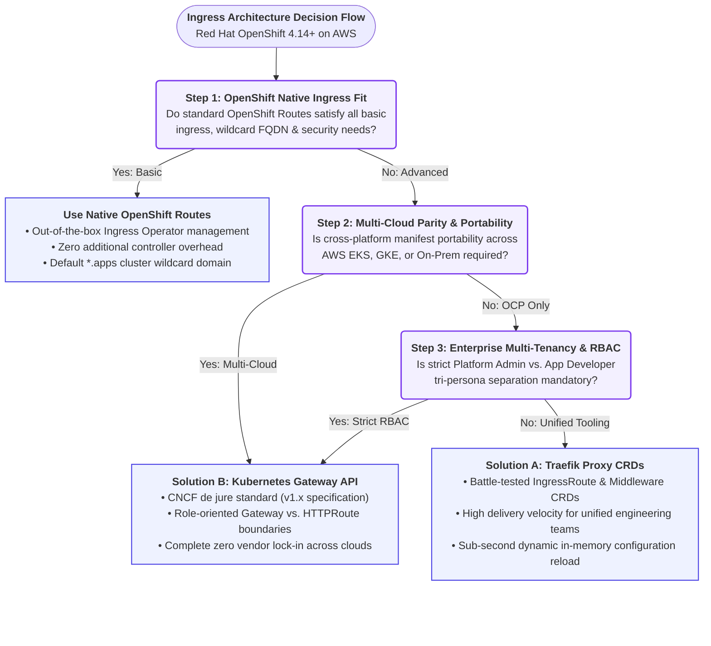

# 🚀 Traefik Proxy v3 vs. Kubernetes Gateway API on Red Hat OpenShift & AWS: Resolving the Enterprise Ingress Dilemma

*Special Cloud-Native Architecture & Platform Engineering Edition*  
**Official GitHub Repository:** 👉 [**nubenetes/traefik-fqdn-management-poc-openshift-aws**](https://github.com/nubenetes/traefik-fqdn-management-poc-openshift-aws)

---

## 📌 Introduction: The Enterprise Ingress Scalability Wall in OpenShift

If you lead or belong to a **Platform Engineering** team running **Red Hat OpenShift (ROSA or OCP on AWS)** at enterprise scale, you have inevitably confronted this architectural dilemma:

> *"Red Hat OpenShift's native `Route` object (powered by HAProxy) is outstanding for day-1 developer velocity, but becomes an unyielding bottleneck when strict requirements for granular Zero-Trust mTLS, declarative header mutations, native HTTP/3 (QUIC), and multi-cloud portability without vendor lock-in come into play."*

What is the common yet costly consequence? Many enterprises are forced into deploying heavy service meshes (such as Istio/Envoy) solely to achieve inter-service (East-West) cryptographic mTLS, imposing a severe CPU and memory penalty per Pod and introducing substantial operational complexity.

To address this challenge with concrete code and validated production architecture, we have open-sourced a comprehensive Proof of Concept (*PoC*) and reference repository:  
🔗 **[https://github.com/nubenetes/traefik-fqdn-management-poc-openshift-aws](https://github.com/nubenetes/traefik-fqdn-management-poc-openshift-aws)**

In this edition, we provide an exhaustive architectural deep dive, comparing **Traefik Proxy v3.0+ Custom Resource Definitions (CRDs)** head-to-head against the CNCF de jure standard **Kubernetes Gateway API v1.x**, illustrating how to architect a high-throughput, zero-reload ingress topology on AWS.

---

## 🛑 The OpenShift Dilemma: Why Native Routes Fall Short in 2026

The OpenShift Ingress Operator abstracts cloud infrastructure via its HAProxy router. However, in modern cloud-native topologies on AWS, platform architects encounter four structural limitations:

1. **HAProxy Process Reload Penalties & Latency Spikes:**  
   While modern HAProxy routers feature dynamic endpoints, frequent certificate renewals, complex route creations, and configuration mutations trigger template regenerations and daemon reload cycles. Under tens of thousands of concurrent connections, this causes noticeable tail latency (*p99 jitter*) and dropped TCP handshakes.
2. **Lack of Granular Route-Level mTLS Verification:**  
   OpenShift Routes support `edge`, `reencrypt`, and `passthrough` termination modes. Under `edge`/`reencrypt`, the router cannot declaratively authenticate and verify client X.509 certificates (`RequireAndVerifyClientCert`) validated against specific corporate internal Root CAs on a per-route basis. Under `passthrough`, the TLS stream is blindly forwarded to backend pods, forfeiting all Layer 7 path matching, inspection, and header manipulation capabilities.
3. **Vulnerable Configuration Snippets:**  
   To enforce advanced security headers (HSTS with preload, enterprise CORS, URL regex rewrites), engineers often rely on `haproxy.router.openshift.io/snippet`. In regulated financial and healthcare environments, SecOps teams strictly disable route snippets due to the risk of arbitrary HAProxy configuration injection.
4. **Absence of Modern Cloud Protocols:**  
   No turnkey, out-of-the-box support for **HTTP/3 over QUIC (UDP)** or optimized gRPC multiplexing pipelines.

---

## 🎯 The FQDN Challenge: Does Advanced Domain Management (North-South & East-West) Justify Traefik / Gateway API?

One of the most consequential questions enterprise platform architects ask is:  
**Does fully qualified domain name (FQDN) management alone justify replacing or augmenting OpenShift's native routing layer?**

The short, decisive answer is **YES**.  
The technical justification lies in the architectural divergence between how OpenShift Routes was historically designed and how modern cloud-native, Zero-Trust ecosystems operate today.

### 1. The `*.apps` Wildcard Trap in North-South Traffic
OpenShift's native ingress model is strictly optimized for a single cluster-wide wildcard domain: `*.<subdomain>.apps.<cluster-name>.<baseDomain>`.  
When an enterprise needs to host multiple independent corporate brands, white-label client domains, or custom apex FQDNs (`api.company.com`, `payments.enterprise.org`, `partner.portal.io`):
* **Lack of Automated DNS Synchronization:** OpenShift Routes cannot natively sync individual custom domain DNS records against AWS Route 53. Platform teams are forced into manual ticketing workflows or decoupled external scripts.
* **IngressController Sprawl & AWS Cost Explosion:** To enforce dedicated TLS certificates or isolated network policies per custom domain in native OpenShift, Red Hat's official design pattern requires provisioning multiple `IngressController` custom resources. Each `IngressController` provisions a dedicated AWS Network Load Balancer (NLB) and an additional pair of HAProxy router pods. Across dozens of enterprise domains, this rapidly inflates AWS infrastructure invoices and consumes cluster compute.
* **The Traefik & Gateway API Advantage:** A single Traefik deployment or `Gateway` instance multiplexes hundreds of disparate corporate FQDNs across a single AWS NLB. It dynamically resolves TLS certificates via SNI and orchestrates AWS Route 53 A/Alias and TXT records in real-time through ExternalDNS integration.

### 2. The Complete Absence of East-West FQDN Routing in OpenShift Routes
The OpenShift router is strictly a **North-South edge ingress proxy**. Native Routes cannot govern or inspect internal service-to-service communication.
* Standard Kubernetes internal DNS only offers Layer 4 ClusterIP addresses (`service.namespace.svc.cluster.local`) with no native client identity verification.
* If an internal microservice needs to invoke another service using an auditable, canonical FQDN (`service-b.apps.cluster.local` or `billing.internal.corp`) with mutual TLS (mTLS), native OpenShift forces teams into two undesirable extremes:
  1. **Traffic Hairpinning:** Egressing internal calls out of the cluster to public AWS load balancers and routing back in through the edge. This introduces latency penalties, AWS data egress costs, and network boundary vulnerabilities by exposing internal APIs to the perimeter.
  2. **Deploying OpenShift Service Mesh (Istio):** Imposing the heavy compute tax of Envoy sidecars inside every single Pod (up to 250MB RAM and 0.2 vCPU per replica).

---

### 🏢 4 Concrete Enterprise Scenarios Where FQDN Management is a Strict Mandate

#### 🔹 Scenario 1: Multi-Tenant & White-Label B2B SaaS Ingress (North-South)
* **Business Requirement:** A financial SaaS platform hosted on OpenShift on AWS services over 150 corporate enterprise clients. Each client demands access through their dedicated vanity FQDN (`api.primarybank.com`, `auth.creditunion.org`) backed by dedicated EV/OV SSL certificates.
* **Why OpenShift Routes Fail:** Manually creating and managing 150 Route objects without automated Route 53 DNS record provisioning creates an unmaintainable operational burden.
* **Why Traefik / Gateway API is Mandatory:** A single ingress gateway handles all vanity FQDNs dynamically. Deploying a new `HTTPRoute` triggers ExternalDNS to automatically provision AWS Route 53 DNS records, while Traefik hot-swaps the corresponding TLS secret in memory in milliseconds.

#### 🔹 Scenario 2: Regulated Banking & Healthcare Zero-Trust Compliance (East-West)
* **Business Requirement:** Regulatory standards such as **PCI-DSS 4.0, HIPAA, and SOC 2 Type II** mandate that inter-service communication between the Order Service (`namespace: e-commerce`) and the Payment Processing Service (`namespace: payments`) must be mutually authenticated (mTLS) and addressed via an auditable internal FQDN (`payments.internal.bank.local`), verifying client certificates issued by an internal security Root CA.
* **Why OpenShift Routes Fail:** OpenShift Routes cannot intercept or route inter-namespace East-West traffic.
* **Why Traefik / Gateway API is Mandatory:** Traefik exposes an internal Layer 7 listener that validates incoming calls against `payments.internal.bank.local`, executes `RequireAndVerifyClientCert` against `internal-ca-secret`, verifies that the TLS SNI matches the HTTP Host header, and injects validated client identities before proxying to the backend pod. **Full Zero-Trust compliance with zero Envoy sidecars.**

#### 🔹 Scenario 3: Monolith Modernization & Canonical Internal API Façades (East-West & Edge)
* **Business Requirement:** During core application modernization, legacy workloads hosted on AWS EC2 outside the cluster must communicate with containerized microservices in OpenShift via a canonical internal FQDN (`core.internal.corp/api/v2`), requiring URL path rewrites and weighted Canary releases (80% to legacy, 20% to new microservice).
* **Why OpenShift Routes Fail:** Native Routes lack declarative, weighted traffic splitting and path rewriting without resorting to dangerous, unmaintainable HAProxy template snippets.
* **Why Traefik / Gateway API is Mandatory:** Declarative URL rewriting filters (`URLRewrite` in Gateway API) and native traffic weighting (`weight: 80 / weight: 20`) are applied directly against the canonical FQDN cleanly and safely.

#### 🔹 Scenario 4: Multi-Cloud Disaster Recovery (DR) & Workload Portability
* **Business Requirement:** An organization runs its active production workloads on OpenShift on AWS (ROSA) with a secondary disaster recovery site running on AWS EKS or Google Cloud GKE. Both cloud environments must expose identical internal and external FQDNs.
* **Why OpenShift Routes Fail:** The `route.openshift.io/v1` API does not exist on EKS or GKE. Platform teams must maintain bifurcated, redundant GitOps repositories.
* **Why Gateway API is Mandatory:** The `HTTPRoute` resource is completely cloud-agnostic. The exact same manifest and FQDN specifications deploy identically across OpenShift, AWS EKS, and Google Cloud GKE.

---

## ⚔️ The Architectural Showdown: Solution A vs. Solution B

To overcome these constraints on OpenShift 4.14+ on AWS, we evaluate and implement the two leading paradigms in the cloud-native ecosystem:



---

### 🅰️ Solution A: Traefik Custom Resource Definitions (CRDs)

*Built on:* `IngressRoute`, `Middleware`, `TLSOption`, `ServersTransport`

* **Key Strength:** **Immediate operational maturity and execution velocity.**  
  Traefik CRDs have been battle-tested in enterprise production for years. Written in concurrent Go, routing changes reload dynamically in memory within milliseconds with zero packet loss or connection drops.
* **Declarative Security Pipelines with Middlewares:**  
  Enables modular, reusable middleware chains for request/response header injection, CORS allowlisting, strict HSTS preload, and perimeter CIDR allowlisting (`ipAllowList`) restricted strictly to the OpenShift OVN-Kubernetes pod network (`10.128.0.0/14`) and AWS VPC subnets (`10.0.0.0/16`).
* **Trade-off / Risk:**  
  *Vendor Lock-in.* Configuration is tied to Traefik-specific APIs (`traefik.io/v1alpha1`). Migrating to another ingress controller requires rewriting automation templates and manifests.

---

### 🅱️ Solution B: Kubernetes Gateway API (CNCF Standard v1.x)

*Built on:* `GatewayClass`, `Gateway`, `HTTPRoute`, `BackendTLSPolicy`

* **Key Strength:** **De jure industry standardization and total workload portability.**  
  Official Kubernetes SIG-Network specification (`gateway.networking.k8s.io`). Swapping the underlying data plane (e.g., Traefik to Envoy Gateway or Cilium) requires zero changes to application developers' `HTTPRoute` definitions.
* **Tri-Persona RBAC Governance:**  
  Directly eliminates multi-tenant configuration contention:
  1. *Infrastructure Provider:* Provisions and manages the `GatewayClass`.
  2. *Platform Admin:* Owns the `Gateway` resource (AWS NLB listeners, ports, master TLS secrets, allowed namespaces).
  3. *Application Developer:* Deploys `HTTPRoute` objects (path matching, header manipulation, canary traffic splitting) without requiring permissions on infrastructure-level load balancers.
* **Trade-off / Learning Curve:**  
  Steeper conceptual abstraction initially and mastering cross-namespace security delegators like `ReferenceGrant`.

---

## 📊 Comprehensive Engineering Comparison Matrix

| Evaluation Dimension | Solution A: Traefik CRDs (`IngressRoute`) | Solution B: Gateway API (`Gateway` / `HTTPRoute`) | Native OpenShift Routes (HAProxy) |
| :--- | :--- | :--- | :--- |
| **Standardization & Lock-in Risk** | ⚠️ **High Vendor Lock-in.** Proprietary to Traefik Proxy. | 🛡️ **Zero Lock-in (CNCF Standard).** Full portability across OCP, AWS EKS, GKE. | ⚠️ **Red Hat Proprietary.** Non-portable to vanilla upstream Kubernetes. |
| **Native AWS Integration (NLB & Route 53)** | Direct via `LoadBalancer` Service annotations + ExternalDNS. | First-class infrastructure mapping in the `Gateway` resource. | Automated via Ingress Operator for cluster `*.apps` wildcard only. |
| **Header & URL Mutations** | Extensive via modular, reusable `Middleware` CRDs. | Standardized declarative filters (`RequestHeaderModifier`, `URLRewrite`). | Highly constrained or dependent on risky HAProxy config snippets. |
| **Multi-Tenancy & RBAC Isolation** | Fragmented; requires strict RBAC or ValidatingWebhooks. | **Optimal.** Strict 3-tier separation of operational personas. | Namespace-scoped developer Route; policies cannot be delegated cleanly. |
| **East-West Traffic & mTLS** | Mesh-less mTLS via `TLSOption` and `ServersTransport`. | Standardized via `BackendTLSPolicy` (`gateway.networking.k8s.io`). | Requires OpenShift Service Mesh (Istio Envoy sidecars), high compute overhead. |
| **Configuration Churn Latency** | **0 ms.** Concurrent in-memory table hot-swap in Go. | **0 ms.** Concurrent in-memory table hot-swap. | Periodic process reload events under high route churn. |

---

## 🌐 North-South Traffic Flow: Edge Route 53 to Workload Bypass

In both architectures demonstrated in the repository, traffic completely bypasses the legacy OpenShift HAProxy router for maximum throughput and low latency:

```
[ Client / External API Consumer ]
                │
                ▼
      AWS Route 53 DNS (Dual-Stack Alias record managed by ExternalDNS)
                │
                ▼
      AWS Network Load Balancer (NLB L4 TCP)
      • PROXY Protocol v2 enabled (Real Client IP preservation)
                │
                ▼
      Direct OpenShift HAProxy Router Bypass
                │
                ▼
      Traefik Proxy v3.0+ Controller (Namespace: traefik-system)
      • OpenShift SCC: nonroot-v2 / restricted-v2 (Non-root UID 65532)
      • EntryPoints: web (:8000), websecure (:8443)
                │
      ┌─────────┴────────────────────────────┐
      ▼                                      ▼
  [ Solution A: IngressRoute ]          [ Solution B: HTTPRoute ]
    • Host matching (company.com)         • Native Request/Response filters
    • HSTS + CORS Middlewares             • URL Rewrite / Prefix rules
    • Direct upstream Service routing     • Direct upstream Service routing
      │                                      │
      └──────────────────┬───────────────────┘
                         ▼
            [ Backend Pod Microservice ]
```

### Key Engineering Principles Implemented:
* **PROXY Protocol v2:** The AWS NLB operates at Layer 4 TCP and prepends the PROXY v2 header. Traefik is configured with `trustedIPs` mapped to the VPC CIDR, extracting the true client IP before any routing or security allowlists are evaluated.
* **OpenShift SCC Compliance:** The Traefik deployment adheres strictly to OpenShift's `nonroot-v2` / `restricted-v2` Security Context Constraint, running with dropped capabilities and non-root UID `65532`.

---

## 🔒 East-West Zero-Trust: Mesh-less Mutual TLS (mTLS)

One of the most impactful breakthroughs demonstrated in this project is achieving **cryptographically enforced mutual TLS between microservices across namespaces** without paying the heavy tax of a full service mesh:

* **The Problem:** Compliance standards (PCI-DSS, HIPAA, SOC 2) mandate end-to-end encryption in transit. Platform teams frequently default to Istio, injecting Envoy sidecars into every pod. This consumes 100MB–250MB RAM and 0.2 vCPU per replica, totaling gigabytes of idle resource overhead across large clusters.
* **The Mesh-less Solution:**  
  Traefik acts as a centralized, high-throughput internal ingress gateway for the cluster domain `*.apps.cluster.local`:
  1. `Service-A` makes an HTTPS request to `https://service-b.apps.cluster.local:8443/api/v1/internal`, presenting its client X.509 certificate issued by the internal corporate CA.
  2. Traefik intercepts the call on its internal listener, validates the certificate chain against `internal-ca-secret` using `clientAuthType: RequireAndVerifyClientCert`, and immediately terminates the handshake if the client certificate is untrusted, invalid, or expired.
  3. Traefik enforces anti-spoofing by validating that the TLS SNI matches the HTTP `Host` header and applying CIDR allowlists.
  4. Traefik establishes an encrypted HTTPS backend connection to `service-b`, validating its SAN certificate via `ServersTransport` (Solution A) or `BackendTLSPolicy` (Solution B).

**Engineering Result:** Full Zero-Trust compliance, audit-ready cryptographic verification, and **zero Envoy sidecars injected**.

---

## 🔄 Zero-Downtime Migration Strategy: Hybrid Multi-Provider Coexistence

A core advantage of **Traefik Proxy v3.0+** is its concurrent multi-provider engine. You can enable both providers simultaneously in the controller:

```yaml
--providers.kubernetescrd=true
--providers.kubernetesgateway=true
```

This unlocks an incremental, risk-free adoption roadmap:
1. **Phase 1 (Immediate Relief):** Migrate high-churn, performance-sensitive workloads from OpenShift Routes to **Solution A (Traefik CRDs)** to eliminate reload drops and leverage Middlewares.
2. **Phase 2 (Standardization):** Deploy the **Gateway API CRDs** and adopt **Solution B** for all new microservices, empowering application teams with `HTTPRoute` self-service.
3. **Phase 3 (Unified Standard):** Incrementally migrate `IngressRoute` manifests to `HTTPRoute` on the live cluster, without changing controllers or reconfiguring AWS NLBs.

---

## 🛠️ Production Manifests Ready for Deployment

The open-source repository provides 10 validated, production-grade Kubernetes/OpenShift manifests ready for immediate deployment via `oc apply -f`:

```
traefik-fqdn-management-poc-openshift-aws/
├── README.md                                    # Root architectural guide
├── COMPARATIVE_MATRIX.md                        # 6-dimension exhaustive matrix
├── LINKEDIN_NEWSLETTER_ES.md                    # Spanish newsletter edition
├── LINKEDIN_NEWSLETTER_EN.md                    # English newsletter edition
└── manifests/
    ├── common/
    │   ├── 00-namespaces-rbac-scc.yaml         # OpenShift SCC & RBAC bindings
    │   ├── 01-mock-microservices.yaml          # Sample workloads (Service-A, Service-B) & CAs
    │   └── 02-traefik-controller-deployment.yaml # Traefik v3 controller & AWS NLB
    ├── solution-a-traefik-crds/
    │   ├── 01-ingressroute-north-south.yaml    # Edge IngressRoute & Route 53 sync
    │   ├── 02-middleware-security.yaml         # HSTS, CORS & IP allowlist middlewares
    │   └── 03-ingressroute-east-west.yaml      # Internal mTLS IngressRoute & TLSOption
    └── solution-b-gateway-api/
        ├── 01-gateway-class.yaml               # Cluster-scoped GatewayClass definition
        ├── 02-gateway-aws.yaml                 # AWS NLB Gateway & listener definitions
        ├── 03-httproute-north-south.yaml       # North-South HTTPRoute with native filters
        └── 04-httproute-east-west.yaml         # East-West HTTPRoute & BackendTLSPolicy
```

---

## 💡 Architectural Verdict & Recommendations

* **Retain Native OpenShift Routes:** If workloads are basic monolithic services operating strictly under the default `*.apps` wildcard domain, requiring no inter-service mTLS and no advanced header filtering.
* **Adopt Solution A (Traefik CRDs):** If your enterprise has established GitOps tooling, Helm charts, or Ansible modules centered on Traefik, and prioritizes immediate delivery velocity over cross-cloud manifest portability.
* **Adopt Solution B (Gateway API):** If your enterprise operates multi-cloud environments (OpenShift on AWS alongside AWS EKS or GKE), requires long-term CNCF standardization, and seeks a clear separation of concerns between Platform Administrators and Application Developers.

---

### 🔗 Explore the Repository & Run the PoC

Clone the repository, inspect the architecture diagrams, and run the automated deployment scripts on your cluster:

👉 **[github.com/nubenetes/traefik-fqdn-management-poc-openshift-aws](https://github.com/nubenetes/traefik-fqdn-management-poc-openshift-aws)**

How are you currently solving inter-namespace mTLS and high-throughput ingress on Red Hat OpenShift? Have you begun your transition toward Kubernetes Gateway API? Share your thoughts and experiences in the comments below! 👇

---
*#Kubernetes #OpenShift #RedHat #AWS #Traefik #GatewayAPI #PlatformEngineering #DevOps #CloudNative #CNCF #ZeroTrust #CyberSecurity*
