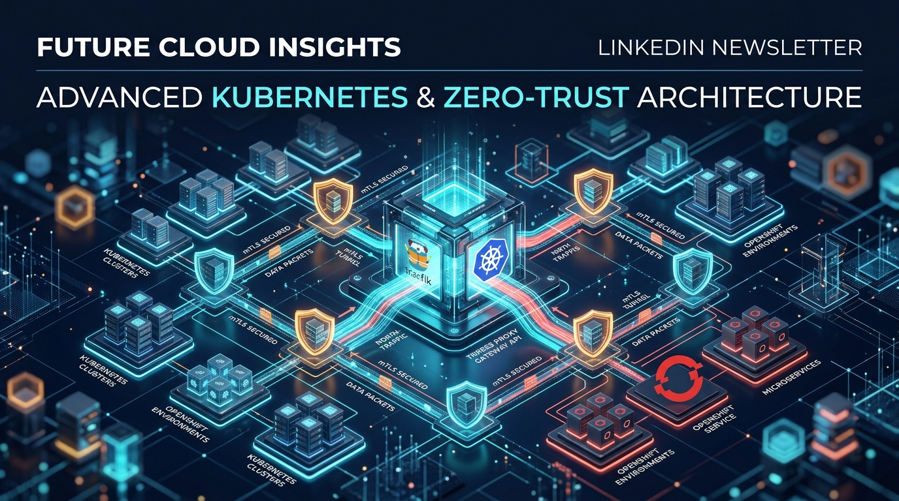
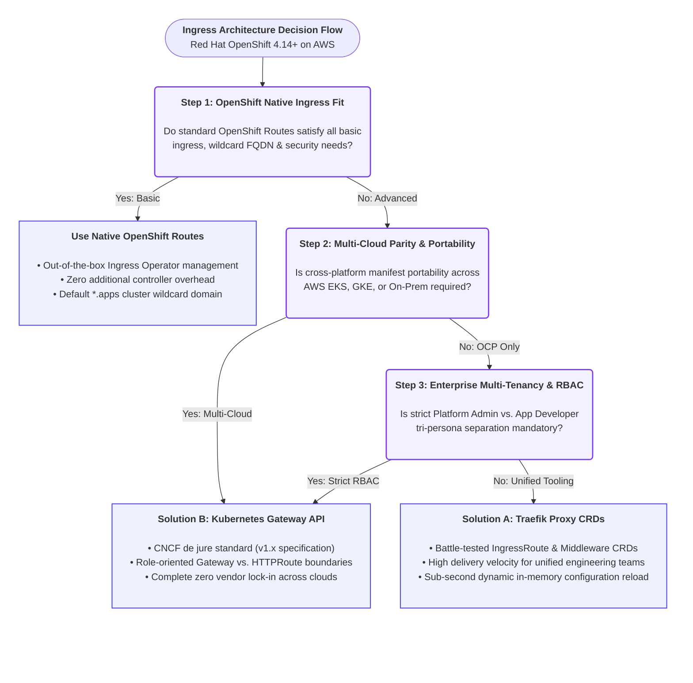
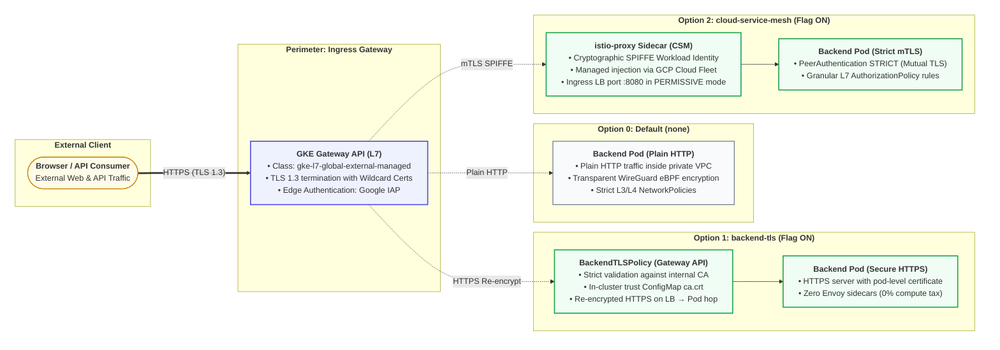

# 🚀 Traefik Proxy v3 vs. Kubernetes Gateway API on Red Hat OpenShift & AWS: Resolving the Enterprise Ingress Dilemma

*Special Cloud-Native Architecture & Platform Engineering Edition*  
**Official GitHub Repository:** 👉 [**nubenetes/traefik-fqdn-management-poc-openshift-aws**](https://github.com/nubenetes/traefik-fqdn-management-poc-openshift-aws)



---

## 📌 Introduction: The Enterprise Ingress Scalability Wall in OpenShift

If you lead or belong to a **Platform Engineering** team running **Red Hat OpenShift (ROSA or OCP on AWS)** at enterprise scale, you have inevitably confronted this architectural dilemma:

> *"Red Hat OpenShift's native `Route` object (powered by HAProxy) is outstanding for day-1 developer velocity, but becomes an unyielding bottleneck when strict requirements for granular Zero-Trust mTLS, declarative header mutations, native HTTP/3 (QUIC), and multi-cloud portability without vendor lock-in come into play."*

What is the common yet costly consequence? Many enterprises are forced into deploying heavy service meshes (such as Istio/Envoy) solely to achieve inter-service (East-West) cryptographic mTLS, imposing a severe CPU and memory penalty per Pod and introducing substantial operational complexity.

To address this challenge with concrete code and validated production architecture, we have open-sourced a comprehensive Proof of Concept (*PoC*) and reference repository:  
🔗 **[https://github.com/nubenetes/traefik-fqdn-management-poc-openshift-aws](https://github.com/nubenetes/traefik-fqdn-management-poc-openshift-aws)**

In this edition, we provide an exhaustive architectural deep dive, comparing **Traefik Proxy v3.0+ Custom Resource Definitions (CRDs)** head-to-head against the CNCF de jure standard **Kubernetes Gateway API v1.x**, illustrating how to architect a high-throughput, zero-reload ingress topology on AWS.

---

## 🛑 The OpenShift Dilemma: Why Native Routes Fall Short in 2026

The OpenShift Ingress Operator abstracts cloud infrastructure via its HAProxy router. However, in modern cloud-native topologies on AWS, platform architects encounter four structural limitations:

1. **HAProxy Process Reload Penalties & Latency Spikes:**  
   While modern HAProxy routers feature dynamic endpoints, frequent certificate renewals, complex route creations, and configuration mutations trigger template regenerations and daemon reload cycles. Under tens of thousands of concurrent connections, this causes noticeable tail latency (*p99 jitter*) and dropped TCP handshakes.
2. **Lack of Granular Route-Level mTLS Verification:**  
   OpenShift Routes support `edge`, `reencrypt`, and `passthrough` termination modes. Under `edge`/`reencrypt`, the router cannot declaratively authenticate and verify client X.509 certificates (`RequireAndVerifyClientCert`) validated against specific corporate internal Root CAs on a per-route basis. Under `passthrough`, the TLS stream is blindly forwarded to backend pods, forfeiting all Layer 7 path matching, inspection, and header manipulation capabilities.
3. **Vulnerable Configuration Snippets:**  
   To enforce advanced security headers (HSTS with preload, enterprise CORS, URL regex rewrites), engineers often rely on `haproxy.router.openshift.io/snippet`. In regulated financial and healthcare environments, SecOps teams strictly disable route snippets due to the risk of arbitrary HAProxy configuration injection.
4. **Absence of Modern Cloud Protocols:**  
   No turnkey, out-of-the-box support for **HTTP/3 over QUIC (UDP)** or optimized gRPC multiplexing pipelines.

---

## 🎯 The FQDN Challenge: Does Advanced Domain Management (North-South & East-West) Justify Traefik / Gateway API?

One of the most consequential questions enterprise platform architects ask is:  
**Does fully qualified domain name (FQDN) management alone justify replacing or augmenting OpenShift's native routing layer?**

The short, decisive answer is **YES**.  
The technical justification lies in the architectural divergence between how OpenShift Routes was historically designed and how modern cloud-native, Zero-Trust ecosystems operate today.

### 1. The `*.apps` Wildcard Trap in North-South Traffic
OpenShift's native ingress model is strictly optimized for a single cluster-wide wildcard domain: `*.<subdomain>.apps.<cluster-name>.<baseDomain>`.  
When an enterprise needs to host multiple independent corporate brands, white-label client domains, or custom apex FQDNs (`api.company.com`, `payments.enterprise.org`, `partner.portal.io`):
* **Lack of Automated DNS Synchronization:** OpenShift Routes cannot natively sync individual custom domain DNS records against AWS Route 53. Platform teams are forced into manual ticketing workflows or decoupled external scripts.
* **IngressController Sprawl & AWS Cost Explosion:** To enforce dedicated TLS certificates or isolated network policies per custom domain in native OpenShift, Red Hat's official design pattern requires provisioning multiple `IngressController` custom resources. Each `IngressController` provisions a dedicated AWS Network Load Balancer (NLB) and an additional pair of HAProxy router pods. Across dozens of enterprise domains, this rapidly inflates AWS infrastructure invoices and consumes cluster compute.
* **The Traefik & Gateway API Advantage:** A single Traefik deployment or `Gateway` instance multiplexes hundreds of disparate corporate FQDNs across a single AWS NLB. It dynamically resolves TLS certificates via SNI and orchestrates AWS Route 53 A/Alias and TXT records in real-time through ExternalDNS integration.

### 2. The Complete Absence of East-West FQDN Routing in OpenShift Routes
The OpenShift router is strictly a **North-South edge ingress proxy**. Native Routes cannot govern or inspect internal service-to-service communication.
* Standard Kubernetes internal DNS only offers Layer 4 ClusterIP addresses (`service.namespace.svc.cluster.local`) with no native client identity verification.
* If an internal microservice needs to invoke another service using an auditable, canonical FQDN (`service-b.apps.cluster.local` or `billing.internal.corp`) with mutual TLS (mTLS), native OpenShift forces teams into two undesirable extremes:
  1. **Traffic Hairpinning:** Egressing internal calls out of the cluster to public AWS load balancers and routing back in through the edge. This introduces latency penalties, AWS data egress costs, and network boundary vulnerabilities by exposing internal APIs to the perimeter.
  2. **Deploying OpenShift Service Mesh (Istio):** Imposing the heavy compute tax of Envoy sidecars inside every single Pod (up to 250MB RAM and 0.2 vCPU per replica).

---

### 🏢 4 Concrete Enterprise Scenarios Where FQDN Management is a Strict Mandate

#### 🔹 Scenario 1: Multi-Tenant & White-Label B2B SaaS Ingress (North-South)
* **Business Requirement:** A financial SaaS platform hosted on OpenShift on AWS services over 150 corporate enterprise clients. Each client demands access through their dedicated vanity FQDN (`api.primarybank.com`, `auth.creditunion.org`) backed by dedicated EV/OV SSL certificates.
* **Why OpenShift Routes Fail:** Manually creating and managing 150 Route objects without automated Route 53 DNS record provisioning creates an unmaintainable operational burden.
* **Why Traefik / Gateway API is Mandatory:** A single ingress gateway handles all vanity FQDNs dynamically. Deploying a new `HTTPRoute` triggers ExternalDNS to automatically provision AWS Route 53 DNS records, while Traefik hot-swaps the corresponding TLS secret in memory in milliseconds.

#### 🔹 Scenario 2: Regulated Banking & Healthcare Zero-Trust Compliance (East-West)
* **Business Requirement:** Regulatory standards such as **PCI-DSS 4.0, HIPAA, and SOC 2 Type II** mandate that inter-service communication between the Order Service (`namespace: e-commerce`) and the Payment Processing Service (`namespace: payments`) must be mutually authenticated (mTLS) and addressed via an auditable internal FQDN (`payments.internal.bank.local`), verifying client certificates issued by an internal security Root CA.
* **Why OpenShift Routes Fail:** OpenShift Routes cannot intercept or route inter-namespace East-West traffic.
* **Why Traefik / Gateway API is Mandatory:** Traefik exposes an internal Layer 7 listener that validates incoming calls against `payments.internal.bank.local`, executes `RequireAndVerifyClientCert` against `internal-ca-secret`, verifies that the TLS SNI matches the HTTP Host header, and injects validated client identities before proxying to the backend pod. **Full Zero-Trust compliance with zero Envoy sidecars.**

#### 🔹 Scenario 3: Monolith Modernization & Canonical Internal API Façades (East-West & Edge)
* **Business Requirement:** During core application modernization, legacy workloads hosted on AWS EC2 outside the cluster must communicate with containerized microservices in OpenShift via a canonical internal FQDN (`core.internal.corp/api/v2`), requiring URL path rewrites and weighted Canary releases (80% to legacy, 20% to new microservice).
* **Why OpenShift Routes Fail:** Native Routes lack declarative, weighted traffic splitting and path rewriting without resorting to dangerous, unmaintainable HAProxy template snippets.
* **Why Traefik / Gateway API is Mandatory:** Declarative URL rewriting filters (`URLRewrite` in Gateway API) and native traffic weighting (`weight: 80 / weight: 20`) are applied directly against the canonical FQDN cleanly and safely.

#### 🔹 Scenario 4: Multi-Cloud Disaster Recovery (DR) & Workload Portability
* **Business Requirement:** An organization runs its active production workloads on OpenShift on AWS (ROSA) with a secondary disaster recovery site running on AWS EKS or Google Cloud GKE. Both cloud environments must expose identical internal and external FQDNs.
* **Why OpenShift Routes Fail:** The `route.openshift.io/v1` API does not exist on EKS or GKE. Platform teams must maintain bifurcated, redundant GitOps repositories.
* **Why Gateway API is Mandatory:** The `HTTPRoute` resource is completely cloud-agnostic. The exact same manifest and FQDN specifications deploy identically across OpenShift, AWS EKS, and Google Cloud GKE.

---

## ⚔️ The Architectural Showdown: Solution A vs. Solution B

To overcome these constraints on OpenShift 4.14+ on AWS, we evaluate and implement the two leading paradigms in the cloud-native ecosystem:



---

### 🅰️ Solution A: Traefik Custom Resource Definitions (CRDs)

*Built on:* `IngressRoute`, `Middleware`, `TLSOption`, `ServersTransport`

* **Key Strength:** **Immediate operational maturity and execution velocity.**  
  Traefik CRDs have been battle-tested in enterprise production for years. Written in concurrent Go, routing changes reload dynamically in memory within milliseconds with zero packet loss or connection drops.
* **Declarative Security Pipelines with Middlewares:**  
  Enables modular, reusable middleware chains for request/response header injection, CORS allowlisting, strict HSTS preload, and perimeter CIDR allowlisting (`ipAllowList`) restricted strictly to the OpenShift OVN-Kubernetes pod network (`10.128.0.0/14`) and AWS VPC subnets (`10.0.0.0/16`).
* **Trade-off / Risk:**  
  *Vendor Lock-in.* Configuration is tied to Traefik-specific APIs (`traefik.io/v1alpha1`). Migrating to another ingress controller requires rewriting automation templates and manifests.

---

### 🅱️ Solution B: Kubernetes Gateway API (CNCF Standard v1.x)

*Built on:* `GatewayClass`, `Gateway`, `HTTPRoute`, `BackendTLSPolicy`

* **Key Strength:** **De jure industry standardization and total workload portability.**  
  Official Kubernetes SIG-Network specification (`gateway.networking.k8s.io`). Swapping the underlying data plane (e.g., Traefik to Envoy Gateway or Cilium) requires zero changes to application developers' `HTTPRoute` definitions.
* **Tri-Persona RBAC Governance:**  
  Directly eliminates multi-tenant configuration contention:
  1. *Infrastructure Provider:* Provisions and manages the `GatewayClass`.
  2. *Platform Admin:* Owns the `Gateway` resource (AWS NLB listeners, ports, master TLS secrets, allowed namespaces).
  3. *Application Developer:* Deploys `HTTPRoute` objects (path matching, header manipulation, canary traffic splitting) without requiring permissions on infrastructure-level load balancers.
* **Trade-off / Learning Curve:**  
  Steeper conceptual abstraction initially and mastering cross-namespace security delegators like `ReferenceGrant`.

---

## 📊 Comprehensive Engineering Comparison Matrix

| Evaluation Dimension | Solution A: Traefik CRDs (`IngressRoute`) | Solution B: Gateway API (`Gateway` / `HTTPRoute`) | Native OpenShift Routes (HAProxy) |
| :--- | :--- | :--- | :--- |
| **Standardization & Lock-in Risk** | ⚠️ **High Vendor Lock-in.** Proprietary to Traefik Proxy. | 🛡️ **Zero Lock-in (CNCF Standard).** Full portability across OCP, AWS EKS, GKE. | ⚠️ **Red Hat Proprietary.** Non-portable to vanilla upstream Kubernetes. |
| **Native AWS Integration (NLB & Route 53)** | Direct via `LoadBalancer` Service annotations + ExternalDNS. | First-class infrastructure mapping in the `Gateway` resource. | Automated via Ingress Operator for cluster `*.apps` wildcard only. |
| **Header & URL Mutations** | Extensive via modular, reusable `Middleware` CRDs. | Standardized declarative filters (`RequestHeaderModifier`, `URLRewrite`). | Highly constrained or dependent on risky HAProxy config snippets. |
| **Multi-Tenancy & RBAC Isolation** | Fragmented; requires strict RBAC or ValidatingWebhooks. | **Optimal.** Strict 3-tier separation of operational personas. | Namespace-scoped developer Route; policies cannot be delegated cleanly. |
| **East-West Traffic & mTLS** | Mesh-less mTLS via `TLSOption` and `ServersTransport`. | Standardized via `BackendTLSPolicy` (`gateway.networking.k8s.io`). | Requires OpenShift Service Mesh (Istio Envoy sidecars), high compute overhead. |
| **Configuration Churn Latency** | **0 ms.** Concurrent in-memory table hot-swap in Go. | **0 ms.** Concurrent in-memory table hot-swap. | Periodic process reload events under high route churn. |

---

## 🌐 North-South Traffic Flow: Edge Route 53 to Workload Bypass

In both architectures demonstrated in the repository, traffic completely bypasses the legacy OpenShift HAProxy router for maximum throughput and low latency:

```
[ Client / External API Consumer ]
                │
                ▼
      AWS Route 53 DNS (Dual-Stack Alias record managed by ExternalDNS)
                │
                ▼
      AWS Network Load Balancer (NLB L4 TCP)
      • PROXY Protocol v2 enabled (Real Client IP preservation)
                │
                ▼
      Direct OpenShift HAProxy Router Bypass
                │
                ▼
      Traefik Proxy v3.0+ Controller (Namespace: traefik-system)
      • OpenShift SCC: nonroot-v2 / restricted-v2 (Non-root UID 65532)
      • EntryPoints: web (:8000), websecure (:8443)
                │
      ┌─────────┴────────────────────────────┐
      ▼                                      ▼
  [ Solution A: IngressRoute ]          [ Solution B: HTTPRoute ]
    • Host matching (company.com)         • Native Request/Response filters
    • HSTS + CORS Middlewares             • URL Rewrite / Prefix rules
    • Direct upstream Service routing     • Direct upstream Service routing
      │                                      │
      └──────────────────┬───────────────────┘
                         ▼
            [ Backend Pod Microservice ]
```

### Key Engineering Principles Implemented:
* **PROXY Protocol v2:** The AWS NLB operates at Layer 4 TCP and prepends the PROXY v2 header. Traefik is configured with `trustedIPs` mapped to the VPC CIDR, extracting the true client IP before any routing or security allowlists are evaluated.
* **OpenShift SCC Compliance:** The Traefik deployment adheres strictly to OpenShift's `nonroot-v2` / `restricted-v2` Security Context Constraint, running with dropped capabilities and non-root UID `65532`.

---

## 🔒 East-West Zero-Trust: Mesh-less Mutual TLS (mTLS)

One of the most impactful breakthroughs demonstrated in this project is achieving **cryptographically enforced mutual TLS between microservices across namespaces** without paying the heavy tax of a full service mesh:

* **The Problem:** Compliance standards (PCI-DSS, HIPAA, SOC 2) mandate end-to-end encryption in transit. Platform teams frequently default to Istio, injecting Envoy sidecars into every pod. This consumes 100MB–250MB RAM and 0.2 vCPU per replica, totaling gigabytes of idle resource overhead across large clusters.
* **The CoreDNS Immutability Reality in OpenShift:** In OpenShift 4.x, application teams **cannot modify internal CoreDNS tables or Corefiles**. The `dns-default` ConfigMap in the `openshift-dns` namespace is strictly reconciled by the **OpenShift DNS Operator** (`dns.operator.openshift.io`), which automatically overwrites manual edits within seconds. Furthermore, managing custom DNS zones cluster-wide via `dnses.operator.openshift.io/default` requires `cluster-admin` RBAC privileges (which developers in multi-tenant enterprise environments never possess) and introduces catastrophic *Split-Brain DNS* risks.
* **The Repository Solution: Split-Horizon Ingress via IngressRoute + Middleware Manifests:**  
  Instead of hacking cluster DNS or injecting sidecars, Traefik acts as a centralized internal L7 routing plane using the declarative **`IngressRoute` + `Middleware`** pattern:

  > 💡 **Which FQDN is Used for East-West Traffic? (3 Real-World Enterprise Patterns):**  
  > In this PoC, we use `service-b.apps.cluster.local` as an illustrative convention mimicking OpenShift's `apps` domain structure. In real-world enterprise production, platform teams generally implement one of three models:  
  > 1. **The Native Universal Kubernetes/OpenShift Standard:** `<service>.<namespace>.svc.cluster.local` (e.g., `service-b.traefik-crd-poc.svc.cluster.local` or `service-b.backend.svc.cluster.local`). This is the standard FQDN that **CoreDNS resolves 100% natively out of the box with zero operator intervention**.  
  > 2. **Corporate Private Hosted Zones (AWS Route 53 Private Zones):** FQDNs like `service-b.internal.company.com` or `*.corp.local` associated with the cluster's AWS VPC.  
  > 3. **The Unified Canonical Public FQDN (`api.company.com`):** Consumed internally by routing packets locally via `spec.hostAliases` inside the calling Pod directly to Traefik's internal `ClusterIP`.

  1. **Native In-Cluster DNS Resolution:** `Service-A` initiates an HTTPS request using the service FQDN (whether the native Kubernetes standard `https://service-b.traefik-crd-poc.svc.cluster.local:8443/api/v1/internal`, a private corporate zone, or the PoC alias `service-b.apps.cluster.local`), presenting its client X.509 certificate issued by the internal corporate CA.
  2. **Cryptographic Interception & Validation via IngressRoute:** The internal `IngressRoute` ([`03-ingressroute-east-west.yaml`](./manifests/solution-a-traefik-crds/03-ingressroute-east-west.yaml)) intercepts the call on its internal listener. It binds the `TLSOption` object (`strict-mtls-option`), validating client certificates against `internal-ca-secret` with `clientAuthType: RequireAndVerifyClientCert`. If the certificate is absent, invalid, or expired, Traefik aborts the connection immediately at the TLS handshake.
  3. **Security and Mutation Middleware Pipeline:** Traefik executes its declarative Middleware pipeline:
     - **`middleware-internal-east-west-allowlist`:** Enforces IP-layer isolation (`ipAllowList`) restricting traffic exclusively to the OpenShift Pod network (`10.128.0.0/14`) and VPC subnets (`10.0.0.0/16`).
     - **`middleware-forwarded-host-mutation`:** If the downstream microservice requires the canonical corporate FQDN (`Host: api.company.com`) for JWT audience validation or CORS verification, Traefik's headers middleware mutates the `Host` header and injects `X-Forwarded-Host: api.company.com` and `X-Forwarded-Proto: https` transparently.
  4. **Encrypted Backend Handshake via ServersTransport:** Finally, Traefik initiates a secure HTTPS upstream connection to the backend pods of `service-b`, validating SAN identities using `ServersTransport` (Solution A) or `BackendTLSPolicy` (Solution B).

**Engineering Result:** Full Zero-Trust compliance, audit-ready cryptographic verification, **zero Envoy sidecars injected, and zero modifications to OpenShift's DNS Operator**.

---

## 🎛️ The Multi-Cloud Mirror: How This is Solved via Feature Flags on GKE (The Case of nubenetes/jenkins-2026)

One of the most consequential architectural questions in modern platform engineering is:  
**Must an enterprise commit irrevocably to a single ingress/mesh pattern (edge ingress only vs. backend TLS vs. full service mesh)? Or can an internal developer platform offer these postures as dynamically toggleable capabilities via *Feature Flags*?**

Within the **nubenetes** engineering organization, the companion production-grade repository:  
👉 **[github.com/nubenetes/jenkins-2026](https://github.com/nubenetes/jenkins-2026)**  
provides an insightful real-world answer on **Google Kubernetes Engine (GKE)**. While this repository focuses on bypassing OpenShift Route limitations on AWS ROSA via Traefik Proxy v3 and Gateway API, `jenkins-2026` standardizes its edge on **Kubernetes Gateway API** (`gke-l7-global-external-managed`) and orchestrates its intra-cluster security axis through **declarative Feature Flags**, enabling platform operators to seamlessly switch between three tiers of security without modifying application code.

### 🧩 The 3 Security Postures Toggled via Feature Flags in `jenkins-2026`



#### 1. Level 0: `none` (Default Baseline / Operational Simplicity)
* **Flag Configuration:** `gateway.backendTls.enabled: false` and `serviceMesh.mode: none`.
* **North-South & Edge FQDNs:** Google's managed Layer 7 Gateway (`gke-l7-global-external-managed`) terminates edge TLS with managed wildcard certificates for all external vanity FQDNs (`app.jenkins2026.nubenetes.com`, `jenkins.jenkins2026...`) and authenticates enterprise users via **Identity-Aware Proxy (IAP)**. The internal load balancer $\rightarrow$ pod hop travels as plain HTTP across Google's private VPC.
* **East-West Traffic over Service FQDNs:** Microservice-to-microservice calls (or from CI smoke test runners) communicate directly over standard Kubernetes **Service FQDNs** (`<service>.<namespace>.svc.cluster.local`) using plain HTTP at Layer 7.
* **Underlying Defense:** The hop is not unprotected on the wire: Google encrypts transit traffic across its physical network, and Dataplane V2 (eBPF Cilium) transparently encrypts node-to-node traffic via **WireGuard** (`in_transit_encryption_config`), combined with strict *default-deny* NetworkPolicies.
* **Limitation:** WireGuard operates at the infrastructure node layer; it provides **zero per-workload cryptographic identity** and no hostname verification over the service FQDN.
* **Verdict:** Zero operational complexity, zero CPU/RAM overhead, ideal for standard workloads or environments where private VPC network boundaries satisfy organizational threat models.

#### 2. Level 1: `backend-tls` (Edge-to-Pod Re-encryption over Service FQDN Without Sidecars)
* **Flag Configuration:** `gateway.backendTls.enabled: true` (or environment variable override `JENKINS2026_GATEWAY_BACKEND_TLS_ENABLED=true`).
* **Mechanism:** Automatically provisions `cert-manager` and an in-cluster Root Certificate Authority (`ClusterIssuer`). Deploys the standard Kubernetes Gateway API **`BackendTLSPolicy`** (`gateway.networking.k8s.io`).
* **The Service FQDN as a Dual Cryptographic Anchor:**  
  In `jenkins-2026`, the internal Service FQDN (`<service>.<namespace>.svc.cluster.local`, e.g., `headlamp.headlamp.svc.cluster.local`) serves a vital dual role in the `BackendTLSPolicy` (`validation.hostname`):
  1. It is the **SNI** that Google's L7 Gateway sends during the backend TLS handshake to the pod.
  2. It is the **SAN (Subject Alternative Name)** against which the Gateway validates the pod's serving certificate, verifying the trust chain against the `jenkins-2026-backend-tls-ca` ConfigMap (`ca.crt`).
  This strictly closes inter-namespace service impersonation or spoofing without sidecars.
* **East-West Traffic:** In-cluster clients (such as Backstage querying Grafana or integration test runners) can consume the Service FQDN over HTTPS directly at `https://<service>.<namespace>.svc.cluster.local:<tls-port>` by mounting the internal CA trust bundle.
* **East-West Limitation:** This remains strictly **one-way server-authenticated TLS**. The calling client verifies the server pod's FQDN, but the server does not cryptographically authenticate the client's identity (no client certificate verification, no mutual mTLS, no L7 URI path authorization).
* **Verdict:** Robust hostname verification and in-transit encryption over internal Service FQDNs **without injecting a single Envoy sidecar or incurring per-pod compute taxes**.

#### 3. Level 2: `cloud-service-mesh` (Comprehensive Zero-Trust via Managed Istio & East-West mTLS)
* **Flag Configuration:** `serviceMesh.mode: cloud-service-mesh` (or environment variable override `JENKINS2026_SERVICE_MESH_MODE=cloud-service-mesh`).
* **Mechanism:** Activates Google Cloud's **Cloud Service Mesh (CSM)** Fleet feature using the standalone SKU (billed per mesh client). The managed control plane automatically injects `istio-proxy` sidecars into designated application namespaces (`istio.io/rev=asm-managed`).
* **East-West Traffic over Service FQDNs:** All internal service-to-service calls resolving internal FQDNs (`gateway` $\rightarrow$ `backend.microservices.svc.cluster.local`) are transparently intercepted by Envoy sidecars.
* **SPIFFE Cryptographic Identity & mTLS:** Inter-service calls strictly enforce **mutual mTLS** with certificates issued by Google Mesh CA bearing workload SPIFFE identities (`spiffe://<project-id>.svc.id.goog/ns/<ns>/sa/<sa>`), enforced via `PeerAuthentication STRICT`.
* **Granular Layer 7 Authorization:** Declarative `AuthorizationPolicy` rules restrict which HTTP methods and URL paths can be called between microservice FQDNs (e.g., only the Gateway's ServiceAccount may call backend processing endpoints).
* **Real-World Operational Traps Solved in `jenkins-2026`:**
  * *The Non-Mesh East-West Caller Trap (`curl exit 56`):* Non-meshed workloads (such as the GKE ingress gateway on port `:8080` or CI smoke test runners in the `jenkins` namespace) attempting to hit a meshed pod over its Service FQDN were rejected by `STRICT` mTLS. `jenkins-2026` solved this by applying per-workload `PeerAuthentication` with `portLevelMtls: PERMISSIVE` on edge ingress and health-check ports, while strictly preserving `STRICT` on internal East-West traffic.
  * *The Sidecar Resource Quota Trap:* Default Istio sidecars requested 2 vCPU limits, causing rolling update surge pods to fail with `exceeded quota`. This was resolved by applying declarative pod annotations (`proxyCPULimit: "500m"`, `proxyMemoryLimit: "512Mi"`).
* **Verdict:** End-to-end Zero-Trust compliance for regulated financial or healthcare workloads (PCI-DSS 4.0 / SOC 2 Type II), trading off sidecar operational overhead for automated control plane and CA rotation managed by Google.

---

### 🔬 Deep Architectural Comparison: `jenkins-2026` Postures vs. OpenShift + Traefik PoC

| Architectural Dimension | Level 0: `none` (Default) | Level 1: `backend-tls` (Feature Flag) | Level 2: `cloud-service-mesh` (Feature Flag) | OpenShift + Traefik v3 Approach (`traefik-fqdn-management`) |
| :--- | :--- | :--- | :--- | :--- |
| **Repository / Cloud Target** | `nubenetes/jenkins-2026` (GKE) | `nubenetes/jenkins-2026` (GKE) | `nubenetes/jenkins-2026` (GKE) | `traefik-fqdn-management-poc-openshift-aws` (ROSA) |
| **Ingress Entry Point** | GKE Gateway API (`gke-l7`) + IAP | GKE Gateway API (`gke-l7`) + IAP | GKE Gateway API (`gke-l7`) + IAP | AWS NLB L4 + Traefik Proxy v3 (`Gateway` / `IngressRoute`) |
| **LB → Pod Hop Security** | Plain HTTP (VPC + WireGuard) | Re-encrypted HTTPS (`BackendTLSPolicy`) | Managed mTLS (edge port PERMISSIVE) | HTTPS with SNI & `ServersTransport` / `BackendTLSPolicy` |
| **East-West (Pod ↔ Pod)** | Cilium L3/L4 NetworkPolicies | Cilium L3/L4 NetworkPolicies | **Strict Mutual mTLS (SPIFFE)** + L7 AuthZ | **Internal Canonical FQDN mTLS** (`*.apps.cluster.local`) |
| **Sidecar Footprint** | **None (0 sidecars)** | **None (0 sidecars)** | Yes (`istio-proxy` per pod) | **None (0 sidecars)** |
| **Per-Pod CPU/RAM Overhead** | 0% | 0% (TLS termination in pod runtime) | +100-250 MB RAM and +0.1-0.2 vCPU / pod | 0% additional in application pods |
| **Cryptographic Identity** | N/A (Network perimeter) | Internal cluster CA (cert-manager) | SPIFFE ID per ServiceAccount (Mesh CA) | Internal X.509 CA verified directly at Traefik |
| **Operational Complexity** | Minimal | Low (internal CA lifecycle) | Medium-High (managed plane, sidecar mgmt) | Low (unified Traefik controller) |

---

### 🛡️ Platform Engineering Heuristics for Network Feature Flags

The implementation in `jenkins-2026` demonstrates three foundational design heuristics:

1. **Strict Mutual Exclusivity (Collision Prevention):**  
   The `backend-tls` and `cloud-service-mesh` states are **mutually exclusive**. In a service mesh, the Mesh CA and Envoy sidecars control the pod's TLS identity. If a `BackendTLSPolicy` concurrently attempts to validate against cert-manager on that same port, TLS handshake collisions trigger persistent HTTP 502 Bad Gateway outages. In `jenkins-2026`, platform initialization scripts (`lib/config.sh`) enforce fail-fast validation, and GitHub Actions CI/CD workflows present a single dropdown (`intra_cluster_tls: [none, backend-tls, cloud-service-mesh]`), making conflicting combinations structurally impossible.
2. **Capability-Gated Probing:**  
   Platform automation never naively trusts raw boolean flags. Internal health probes (`j2026_backend_tls_active` and `j2026_service_mesh_active`) verify that cluster-level prerequisites (`BackendTLSPolicy` CRDs or Istio sidecar injection webhooks) are physically reconciled before reconfiguring workloads. If prerequisites are absent during mid-flight rollouts, the platform **gracefully degrades to plain HTTP with an actionable warning**, completely eliminating rollout outages.
3. **The Multi-Cloud Reality of Gateway API:**  
   The most compelling architectural takeaway is that while this repository runs on **OpenShift on AWS using Traefik Proxy v3** and `jenkins-2026` runs on **GKE on Google Cloud using Cloud Service Mesh**, the application routing manifests (`HTTPRoute`) are **virtually identical and 100% portable**. A platform team can author standard `HTTPRoute` manifests once and deploy them seamlessly across ROSA, EKS, and GKE.

---

## 🔄 Zero-Downtime Migration Strategy: Hybrid Multi-Provider Coexistence

A core advantage of **Traefik Proxy v3.0+** is its concurrent multi-provider engine. You can enable both providers simultaneously in the controller:

```yaml
--providers.kubernetescrd=true
--providers.kubernetesgateway=true
```

This unlocks an incremental, risk-free adoption roadmap:
1. **Phase 1 (Immediate Relief):** Migrate high-churn, performance-sensitive workloads from OpenShift Routes to **Solution A (Traefik CRDs)** to eliminate reload drops and leverage Middlewares.
2. **Phase 2 (Standardization):** Deploy the **Gateway API CRDs** and adopt **Solution B** for all new microservices, empowering application teams with `HTTPRoute` self-service.
3. **Phase 3 (Unified Standard):** Incrementally migrate `IngressRoute` manifests to `HTTPRoute` on the live cluster, without changing controllers or reconfiguring AWS NLBs.

---

## 🛠️ Production Manifests Ready for Deployment

The open-source repository provides 10 validated, production-grade Kubernetes/OpenShift manifests ready for immediate deployment via `oc apply -f`:

```
traefik-fqdn-management-poc-openshift-aws/
├── README.md                                    # Root architectural guide
├── COMPARATIVE_MATRIX.md                        # 6-dimension exhaustive matrix
├── LINKEDIN_NEWSLETTER_ES.md                    # Spanish newsletter edition
├── LINKEDIN_NEWSLETTER_EN.md                    # English newsletter edition
└── manifests/
    ├── common/
    │   ├── 00-namespaces-rbac-scc.yaml         # OpenShift SCC & RBAC bindings
    │   ├── 01-mock-microservices.yaml          # Sample workloads (Service-A, Service-B) & CAs
    │   └── 02-traefik-controller-deployment.yaml # Traefik v3 controller & AWS NLB
    ├── solution-a-traefik-crds/
    │   ├── 01-ingressroute-north-south.yaml    # Edge IngressRoute & Route 53 sync
    │   ├── 02-middleware-security.yaml         # HSTS, CORS & IP allowlist middlewares
    │   └── 03-ingressroute-east-west.yaml      # Internal mTLS IngressRoute & TLSOption
    └── solution-b-gateway-api/
        ├── 01-gateway-class.yaml               # Cluster-scoped GatewayClass definition
        ├── 02-gateway-aws.yaml                 # AWS NLB Gateway & listener definitions
        ├── 03-httproute-north-south.yaml       # North-South HTTPRoute with native filters
        └── 04-httproute-east-west.yaml         # East-West HTTPRoute & BackendTLSPolicy
```

---

## 💡 Architectural Verdict & Recommendations

### 🎯 Choosing by Enterprise Use Case:
* **Retain Native OpenShift Routes:** If workloads are basic monolithic services operating strictly under the default `*.apps` wildcard domain, requiring no inter-service mTLS and no advanced header filtering.
* **Adopt Solution A (Traefik CRDs):** If your enterprise has established GitOps tooling, Helm charts, or Ansible modules centered on Traefik, and prioritizes immediate delivery velocity over cross-cloud manifest portability.
* **Adopt Solution B (Gateway API):** If your enterprise operates multi-cloud environments (OpenShift on AWS alongside AWS EKS or GKE), requires long-term CNCF standardization, and seeks a clear separation of concerns between Platform Administrators and Application Developers.

---

### ⚡ The Decisive Factor: Dual-Scope Canonical FQDN (North-South & East-West) Without Hairpinning

There is an increasingly common enterprise pattern where **Traefik and Gateway API become strictly mandatory over OpenShift Routes**:  
👉 **When the exact same canonical FQDN (`api.company.com` or `payments.platform.io`) must be consumed by external Internet clients (North-South) AND by internal microservices (East-West), while completely avoiding *Traffic Hairpinning*.**

#### Why OpenShift Routes Fail in this Scenario:
In native OpenShift, a `Route` is fundamentally bound to the external perimeter IngressController. When an internal service inside the cluster (e.g., an SSR frontend, an order processor, or a local webhook runner) issues an HTTPS request to `https://api.company.com`, DNS resolution routes the packet out of the cluster to the public AWS NLB, traversing the AWS cloud boundary and hairpinning back into the cluster through HAProxy.  
This **Hairpinning** pattern causes severe architectural penalties:
1. **Unacceptable Latency Inflation:** Introduces multiple redundant network hops across AWS VPC routing tables and load balancer targets instead of remaining within the high-speed OVN-Kubernetes SDN fabric (adding 15–40ms of latency).
2. **Needless AWS Data Transfer Costs:** Organizations incur billable NAT gateway and inter-AZ data egress charges for communications that never should have left the cluster.
3. **Compromised Zero-Trust Security:** Internal calls leave the cluster boundary, exposing internal service invocations to perimeter risks and stripping original client Pod identity.
4. **Fragile Availability:** Any external network blip or AWS edge gateway incident can disrupt purely internal service-to-service calls between pods running on the same cluster.

#### The Myth of "Modifying CoreDNS" in OpenShift: Why It Is Unviable for Application Teams
The instinctive question often asked is: *Why not simply add a custom rewrite or zone in CoreDNS so that `api.company.com` resolves directly to an in-cluster private IP?*  
In Red Hat OpenShift, **this approach is an unviable anti-pattern by design**:
* **The OpenShift DNS Operator Owns CoreDNS:** The `dns-default` ConfigMap in namespace `openshift-dns` is actively reconciled by the OpenShift DNS Operator (`dns.operator.openshift.io`). Any manual edits to the Corefiles or DNS plugins (such as `rewrite` or `hosts`) are overwritten and reverted by the operator daemonset within seconds.
* **RBAC Privilege Barriers (Loss of Developer Autonomy):** The only officially supported way to declare custom DNS zones in OpenShift is patching the cluster-scoped CRD `dnses.operator.openshift.io/default`. This strictly requires **`cluster-admin` RBAC privileges**. In enterprise multi-tenant clusters, application developers neither have nor should have cluster administration rights; submitting tickets to infrastructure operations for every FQDN destroys CI/CD delivery velocity.
* **The Catastrophic Hazard of Split-Brain DNS:** Hijacking the enterprise root domain (`company.com`) cluster-wide breaks external DNS resolution for legitimate external corporate endpoints, SaaS webhooks, and cloud-hosted OAuth/SAML identity providers.

#### The Architectural Solution: Split-Horizon Ingress via Traefik & Gateway API
Instead of fragile DNS manipulations at the infrastructure level, **Split-Horizon Ingress** shifts domain segregation directly to **Layer 7 within Traefik**:
Traefik binds the **exact same canonical FQDN (`api.company.com`) across two distinct logical horizons with completely segregated policies**:
* **External Horizon (North-South Ingress - EntryPoint `websecure` :8443):** Listens on the public AWS NLB, enforces perimeter WAF rules, public web CORS, rate-limiting, and terminates edge TLS with public certificates (Let's Encrypt / DigiCert / AWS ACM).
* **Internal Horizon (East-West Ingress - EntryPoint / Service `ClusterIP`):** Listens on an internal private virtual IP accessible strictly within the OpenShift OVN-Kubernetes pod overlay network.

#### How Internal Routing Is Implemented Without Altering CoreDNS (2 Production Patterns):
1. **Recommended Pattern: Internal IngressRoute + Header Mutation Middleware (`headers`):**
   * The consuming microservice resolves the native in-cluster service name (`service-b.traefik-crd-poc.svc.cluster.local` or the chosen internal convention such as `service-b.apps.cluster.local`), which CoreDNS resolves natively out of the box without any operator modifications.
   * Traefik's internal `IngressRoute` ([`03-ingressroute-east-west.yaml`](./manifests/solution-a-traefik-crds/03-ingressroute-east-west.yaml)) intercepts the call and executes the `headers` Middleware ([`02-middleware-security.yaml`](./manifests/solution-a-traefik-crds/02-middleware-security.yaml)): mutating `Host` to `api.company.com` and injecting `X-Forwarded-Host: api.company.com`.
   * The destination backend receives the request with the expected canonical FQDN for JWT audience and CORS validation, while `TLSOption` enforces strict mTLS (`RequireAndVerifyClientCert`) and `ipAllowList` protects the network. All at wire speed, without leaving the cluster and without touching CoreDNS.
2. **Pattern for Rigid Codebases: Zero-Privilege `spec.hostAliases` Injection at Pod Level:**
   * If an application binary or third-party SDK has the public URL `https://api.company.com` hardcoded and cannot be modified:
   * The application team configures `spec.hostAliases` directly inside their own application `Deployment` (requiring zero `cluster-admin` privileges):
     ```yaml
     spec:
       template:
         spec:
           hostAliases:
             - ip: "172.30.150.10" # Traefik internal ClusterIP Service
               hostnames:
                 - "api.company.com"
     ```
   * Kubernetes injects this mapping into `/etc/hosts` inside the container. When the microservice calls `https://api.company.com`, the container's local resolver sends the packets directly to Traefik's internal `ClusterIP`.
   * Traefik intercepts the call on its internal horizon, validates mTLS with `strict-mtls-option`, runs Middlewares, and delivers the payload to backend pods inside OVN-Kubernetes.

**Architectural Verdict:** Clean **Split-Horizon Ingress**: the cluster preserves **a single canonical FQDN everywhere**, guaranteeing inviolable API contracts, **zero hairpinning across AWS, sub-millisecond inter-service latency, zero OpenShift DNS Operator dependencies, and zero Envoy sidecar RAM overhead**.

---

### 🎬 Companion Video Masterclasses on YouTube (@nubenetes)

For a step-by-step visual and audio walkthrough of the architecture, code, and live OpenShift cluster validations, watch the technical masterclass series on [**youtube.com/@nubenetes**](https://youtube.com/@nubenetes):

> 💡 **Language & Audio Settings Note:** These videos were produced with **original Spanish audio** and feature **YouTube Multilingual Audio Tracks** / auto-dubbing. You can select your preferred listening language and subtitles directly in the YouTube player via **Settings (⚙️) ➔ Audio track**.

1. 🚀 [**OpenShift con FQDN en north-south y east-west: Traefik vs Gateway API**](https://www.youtube.com/watch?v=kIEqhHRf-Ks) *(9m 06s • Original: Spanish 🇪🇸 • Multilingual Audio ⚙️)*  
   *Deep-Dive:* Hands-on architectural walkthrough of this repository on Red Hat OpenShift on AWS (ROSA). Comparing Solution A (`IngressRoute`) vs. Solution B (`HTTPRoute`), configuring AWS NLB with PROXY Protocol v2, strict mTLS (TLS 1.3), and `restricted-v2` SCC compliance.
2. 🎯 [**FQDN unificado en OpenShift para north-south y east-west con Traefik y Gateway API**](https://www.youtube.com/watch?v=zUq_CYC7vM8) *(9m 25s • Original: Spanish 🇪🇸 • Multilingual Audio ⚙️)*  
   *Deep-Dive:* Platform engineering guide on overcoming the OpenShift CoreDNS immutability barrier with Traefik Proxy v3 and Gateway API. Pattern A (DNS Operator Forwarding) vs. Pattern B (Split-Horizon Route 53).
3. 🎙️ [**Unified FQDN Routing with Traefik alternatives**](https://www.youtube.com/watch?v=xuDtcUZYeHU) *(8m 14s • Original: Spanish 🇪🇸 • Multilingual Audio ⚙️)*  
   *Deep-Dive:* Evaluating alternatives to Traefik: in-kernel Cilium eBPF vs. Istio Ambient mode, sidecarless data plane efficiency (0 MB pod RAM overhead), and Layer 4 vs. Layer 7 mechanics.
4. 🎙️ [**Gateway API y FQDNs**](https://www.youtube.com/watch?v=vay32AcPJ9Q) *(8m 44s • Original: Spanish 🇪🇸 • Multilingual Audio ⚙️)*  
   *Deep-Dive:* Evolution of Kubernetes Gateway API v1.1 GA towards 2026, dual-plane FQDN resolution, and eliminating environment drift across multi-cloud clusters.

---

### 🔗 Explore the Repository & Run the PoC

Clone the repository, inspect the architecture diagrams, and run the automated deployment scripts on your cluster:

👉 **[github.com/nubenetes/traefik-fqdn-management-poc-openshift-aws](https://github.com/nubenetes/traefik-fqdn-management-poc-openshift-aws)**

How are you currently solving inter-namespace mTLS and high-throughput ingress on Red Hat OpenShift? Have you begun your transition toward Kubernetes Gateway API? Share your thoughts and experiences in the comments below! 👇

---
*#Kubernetes #OpenShift #RedHat #AWS #Traefik #GatewayAPI #PlatformEngineering #DevOps #CloudNative #CNCF #ZeroTrust #CyberSecurity*
