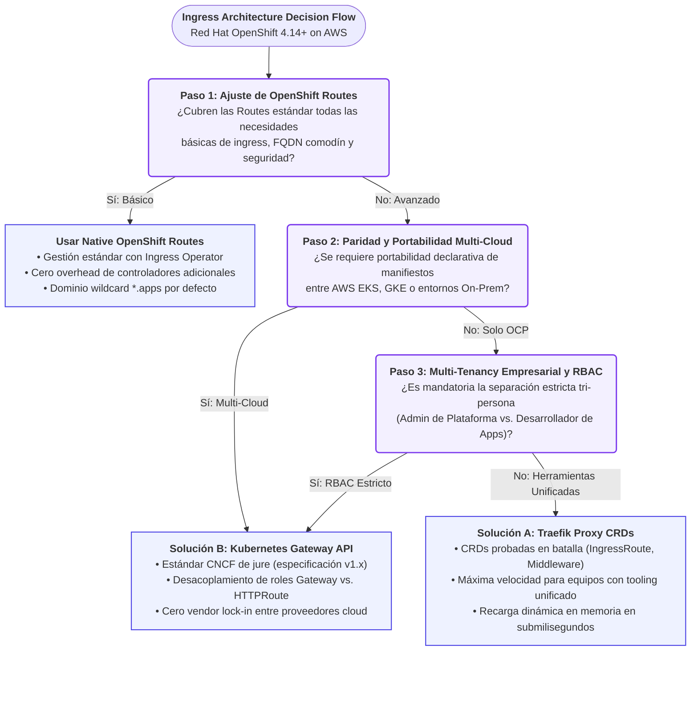
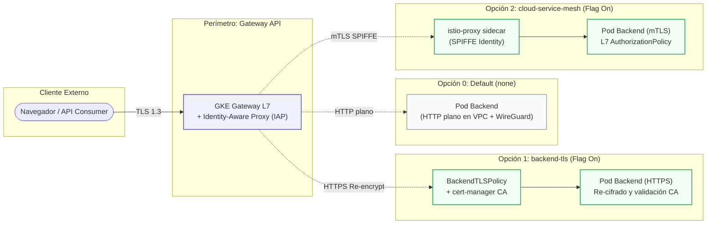

# 🚀 Traefik Proxy v3 vs. Kubernetes Gateway API en Red Hat OpenShift & AWS: El Fin del Dilema de Ingress Empresarial

*Edición Especial de Arquitectura Cloud-Native & Platform Engineering*  
**Repositorio Oficial en GitHub:** 👉 [**nubenetes/traefik-fqdn-management-poc-openshift-aws**](https://github.com/nubenetes/traefik-fqdn-management-poc-openshift-aws)

---

## 📌 Introducción: El Gran Cuello de Botella del Ingress en OpenShift

Si lideras o formas parte de un equipo de **Platform Engineering** gestionando **Red Hat OpenShift (ROSA u OCP on AWS)** a escala empresarial, es casi seguro que te has topado con este dilema arquitectónico:

> *"El objeto nativo `Route` de OpenShift (basado en HAProxy) es fantástico para la agilidad del desarrollador en el día 1, pero se convierte en una pared infranqueable cuando entran en juego requerimientos estrictos de Zero-Trust mTLS granular, mutación avanzada de cabeceras, soporte nativo para HTTP/3 (QUIC) y portabilidad multi-cloud sin vendor lock-in."*

¿La consecuencia directa? Muchas organizaciones terminan forzando la instalación de gigantescas mallas de servicios (*Service Meshes* basadas en Istio/Envoy) únicamente para resolver el cifrado inter-servicio (East-West), disparando el consumo de CPU/Memoria por los sidecars y multiplicando la complejidad operativa.

Para responder a este desafío con código y arquitectura real, hemos publicado un repositorio de referencia y prueba de concepto (*PoC*) con grado de producción:  
🔗 **[https://github.com/nubenetes/traefik-fqdn-management-poc-openshift-aws](https://github.com/nubenetes/traefik-fqdn-management-poc-openshift-aws)**

En este artículo desgranamos el análisis técnico profundo, la comparativa frente a frente entre **Traefik Proxy v3.0+ CRDs** y el nuevo estándar **Kubernetes Gateway API v1.x**, y cómo diseñar una topología de Ingress de alto rendimiento en AWS con cero recargas de proceso.

---

## 🛑 El Dilema de OpenShift: ¿Por qué las Routes Nativas se Quedan Cortas?

El Ingress Operator de Red Hat OpenShift desacopla la infraestructura mediante su router HAProxy. Sin embargo, en arquitecturas cloud modernas sobre AWS, emergen cuatro limitaciones críticas:

1. **Penalizaciones por Recarga de Proceso HAProxy:**  
   Aunque HAProxy ha incorporado endpoints dinámicos, cambios continuos en certificados TLS, rutas complejas o mutaciones de configuración provocan regeneraciones de plantilla y recargas del demonio. A escalas de miles de peticiones concurrentes, esto se traduce en picos de latencia (*p99 jitter*) y micro-cortes TCP.
2. **Carencia de mTLS Granular a Nivel de Ruta:**  
   OpenShift Routes soporta terminación `edge`, `reencrypt` o `passthrough`. En `edge`/`reencrypt`, el router no permite autenticar y verificar de forma declarativa certificados de cliente X.509 (`RequireAndVerifyClientCert`) validados contra Root CAs corporativas específicas por microservicio. En `passthrough`, la conexión se reenvía opaca al Pod, perdiendo toda capacidad de inspección L7, routing por path y manipulación de cabeceras.
3. **Snippets de Configuración Vulnerables:**  
   Para implementar cabeceras complejas (HSTS estricto, CORS corporativo, path regex rewrites), los desarrolladores recurren a la anotación `haproxy.router.openshift.io/snippet`. En clústeres empresariales regulados (banca, salud, seguros), SecOps desactiva estos snippets por riesgo crítico de inyección de configuración arbitraria.
4. **Restricción de Protocolos Cloud de Nueva Generación:**  
   Falta de soporte nativo out-of-the-box para **HTTP/3 sobre QUIC (UDP)** y multiplexación optimizada de streams gRPC.

---

## 🎯 El Desafío de los FQDNs: ¿Justifica la Gestión de Dominios (North-South & East-West) el Salto a Traefik / Gateway API?

Una de las preguntas arquitectónicas más críticas para los líderes de plataforma es:  
**¿Realmente la gestión de nombres de dominio totalmente cualificados (FQDNs) justifica por sí sola reemplazar o complementar el router nativo de OpenShift?**

La respuesta técnica contundente es **SÍ**.  
La razón fundamental radica en la enorme brecha que existe entre cómo OpenShift Routes fue diseñado históricamente y las exigencias de los ecosistemas cloud-native y Zero-Trust modernos.

### 1. La Trampa del Comodín `*.apps` en North-South
El modelo nativo de OpenShift está estructuralmente optimizado para un único dominio comodín (*wildcard*): `*.<subdominio>.apps.<cluster-name>.<baseDomain>`.  
Cuando una organización requiere exponer múltiples marcas, dominios de clientes (*white-label*) o FQDNs corporativos independientes (`api.empresa.com`, `pagos.banco.es`, `partner.portal.io`):
* **Falta de Automatización DNS Nativa:** OpenShift Routes no sincroniza registros DNS individuales contra AWS Route 53 para dominios externos arbitrarios. Obliga a depender de tickets manuales a redes o de scripts externos desacoplados.
* **La Proliferación de IngressControllers (*Sprawl* de Costes en AWS):** Para aislar certificados TLS o aplicar políticas de red diferenciadas por dominio en OpenShift nativo, el patrón oficial de Red Hat exige desplegar múltiples instancias del operador `IngressController`. Cada `IngressController` provisiona un nuevo AWS Network Load Balancer (NLB) y nuevos pods de HAProxy. En organizaciones con decenas de dominios, esto dispara exponencialmente la factura de AWS y el consumo de cómputo del clúster.
* **La Ventaja de Traefik / Gateway API:** Un único despliegue de Traefik o una sola instancia de `Gateway` multiplexa cientos de FQDNs corporativos sobre un único AWS NLB, seleccionando dinámicamente certificados TLS vía SNI y orquestando registros A/Alias en AWS Route 53 en tiempo real mediante ExternalDNS.

### 2. El Vacío Absoluto de FQDNs East-West en OpenShift Routes
El router de OpenShift es un componente **exclusivamente de borde (North-South)**. Las OpenShift Routes no están diseñadas para gobernar ni inspeccionar tráfico interno de servicio a servicio.
* Para llamadas entre microservicios, Kubernetes solo ofrece nombres DNS de ClusterIP (`servicio.namespace.svc.cluster.local`) en capa 4 sin verificación de identidad por cliente.
* Si una aplicación interna necesita invocar a otra usando un FQDN canónico (`servicio-b.apps.cluster.local` o `facturacion.internal.corp`) con autenticación mutua TLS (mTLS), en OpenShift tradicional solo existen dos caminos:
  1. **Hacer *Hairpinning*:** Forzar al tráfico a salir del clúster al balanceador externo de AWS y volver a entrar por el router perimetral. Esto añade latencia inaceptable, costes de transferencia de datos en AWS y riesgos graves de seguridad al exponer APIs internas al perímetro.
  2. **Implantar Red Hat OpenShift Service Mesh (Istio):** Pagar el descomunal peaje de CPU y RAM de inyectar sidecars de Envoy en cada pod (hasta 250MB RAM y 0.2 vCPU por réplica).

---

### 🏢 4 Casos de Uso Empresariales Reales: Cuándo este Requisito es Obligatorio

#### 🔹 Caso 1: Plataformas SaaS B2B Multi-Tenant y White-Label (North-South)
* **Requisito del Negocio:** Una plataforma SaaS financiera sobre OpenShift en AWS da servicio a más de 150 entidades bancarias. Cada cliente exige acceder a la API a través de su propio FQDN personalizado (`api.bancoprimario.com`, `auth.caja-ahorros.es`) con certificados EV/OV corporativos específicos.
* **Por qué falla OpenShift Routes:** Crear 150 rutas manuales con dominios externos sin automatización DNS colapsa el ciclo de vida de certificados y genera fricción operativa inmanejable.
* **Por qué Traefik / Gateway API es mandatorio:** Un único punto de entrada resuelve todos los FQDNs dinámicamente. Al crear un nuevo `HTTPRoute` con su hostname correspondiente, ExternalDNS genera automáticamente el alias en AWS Route 53 y Traefik asocia el Secret TLS adecuado en submilisegundos.

#### 🔹 Caso 2: Auditoría y Cumplimiento Zero-Trust Bancario / Salud (East-West)
* **Requisito del Negocio:** Normativas como **PCI-DSS 4.0, HIPAA o ENS (Nivel Alto)** exigen que toda comunicación entre el servicio de Pedidos (`namespace: e-commerce`) y el servicio de Pagos (`namespace: transacciones`) viaje cifrada con mTLS mutuo, validando que el llamante posee un certificado emitido por la CA de Seguridad y accediendo a través del FQDN interno auditable `pagos.internal.banco.local`.
* **Por qué falla OpenShift Routes:** Las Routes nativas no interceptan tráfico entre namespaces internos.
* **Por qué Traefik / Gateway API es mandatorio:** Traefik expone un EntryPoint interno que evalúa la llamada a `pagos.internal.banco.local`, ejecuta `RequireAndVerifyClientCert` contra `internal-ca-secret`, valida el SNI contra el header Host, e inyecta la identidad del cliente verificado antes de entregar al pod de destino. **Cero sidecars de Envoy, 100% de cumplimiento normativo.**

#### 🔹 Caso 3: Modernización de Monolitos y Fachada de API Canónica (East-West & Edge)
* **Requisito del Negocio:** Durante la migración de un sistema core bancario, componentes legados que aún residen en máquinas virtuales AWS EC2 fuera del clúster deben consumir microservicios en OpenShift bajo un FQDN canónico unificado (`core.internal.corp/api/v2`), requiriendo reescritura transparente de rutas y Canary Splitting (80% a v1, 20% a v2).
* **Por qué falla OpenShift Routes:** Las Routes nativas no soportan división ponderada avanzada de tráfico ni reescritura de paths declarativa sin snippets HAProxy vulnerables.
* **Por qué Traefik / Gateway API es mandatorio:** El middleware de reescritura (`URLRewrite` en Gateway API) y la ponderación nativa (`weight: 80 / weight: 20`) se definen de manera segura y estándar sobre el FQDN canónico.

#### 🔹 Caso 4: Estrategia Multi-Cloud y Recuperación ante Desastres (DR)
* **Requisito del Negocio:** La organización opera su producción principal en OpenShift sobre AWS (ROSA), pero mantiene un clúster secundario de Disaster Recovery en AWS EKS o Google Cloud GKE. Ambos clústeres deben publicar exactamente los mismos FQDNs internos y externos.
* **Por qué falla OpenShift Routes:** Las APIs `route.openshift.io/v1` no existen en EKS ni en GKE. El equipo se ve forzado a mantener dos repositorios de GitOps paralelos con manifiestos divergentes.
* **Por qué Gateway API es mandatorio:** El manifiesto `HTTPRoute` con sus reglas de FQDN es 100% portable. El mismo fichero YAML se aplica sin cambios en OpenShift, EKS o GKE.

---

## ⚔️ La Batalla de Paradigmas: Solución A vs. Solución B

Para superar estas limitaciones sobre OpenShift 4.14+ en AWS, evaluamos e implementamos los dos paradigmas líderes del ecosistema cloud-native:



---

### 🅰️ Solución A: Traefik Custom Resource Definitions (CRDs)

*Basado en:* `IngressRoute`, `Middleware`, `TLSOption`, `ServersTransport`

* **Mayor Fortaleza:** **Velocidad de entrega y madurez operacional inmediata.**  
  Las CRDs de Traefik han sido probadas en batalla durante años. La reactividad de Go permite hot-swapping de tablas de enrutamiento en milisegundos directamente en memoria, sin recargas de proceso ni conexiones perdidas.
* **Seguridad Declarativa con Middlewares:**  
  Permite encadenar tuberías de middleware reutilizables para inyección/mutación de cabeceras, CORS whitelisting, forzado de HSTS con preload y restricción perimetral de rangos CIDR (`ipAllowList`) para OVN-Kubernetes (`10.128.0.0/14`) y subnets de AWS VPC (`10.0.0.0/16`).
* **Compromiso / Riesgo:**  
  *Vendor lock-in*. La configuración está atada a las APIs propietarias de Traefik (`traefik.io/v1alpha1`). Cambiar de controlador de Ingress en el futuro requiere reescribir todos los manifiestos.

---

### 🅱️ Solución B: Kubernetes Gateway API (CNCF Standard v1.x)

*Basado en:* `GatewayClass`, `Gateway`, `HTTPRoute`, `BackendTLSPolicy`

* **Mayor Fortaleza:** **Estándar de la industria *de jure* y portabilidad absoluta.**  
  Especificación oficial de Kubernetes SIG-Network (`gateway.networking.k8s.io`). El plano de datos subyacente puede reemplazarse (de Traefik a Envoy Gateway, Cilium o F5) sin alterar ni una sola línea de los manifiestos de los equipos de aplicación.
* **Separación de Roles Tri-Persona en RBAC:**  
  Resuelve de raíz el conflicto de gobernanza en grandes organizaciones:
  1. *Infrastructure Provider:* Define el `GatewayClass`.
  2. *Platform Admin:* Controla el objeto `Gateway` (listeners NLB, puertos, secretos TLS maestros, namespaces autorizados).
  3. *Application Developer:* Gestiona sus propios `HTTPRoute` (reglas de matching, reescritura de URLs y backend refs) sin privilegios sobre los balanceadores ni la infraestructura de red.
* **Compromiso / Curva:**  
  Mayor abstracción inicial y necesidad de dominar el uso de `ReferenceGrant` para delegación segura de secretos entre namespaces.

---

## 📊 Matriz Comparativa de Ingeniería

| Dimensión de Evaluación | Solución A: Traefik CRDs (`IngressRoute`) | Solución B: Gateway API (`Gateway` / `HTTPRoute`) | OpenShift Native Routes (HAProxy) |
| :--- | :--- | :--- | :--- |
| **Estandarización & Lock-in** | ⚠️ **Propietario.** Fuerte acoplamiento a Traefik Proxy. | 🛡️ **Estándar CNCF v1.x.** Cero lock-in; portabilidad entre OCP, EKS y GKE. | ⚠️ **Propietario Red Hat.** No portable a Kubernetes upstream vanilla. |
| **Integración AWS (NLB + Route 53)** | Directa vía anotaciones en Service `LoadBalancer` + ExternalDNS. | Asignación nativa de infraestructura en el recurso `Gateway`. | Gestión automática vía Ingress Operator para el comodín `*.apps`. |
| **Mutación de Cabeceras / URLs** | Extensa y desacoplada mediante CRD `Middleware`. | Estandarizada mediante filtros nativos (`RequestHeaderModifier`, `URLRewrite`). | Limitada o dependiente de snippets HAProxy no declarativos. |
| **Aislamiento Multi-Tenancy & RBAC** | Fragmentado; requiere RBAC estricto o webhooks validadores. | **Óptimo.** Desacoplamiento estricto en 3 capas de responsabilidad. | Centrado en el namespace del desarrollador; políticas poco delegables. |
| **Tráfico East-West y mTLS** | Ligero vía `TLSOption` y `ServersTransport` (sin sidecars). | Estandarizado vía `BackendTLSPolicy` (`gateway.networking.k8s.io`). | Requiere OpenShift Service Mesh (Istio sidecars), alto overhead. |
| **Penalización por Cambios** | **0 ms.** Actualización concurrente en memoria en Go. | **0 ms.** Reconciliación dinámica en memoria. | Recarga periódica del proceso HAProxy ante eventos de churn. |

---

## 🌐 Flujo de Tráfico North-South: De Route 53 al Microservicio sin HAProxy

En ambos enfoques demostrados en el repositorio, se implementa un bypass completo del Ingress Operator tradicional de OpenShift para maximizar el rendimiento:

```
[ Cliente / API Consumer ]
            │
            ▼
    AWS Route 53 DNS (Alias Dual-Stack gestionado por ExternalDNS)
            │
            ▼
    AWS Network Load Balancer (NLB L4 TCP)
    • PROXY Protocol v2 activo (Preservación de Real Client IP)
            │
            ▼
    Bypass Directo del Router OpenShift
            │
            ▼
    Traefik Proxy v3.0+ Controller (Namespace: traefik-system)
    • Cumplimiento SCC OpenShift: nonroot-v2 / restricted-v2 (UID 65532)
    • Puertos de entrada: web (:8000), websecure (:8443)
            │
    ┌───────┴──────────────────────────────┐
    ▼                                      ▼
[ Solución A: IngressRoute ]          [ Solución B: HTTPRoute ]
  • Validación Host (company.com)       • Filtros de Header Request/Response
  • Middleware HSTS + CORS              • URL Rewrite / Prefix Matching
  • Enrutamiento al Service backend     • Enrutamiento al Service backend
    │                                      │
    └──────────────────┬───────────────────┘
                       ▼
          [ Backend Pod Microservice ]
```

### Claves de Ingeniería Implementadas:
* **PROXY Protocol v2:** El NLB de AWS entrega el tráfico TCP en capa 4 inyectando el encabezado PROXY v2. Traefik está configurado con `trustedIPs` hacia la VPC para recuperar la IP de origen real del cliente antes de cualquier evaluación de reglas.
* **Seguridad en OpenShift (SCC):** El despliegue de Traefik no requiere privilegios de `root` ni SCC `privileged`. Cumple estrictamente con el SCC `nonroot-v2` / `restricted-v2` de OpenShift ejecutándose bajo el UID no privilegiado `65532`.

---

## 🔒 Tráfico East-West y Zero-Trust: mTLS Sin el Overhead de un Service Mesh

Uno de los mayores hallazgos de este PoC es cómo lograr **mTLS mutuo criptográficamente riguroso entre microservicios en distintos namespaces** sin pagar el peaje de Istio:

* **El Problema Típico:** Para cumplir normativas como PCI-DSS, HIPAA o ENS Alto, los equipos despliegan Envoy sidecars en cada Pod. Esto consume 100MB–250MB de RAM y 0.2 vCPU adicionales por cada réplica, sumando gigabytes de desperdicio en clústeres con cientos de microservicios.
* **La Solución Demostrada en el Repo:**  
  Utilizar Traefik como plano de control y proxy perimetral interno para el dominio de clúster `*.apps.cluster.local`:
  1. `Service-A` inicia una llamada HTTPS a `https://service-b.apps.cluster.local:8443/api/v1/internal` presentando su certificado de cliente emitido por la CA interna.
  2. Traefik intercepta el tráfico en su EntryPoint interno, valida la cadena contra el secreto `internal-ca-secret` mediante `clientAuthType: RequireAndVerifyClientCert`, y si el certificado falta o expiró, aborta la conexión en el handshake TLS.
  3. Traefik aplica anti-spoofing verificando que el SNI coincida con el encabezado `Host` y filtra por IP para descartar cualquier tráfico externo.
  4. Finalmente, Traefik abre una conexión HTTPS segura hacia el Pod de `service-b`, validando el SAN mediante `ServersTransport` (Solución A) o `BackendTLSPolicy` (Solución B).

**Resultado:** Cifrado Zero-Trust de extremo a extremo, trazable, verificable por auditoría y con **cero sidecars inyectados**.

---

## 🎛️ El Espejo Multi-Cloud: Cómo lo Resuelve con Feature Flags el Repo Hermano 'jenkins-2026' en GKE

Una de las preguntas más recurrentes al diseñar plataformas cloud-native es:  
**¿Es obligatorio casarse con un modelo único (solo Ingress perimetral vs. Backend TLS vs. Service Mesh completo)? ¿O puede una plataforma ofrecer estas soluciones como capacidades conmutables mediante *Feature Flags*?**

En la organización **nubenetes**, el repositorio complementario de grado empresarial:  
👉 **[github.com/nubenetes/jenkins-2026](https://github.com/nubenetes/jenkins-2026)**  
ofrece una respuesta fascinante a este problema sobre **Google Kubernetes Engine (GKE)**. Mientras que en este repositorio sobre OpenShift y AWS demostramos cómo evitar los cuellos de botella de OpenShift Routes mediante Traefik Proxy v3 y Gateway API, en `jenkins-2026` se estandariza el borde con **Kubernetes Gateway API** (`gke-l7-global-external-managed`) y se orquesta el eje de seguridad intra-clúster mediante **Feature Flags declarativos**, permitiendo alternar entre tres niveles de seguridad sin modificar el código de las aplicaciones.

### 🧩 Los 3 Niveles de Seguridad Activados por Feature Flags en `jenkins-2026`



#### 1. Nivel 0: `none` (Postura por Defecto / Máxima Simplicidad)
* **Configuración del Flag:** `gateway.backendTls.enabled: false` y `serviceMesh.mode: none`.
* **Mecanismo:** El Gateway L7 gestionado por Google termina el TLS perimetral con certificados comodín gestionados y valida autenticación corporativa con **Google Identity-Aware Proxy (IAP)**. El salto interno desde el balanceador al pod viaja en HTTP plano dentro de la VPC privada de Google.
* **Seguridad Subyacente:** La red no está desprotegida: Google cifra el tráfico en la capa de red física, y Dataplane V2 (eBPF Cilium) aplica cifrado transparente nodo a nodo vía **WireGuard** (`in_transit_encryption_config`) junto con `NetworkPolicies` estrictas en modo *default-deny*.
* **Veredicto:** Cero sobrecoste operacional, cero consumo extra de memoria/CPU, ideal para entornos de desarrollo, PoCs o cargas donde la red privada se considera frontera de confianza suficiente.

#### 2. Nivel 1: `backend-tls` (Re-cifrado de Borde a Pod Sin Sidecars)
* **Configuración del Flag:** `gateway.backendTls.enabled: true` (o variable de entorno `JENKINS2026_GATEWAY_BACKEND_TLS_ENABLED=true`).
* **Mecanismo:** Instala automáticamente `cert-manager` y una Autoridad de Certificación (CA) interna (`ClusterIssuer`). Despliega la directiva estándar **`BackendTLSPolicy`** de Gateway API (`gateway.networking.k8s.io`). El Gateway de Google re-encripta la conexión en HTTPS hacia el pod y valida criptográficamente que el certificado servido por el pod fue firmado por la CA interna del clúster (`ca.crt` montado vía ConfigMap).
* **Tráfico East-West:** La comunicación entre microservicios se mantiene gestionada por Dataplane V2 / WireGuard.
* **Veredicto:** Añade autenticación del servidor y re-cifrado en el salto perimetral, cerrando el riesgo de suplantación de servicios dentro del clúster **sin penalizar el clúster con sidecars de Envoy ni consumir vCPU/RAM adicional por réplica**.

#### 3. Nivel 2: `cloud-service-mesh` (Zero-Trust Integral con Istio Gestionado)
* **Configuración del Flag:** `serviceMesh.mode: cloud-service-mesh` (o variable de entorno `JENKINS2026_SERVICE_MESH_MODE=cloud-service-mesh`).
* **Mecanismo:** Activa la integración nativa de **Cloud Service Mesh (CSM)** en Google Cloud bajo el SKU *standalone* (a la carta por cliente de malla, sin requerir licencias de GKE Enterprise). El plano de control gestionado inyecta automáticamente sidecars de `istio-proxy` en los namespaces seleccionados (`istio.io/rev=asm-managed`).
* **Tráfico North-South & East-West:** El puerto de entrada del Gateway opera en modo `PERMISSIVE`, mientras que todo el tráfico de servicio a servicio (East-West) se eleva a **mTLS mutuo estricto con identidad criptográfica SPIFFE** por pod (`PeerAuthentication STRICT`), gobernado por políticas de autorización de capa 7 (`AuthorizationPolicy`).
* **Veredicto:** Cobertura Zero-Trust absoluta a nivel de proceso para normativas financieras extremas (PCI-DSS 4.0 / SOC 2 Type II), asumiendo el coste operacional de los sidecars pero delegando el plano de control y la rotación de certificados en Google Mesh CA.

---

### 🔬 Comparativa Profunda: Los 3 Enfoques de `jenkins-2026` vs. El PoC de OpenShift + Traefik

| Dimensión Técnica | Nivel 0: `none` (Default) | Nivel 1: `backend-tls` (Feature Flag) | Nivel 2: `cloud-service-mesh` (Feature Flag) | Enfoque OpenShift + Traefik v3 (`traefik-fqdn-management`) |
| :--- | :--- | :--- | :--- | :--- |
| **Repositorio / Ecosistema** | `nubenetes/jenkins-2026` (GKE) | `nubenetes/jenkins-2026` (GKE) | `nubenetes/jenkins-2026` (GKE) | `traefik-fqdn-management-poc-openshift-aws` (ROSA) |
| **Punto de Entrada Ingress** | GKE Gateway API (`gke-l7`) + IAP | GKE Gateway API (`gke-l7`) + IAP | GKE Gateway API (`gke-l7`) + IAP | AWS NLB L4 + Traefik Proxy v3 (`Gateway` / `IngressRoute`) |
| **Salto Ingress/LB → Pod** | HTTP plano (VPC + WireGuard) | HTTPS re-cifrado y validado (`BackendTLSPolicy`) | mTLS gestionado (puerto edge PERMISSIVE) | HTTPS con SNI y `ServersTransport` / `BackendTLSPolicy` |
| **Tráfico East-West (Pod ↔ Pod)** | Cilium L3/L4 NetworkPolicies | Cilium L3/L4 NetworkPolicies | **mTLS mutuo estricto (SPIFFE)** + AuthZ L7 | **mTLS perimetral interno** vía FQDN canónico (`*.apps.cluster.local`) |
| **Presencia de Sidecars** | **Ninguno (0 sidecars)** | **Ninguno (0 sidecars)** | Sí (`istio-proxy` por pod) | **Ninguno (0 sidecars)** |
| **Overhead de CPU / RAM por Pod** | 0% | 0% (solo handshake TLS en pod) | +100-250 MB RAM y +0.1-0.2 vCPU / pod | 0% adicional en pods de aplicación |
| **Identidad Criptográfica** | N/A (Aislamiento de red) | CA interna de clúster (cert-manager) | SPIFFE ID por ServiceAccount (Mesh CA) | Certificados X.509 de CA interna verificados en Traefik |
| **Complejidad Operacional** | Mínima | Baja (gestión de CA interna) | Media-Alta (malla gestionada pero sidecars) | Baja (controlador Traefik unificado) |

---

### 🛡️ Lecciones de Arquitectura y Buenas Prácticas para Feature Flags en Redes

La experiencia en el repositorio `jenkins-2026` deja tres patrones de diseño esenciales para cualquier equipo de Platform Engineering:

1. **Exclusividad Mutua Estricta (Guardrail Anticolisión):**  
   Las opciones `backend-tls` y `cloud-service-mesh` son **mutuamente excluyentes**. Cuando una malla de servicios está activa, el Mesh CA y el sidecar de Envoy asumen el control del ciclo de vida TLS del pod. Si una política de `BackendTLSPolicy` intentara validar simultáneamente contra la CA de `cert-manager` en el mismo puerto, se produce un conflicto en el handshake que degenera en errores HTTP 502 Bad Gateway. En `jenkins-2026`, los scripts de configuración (`lib/config.sh`) abortan el despliegue con un error explícito si ambos flags están activos, y los workflows de GitHub Actions presentan un selector único (`intra_cluster_tls: [none, backend-tls, cloud-service-mesh]`), haciendo físicamente imposible una colisión.
2. **Sondeo Activo de Capacidades (Capability-Gated Probing):**  
   Ningún componente confía ciegamente en el valor del flag booleano. Antes de reconfigurar los pods para servir TLS o inyectar sidecars, las sondas de plataforma (`j2026_backend_tls_active` y `j2026_service_mesh_active`) verifican que el clúster soporte físicamente la API requerida (que la CRD `BackendTLSPolicy` exista en el clúster o que el webhook de inyección de Istio esté disponible). Si el clúster es antiguo o el plano de control aún está convergiendo, el sistema **degrada de forma segura y consistente a HTTP plano con un warning**, eliminando por completo caídas de servicio durante rollouts progresivos.
3. **La Promesa Cumplida de Gateway API entre Nubes:**  
   Lo más revelador al contrastar ambos repositorios es que, a pesar de que este proyecto utiliza **OpenShift en AWS con Traefik Proxy v3** y `jenkins-2026` utiliza **GKE en Google Cloud con Cloud Service Mesh**, las definiciones de enrutamiento de aplicación (`HTTPRoute`) son **100% interoperables**. Un desarrollador puede aplicar prácticamente el mismo manifiesto de enrutamiento en ambos clústeres, demostrando que Gateway API no es una promesa futura, sino el estándar de facto que unifica la gestión de tráfico cloud-native hoy.

---

## 🔄 Estrategia de Migración con Cero Downtime: Coexistencia Híbrida

Una de las grandes ventajas de **Traefik Proxy v3.0+** es su arquitectura multi-proveedor. Puedes activar simultáneamente en el controlador:

```yaml
--providers.kubernetescrd=true
--providers.kubernetesgateway=true
```

Esto habilita una transición sin riesgos:
1. **Fase 1 (Día 1):** Migrar cargas críticas existentes desde OpenShift Routes hacia la **Solución A (Traefik CRDs)** para ganar estabilidad inmediata, eliminación de caídas por recargas y soporte de Middlewares.
2. **Fase 2 (Día 2):** Adoptar progresivamente la **Solución B (Gateway API)** para nuevos servicios, delegando `HTTPRoutes` en los equipos de desarrollo.
3. **Fase 3 (Convergencia):** Trasladar los `IngressRoute` a `HTTPRoute` de forma transparente sobre el mismo clúster, sin reemplazar controladores ni alterar la configuración de los balanceadores de AWS.

---

## 🛠️ Manifiestos de Producción Listos para Usar

En el repositorio abierto encontrarás los 10 manifiestos listos para desplegar con `oc apply -f`:

```
traefik-fqdn-management-poc-openshift-aws/
├── README.md                                    # Guía técnica exhaustiva
├── COMPARATIVE_MATRIX.md                        # Matriz profunda de 6 dimensiones
├── LINKEDIN_NEWSLETTER_ES.md                    # Este informe en español
├── LINKEDIN_NEWSLETTER_EN.md                    # English newsletter edition
└── manifests/
    ├── common/
    │   ├── 00-namespaces-rbac-scc.yaml         # RBAC, ServiceAccount y OpenShift SCCs
    │   ├── 01-mock-microservices.yaml          # Cargas de prueba (service-a, service-b) y CAs
    │   └── 02-traefik-controller-deployment.yaml # Controlador Traefik v3 + AWS NLB
    ├── solution-a-traefik-crds/
    │   ├── 01-ingressroute-north-south.yaml    # IngressRoute Edge con Route 53
    │   ├── 02-middleware-security.yaml         # Middlewares de HSTS, CORS e IP allowlist
    │   └── 03-ingressroute-east-west.yaml      # Enrutamiento mTLS interno con TLSOption
    └── solution-b-gateway-api/
        ├── 01-gateway-class.yaml               # Definición del GatewayClass
        ├── 02-gateway-aws.yaml                 # Gateway para AWS NLB y listeners
        ├── 03-httproute-north-south.yaml       # HTTPRoute Edge con filtros nativos
        └── 04-httproute-east-west.yaml         # HTTPRoute con BackendTLSPolicy mTLS
```

---

## 💡 Conclusión y Recomendación para Arquitectos

* **¿Cuándo mantener OpenShift Routes?** Si tus aplicaciones son monolitos o servicios web básicos dentro del comodín `*.apps`, sin exigencias de mTLS entre microservicios ni cabeceras complejas.
* **¿Cuándo elegir la Solución A (Traefik CRDs)?** Si tu equipo ya cuenta con automatizaciones en Ansible/Terraform/ArgoCD para Traefik y prioriza velocidad operativa inmediata sobre portabilidad estricta.
* **¿Cuándo elegir la Solución B (Gateway API)?** Si operas entornos híbridos (OpenShift + EKS/GKE), buscas estandarización oficial de la CNCF a 5-10 años vista y necesitas un modelo de gobernanza limpio entre administradores de plataforma y desarrolladores de aplicaciones.

---

### 🔗 Explora el Repositorio y Prueba el Despliegue

Te invito a clonar el repositorio, revisar los diagramas de arquitectura en Mermaid y probar los scripts de despliegue en tu propio clúster:

👉 **[github.com/nubenetes/traefik-fqdn-management-poc-openshift-aws](https://github.com/nubenetes/traefik-fqdn-management-poc-openshift-aws)**

¿Qué estrategia de Ingress estás utilizando actualmente en tus clústeres de OpenShift? ¿Has comenzado la adopción de Kubernetes Gateway API o sigues confiando en soluciones basadas en CRDs? ¡Déjame tu opinión en los comentarios! 👇

---
*#Kubernetes #OpenShift #RedHat #AWS #Traefik #GatewayAPI #PlatformEngineering #DevOps #CloudNative #CNCF #ZeroTrust #CyberSecurity*
