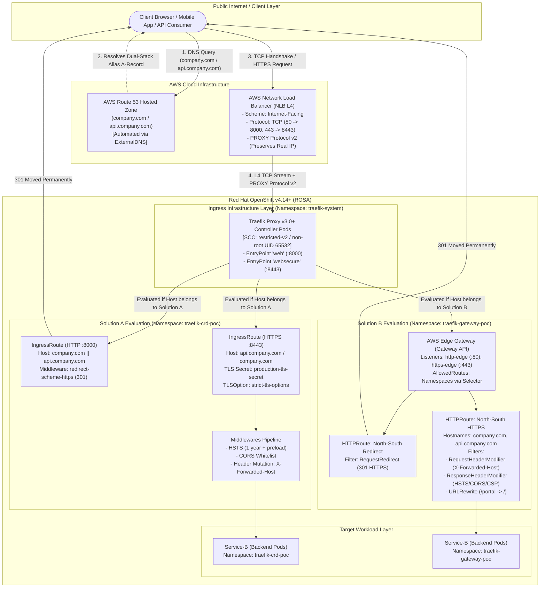

# Enterprise Traefik Proxy Ingress & FQDN Architecture on Red Hat OpenShift (AWS)

[](https://www.redhat.com/en/technologies/cloud-computing/openshift)
[](https://aws.amazon.com/rosa/)
[](https://traefik.io/)
[](https://gateway-api.sigs.k8s.io/)
[](https://github.com/nubenetes/traefik-fqdn-management-poc-openshift-aws)

---

## Executive Summary

This enterprise Proof of Concept (PoC) repository—hosted under the organization path `https://github.com/nubenetes` (repository reference: `://github.com/nubenetes/traefik-fqdn-management-poc-openshift-aws`)—establishes a reference architecture for advanced Fully Qualified Domain Name (FQDN) management, automated edge routing, and zero-trust microservice communication within **Red Hat OpenShift Container Platform v4.14+ (ROSA / self-managed OCP on AWS)**.

In mission-critical enterprise environments, default platform routing constructs often struggle to address the convergence of hybrid cloud domain delegation, sub-second route propagation without proxy reload overhead, multi-tenant RBAC boundaries, and East-West mutual TLS (mTLS) enforcement. This PoC implements and benchmark-tests two production-grade architectures:

1. **Solution A (Traefik CRD Stack):** A battle-tested architecture utilizing native Traefik v3.0+ Custom Resource Definitions (`IngressRoute`, `Middleware`, `TLSOption`, `ServersTransport`).
2. **Solution B (Kubernetes Gateway API Stack):** A forward-looking, standardized architecture implementing the official Kubernetes Gateway API specification (`GatewayClass`, `Gateway`, `HTTPRoute`, `BackendTLSPolicy`) driven by Traefik v3.0+'s native gateway controller.

Both solutions are integrated with **AWS Route 53** via automated ExternalDNS synchronization, terminate high-throughput edge traffic on **AWS Network Load Balancers (NLB)** with PROXY protocol v2, and strictly adhere to Red Hat OpenShift's default `restricted-v2` Security Context Constraints (SCC).

---

## Repository Structure

```
.
├── README.md                                    # Architectural specification & deployment guide
├── COMPARATIVE_MATRIX.md                        # Deep-dive comparative matrix & OpenShift dilemma analysis
└── manifests/
    ├── common/
    │   ├── 00-namespaces-rbac-scc.yaml         # Namespaces, ServiceAccounts, RBAC, and SCC bindings
    │   ├── 01-mock-microservices.yaml          # Sample workloads (Service-A, Service-B) and TLS secrets
    │   └── 02-traefik-controller-deployment.yaml # Traefik Proxy v3.0+ controller & AWS NLB Service
    ├── solution-a-traefik-crds/
    │   ├── 01-ingressroute-north-south.yaml    # External edge IngressRoute for corporate FQDNs
    │   ├── 02-middleware-security.yaml         # HSTS, CORS, header mutations, and IP allowlist middlewares
    │   └── 03-ingressroute-east-west.yaml      # Internal mTLS IngressRoute & TLSOption configuration
    └── solution-b-gateway-api/
        ├── 01-gateway-class.yaml               # Cluster-scoped GatewayClass (traefik.io/gateway-controller)
        ├── 02-gateway-aws.yaml                 # AWS NLB Gateway with Route 53 ExternalDNS annotations
        ├── 03-httproute-north-south.yaml       # North-South HTTPRoute with native filters & URL rewrites
        └── 04-httproute-east-west.yaml         # East-West HTTPRoute with BackendTLSPolicy mTLS enforcement
```

---

## North-South Traffic Flow (Edge to Workload)

North-South ingress handles external user requests entering the AWS cloud, traversing the network perimeter, and reaching backend microservices residing inside isolated OpenShift namespaces.

### North-South Architecture Diagram



### Hop-by-Hop North-South Mechanics Breakdown

1. **DNS Resolution & AWS Route 53 Automation:**
   - External clients issue DNS queries for `company.com` or `api.company.com`.
   - **ExternalDNS Integration:** The ExternalDNS controller running inside OpenShift continuously monitors annotations on the `IngressRoute` (Solution A) or the `Gateway` / `HTTPRoute` (Solution B). It automatically registers AWS Route 53 Alias A-records mapped to the canonical AWS NLB DNS name (`k8s-traefik-*.elb.amazonaws.com`). Changes in route definitions synchronize with Route 53 within 60 seconds without manual DNS tickets.

2. **Edge Ingestion at AWS Network Load Balancer (NLB):**
   - The AWS NLB operates at Layer 4 (TCP), listening on port 80 and port 443, routing traffic across multiple Availability Zones to OpenShift worker nodes.
   - **Real IP Preservation:** The NLB is configured via `service.beta.kubernetes.io/aws-load-balancer-proxy-protocol: "*"` to inject PROXY protocol v2 headers into the TCP stream. This ensures the client's original IPv4/IPv6 source address is preserved and not masked by AWS NAT or node IP translation.

3. **OpenShift Router Layer Bypass:**
   - In standard OpenShift, external traffic passes through the default HAProxy Router (`ingresscontroller.operator.openshift.io`). In this architecture, we **bypass the default OpenShift router** by binding the AWS NLB directly to Traefik's `LoadBalancer` Service.
   - *Advantage:* Bypassing eliminates double-proxying, minimizes packet latency, avoids HAProxy configuration reload penalties, and allows Traefik full ownership of SNI routing, TLS termination, and header mutation.

4. **Security Context Constraints (SCC) & Non-Root Execution:**
   - OpenShift 4.14+ enforces the strict `restricted-v2` SCC. Traefik runs entirely unprivileged under user UID `65532` and GID `65532`.
   - To adhere to non-root port binding restrictions (ports `< 1024` are forbidden for unprivileged pods), Traefik binds internally to unprivileged port `8000` (HTTP), port `8443` (HTTPS), and port `9000` (Ping/Metrics). The AWS NLB handles external port mapping (`80 -> 8000`, `443 -> 8443`).

5. **FQDN Matching & Evaluation (Solution A vs. Solution B):**
   - **Solution A (Traefik CRDs):** Traefik evaluates the incoming HTTP `Host` header and TLS SNI against `IngressRoute.spec.routes[].match` rules (e.g., `Host('api.company.com') && PathPrefix('/api')`). If matched, Traefik applies the chained `Middleware` CRDs (`middleware-security-headers`, `middleware-forwarded-host-mutation`) to inject HSTS headers, mutate `X-Forwarded-Host`, enforce CORS, and route to `service-b`.
   - **Solution B (Gateway API):** Traefik evaluates the `Gateway`'s listeners (`hostname: "*.company.com"`). The matched listener delegates routing decisions to attached `HTTPRoute` resources in permitted namespaces (`allowedRoutes.namespaces.from: Selector`). Standardized filters (`RequestHeaderModifier`, `ResponseHeaderModifier`, `URLRewrite`) execute in memory, modifying request/response headers natively without requiring custom controller-specific CRDs.

---

## East-West Traffic Flow & Mutual TLS (mTLS)

East-West traffic governs internal, secure communication between services across different namespaces within the OpenShift cluster (e.g., frontend `service-a` calling backend `service-b`).

### East-West Architecture Diagram

```mermaid
flowchart LR
    subgraph Client_Namespace ["Namespace: traefik-crd-poc / traefik-gateway-poc"]
        ServiceA["Service-A Pod\n(API Consumer Client)\n- In-cluster FQDN call\n- Presents Client Certificate"]
    end

    subgraph Ingress_Core ["Core Ingress & Mesh Data Plane (traefik-system)"]
        TraefikInternal["Traefik Proxy v3.0+ Router\n(Internal Mesh Listener :8443)"]
    end

    subgraph Security_Validation ["Zero-Trust Cryptographic & Policy Engine"]
        subgraph SolA_Security ["Solution A Engine"]
            TLSOption["Traefik TLSOption:\n- minVersion: TLS 1.3\n- clientAuthType: RequireAndVerifyClientCert\n- CA Secret: internal-ca-secret"]
            ST["ServersTransport:\n- Downstream mTLS to Pod\n- SAN: service-b.apps.cluster.local"]
            MW_IP["Middleware: IPAllowList\n- Enforces OVN-K8s CIDR: 10.128.0.0/14\n- Enforces VPC CIDR: 10.0.0.0/16"]
        end

        subgraph SolB_Security ["Solution B Engine"]
            GW_Internal["Gateway Listener: internal-mtls\n- Hostname: *.apps.cluster.local\n- Port: 8443 (HTTPS Terminate)"]
            BTLP["BackendTLSPolicy (Gateway API v1alpha3):\n- Target: Service 'service-b'\n- CA Ref: internal-ca-secret\n- Hostname Validation: service-b.apps.cluster.local"]
            HR_Filter["HTTPRoute Filters:\n- RequestHeaderModifier (X-Authenticated-Issuer)\n- ExtensionRef (IPAllowList Hook)"]
        end
    end

    subgraph Backend_Namespace ["Namespace: traefik-crd-poc / traefik-gateway-poc"]
        ServiceB["Service-B Pod\n(Provider API)\n- Listens on Port 8443\n- Validates Upstream Traefik Identity"]
    end

    ServiceA -->|"1. HTTPS call to https://service-b.apps.cluster.local:8443\n(Presents Client Cert signed by internal CA)"| TraefikInternal

    TraefikInternal -->|"Solution A Flow"| TLSOption
    TLSOption -->|"Verify Client Cert against Root CA"| MW_IP
    MW_IP -->|"Verify Caller Pod IP is inside Cluster CIDR"| ST
    ST -->|"2. Secure Upstream mTLS Connection"| ServiceB

    TraefikInternal -->|"Solution B Flow"| GW_Internal
    GW_Internal -->|"Validate Gateway Listener Binding"| HR_Filter
    HR_Filter -->|"Inject Authenticated Caller Context"| BTLP
    BTLP -->|"Verify Upstream SAN & CA Trust Anchor"| ServiceB
```



### Hop-by-Hop East-West & mTLS Mechanics Breakdown

1. **Targeting Internal Cluster FQDNs:**
   - Rather than communicating directly over ephemeral pod IPs or standard Kubernetes CoreDNS `service-b.namespace.svc.cluster.local` addresses without ingress visibility, `Service-A` routes through Traefik using dedicated internal FQDNs: `service-b.apps.cluster.local`.
   - CoreDNS or cluster `/etc/hosts` resolves `*.apps.cluster.local` to Traefik's internal cluster IP, establishing centralized observability, rate limiting, and access audit logging.

2. **mTLS Handshake Enforcement (`RequireAndVerifyClientCert`):**
   - When `Service-A` establishes an HTTPS connection to Traefik, Traefik initiates a TLS 1.3 handshake and requests a client certificate (`CertificateRequest`).
   - `Service-A` presents its X.509 certificate signed by the corporate internal Root CA (`internal-ca-secret`).
   - Traefik cryptographically verifies the entire certificate chain against `internal-ca-secret`. If the client certificate is missing, expired, or signed by an untrusted CA, the connection is instantly aborted with a TLS alert (`handshake failure`).

3. **Anti-Spoofing & Cross-Namespace Domain Validation:**
   - To prevent a rogue pod in an unprivileged namespace from intercepting or spoofing `service-b.apps.cluster.local`:
     - **SNI & Host Header Enforcement:** Traefik verifies that the TLS Server Name Indication (SNI) matches the HTTP `Host` header (`service-b.apps.cluster.local`). Mismatches result in an immediate `400 Bad Request`.
     - **IP Perimeter Filtering (Solution A Middleware):** Traefik applies the `middleware-internal-east-west-allowlist` ensuring the calling pod originates strictly within the OpenShift OVN-Kubernetes cluster pod network (`10.128.0.0/14`) or the AWS VPC subnet (`10.0.0.0/16`). External internet IPs hitting the internal listener are discarded.
     - **Gateway API Route Attachment Controls (Solution B):** The `aws-edge-gateway` explicitly restricts East-West listener attachments using `allowedRoutes.namespaces.from: Selector` with matching labels `solution: solution-b-gateway-api`. Workloads in unauthorized namespaces cannot bind routes to the internal domain.

4. **Zero-Trust Backend Encryption (Traefik to Upstream Pod):**
   - **Solution A (`ServersTransport`):** Traefik initiates an encrypted HTTPS connection to `service-b:8443`. It validates the backend pod's certificate against `internal-ca-secret` and verifies that the certificate's Subject Alternative Name (SAN) matches `service-b.apps.cluster.local`.
   - **Solution B (`BackendTLSPolicy`):** Gateway API's declarative `BackendTLSPolicy` configures Traefik to enforce strict TLS verification against `service-b`, anchoring trust directly to `internal-ca-secret` and rejecting any untrusted upstream endpoint.

---

## Production Deployment Steps (OpenShift CLI `oc`)

Follow these concrete, step-by-step commands to deploy and test both solutions on a Red Hat OpenShift v4.14+ cluster on AWS.

### Step 1: Clone Repository & Login to OpenShift

```bash
# Clone the repository (local path context: /home/inaki/github/traefik-fqdn-management-poc-openshift-aws)
cd /home/inaki/github/traefik-fqdn-management-poc-openshift-aws

# Authenticate with your OpenShift cluster
oc login --server=https://api.my-cluster.example.opentlc.com:6443 -u admin
```

### Step 2: Provision Namespaces, RBAC, and OpenShift SCCs

```bash
# Deploy namespaces, ServiceAccount, ClusterRole, and ClusterRoleBinding
oc apply -f manifests/common/00-namespaces-rbac-scc.yaml

# Grant the Traefik ServiceAccount permission to use OpenShift nonroot-v2 SCC
oc adm policy add-scc-to-user nonroot-v2 -z traefik-ingress-controller -n traefik-system

# Verify namespace creation and pod security labels
oc get namespaces -l app.kubernetes.io/part-of=traefik-platform
oc get namespaces -l app.kubernetes.io/part-of=traefik-poc
```

### Step 3: Deploy Mock Workloads and TLS Certificates

```bash
# Provision mock backend workloads (service-a, service-b) and TLS secrets
oc apply -f manifests/common/01-mock-microservices.yaml

# Wait for backend deployments to become ready in both namespaces
oc rollout status deployment/service-b -n traefik-crd-poc --timeout=120s
oc rollout status deployment/service-b -n traefik-gateway-poc --timeout=120s
```

### Step 4: Deploy Traefik Proxy v3.0+ Controller & AWS NLB

```bash
# Deploy Traefik Proxy v3.0+ with dual CRD and Gateway API providers enabled
oc apply -f manifests/common/02-traefik-controller-deployment.yaml

# Verify Traefik deployment rollout
oc rollout status deployment/traefik-ingress-controller -n traefik-system --timeout=120s

# Retrieve the AWS NLB external hostname provisioned by AWS Load Balancer Controller
export NLB_HOSTNAME=$(oc get svc traefik-loadbalancer -n traefik-system -o jsonpath='{.status.loadBalancer.ingress[0].hostname}')
echo "Provisioned AWS NLB Hostname: ${NLB_HOSTNAME}"
```

### Step 5: Deploy Solution A (Traefik CRD Stack)

```bash
# Apply Solution A Middlewares (HSTS, CORS, Host mutations, IP allowlists)
oc apply -f manifests/solution-a-traefik-crds/02-middleware-security.yaml

# Apply Solution A North-South IngressRoute (captures company.com & api.company.com)
oc apply -f manifests/solution-a-traefik-crds/01-ingressroute-north-south.yaml

# Apply Solution A East-West IngressRoute & TLSOption (strict mTLS)
oc apply -f manifests/solution-a-traefik-crds/03-ingressroute-east-west.yaml

# Inspect Solution A IngressRoute statuses
oc get ingressroutes -n traefik-crd-poc
oc get middlewares -n traefik-crd-poc
oc get tlsoptions -n traefik-crd-poc
```

### Step 6: Deploy Solution B (Kubernetes Gateway API Stack)

```bash
# Ensure Kubernetes Gateway API CRDs are installed on OpenShift 4.14+
oc get crd gateways.gateway.networking.k8s.io || \
  oc apply -f https://github.com/kubernetes-sigs/gateway-api/releases/download/v1.1.0/standard-install.yaml

# Apply GatewayClass targeting Traefik Gateway Controller
oc apply -f manifests/solution-b-gateway-api/01-gateway-class.yaml

# Apply AWS Edge Gateway resource in traefik-system
oc apply -f manifests/solution-b-gateway-api/02-gateway-aws.yaml

# Apply Solution B North-South HTTPRoute with native filters (RequestHeaderModifier, URLRewrite)
oc apply -f manifests/solution-b-gateway-api/03-httproute-north-south.yaml

# Apply Solution B East-West HTTPRoute and BackendTLSPolicy
oc apply -f manifests/solution-b-gateway-api/04-httproute-east-west.yaml

# Inspect Gateway API statuses
oc get gatewayclass
oc get gateway aws-edge-gateway -n traefik-system
oc get httproutes -n traefik-gateway-poc
```

---

## Validation & Verification Testing

### 1. Validating North-South HTTP to HTTPS Redirection
```bash
# Test HTTP redirect on company.com (Resolution A / B via AWS NLB)
curl -sI -H "Host: company.com" "http://${NLB_HOSTNAME}" | grep -E "HTTP/|location:"
# Expected Output:
# HTTP/1.1 301 Moved Permanently
# location: https://company.com/
```

### 2. Validating Solution A (Traefik CRDs) HTTPS Route & Security Headers
```bash
# Test API route on api.company.com for Solution A
curl -k -sI -H "Host: api.company.com" "https://${NLB_HOSTNAME}/api/data" | grep -E "HTTP/|strict-transport-security|x-served-by|access-control-allow-origin"
# Expected Output:
# HTTP/2 200
# strict-transport-security: max-age=31536000; includeSubDomains; preload
# x-served-by-proxy: Traefik-v3-CRD-IngressRoute
# access-control-allow-origin: https://company.com
```

### 3. Validating Solution B (Gateway API) Native Header Filters & Rewrites
```bash
# Test API endpoint on Solution B verifying RequestHeaderModifier and ResponseHeaderModifier
curl -k -sI -H "Host: api.company.com" "https://${NLB_HOSTNAME}/api/v1/resource" | grep -E "HTTP/|strict-transport-security|x-gateway-engine|access-control-allow-origin"
# Expected Output:
# HTTP/2 200
# strict-transport-security: max-age=31536000; includeSubDomains; preload
# access-control-allow-origin: https://company.com
```

### 4. Validating East-West Mutual TLS (mTLS) Enforcement
```bash
# Execute internal test from Service-A Pod in traefik-crd-poc namespace
CLIENT_POD=$(oc get pod -l app=service-a -n traefik-crd-poc -o jsonpath='{.items[0].metadata.name}')

# Attempt 1: Call Service-B WITHOUT client certificate (Must Fail Handshake)
oc exec -n traefik-crd-poc "${CLIENT_POD}" -- \
  curl -k -s -o /dev/null -w "%{http_code}\n" "https://service-b.apps.cluster.local:8443/api/v1/internal" || echo "Handshake rejected as expected"

# Attempt 2: Call Service-B WITH valid internal client certificate (Must Succeed 200 OK)
oc exec -n traefik-crd-poc "${CLIENT_POD}" -- \
  curl -k -s --cert /var/run/secrets/tls/client.crt --key /var/run/secrets/tls/client.key \
  -H "Host: service-b.apps.cluster.local" \
  "https://traefik-loadbalancer.traefik-system.svc.cluster.local:8443/api/v1/internal"
```

---

## Architectural Comparison & Further Reading

For an exhaustive architectural matrix comparing **Traefik CRDs**, **Kubernetes Gateway API**, and **Native OpenShift Routes (HAProxy)** across security, multi-tenancy, AWS integration, and performance, see:
👉 [**COMPARATIVE_MATRIX.md**](file:///home/inaki/github/traefik-fqdn-management-poc-openshift-aws/COMPARATIVE_MATRIX.md)
