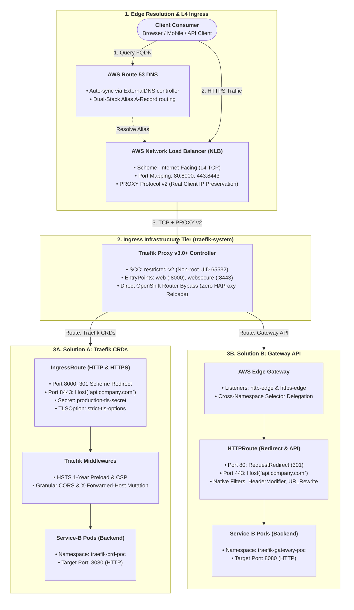
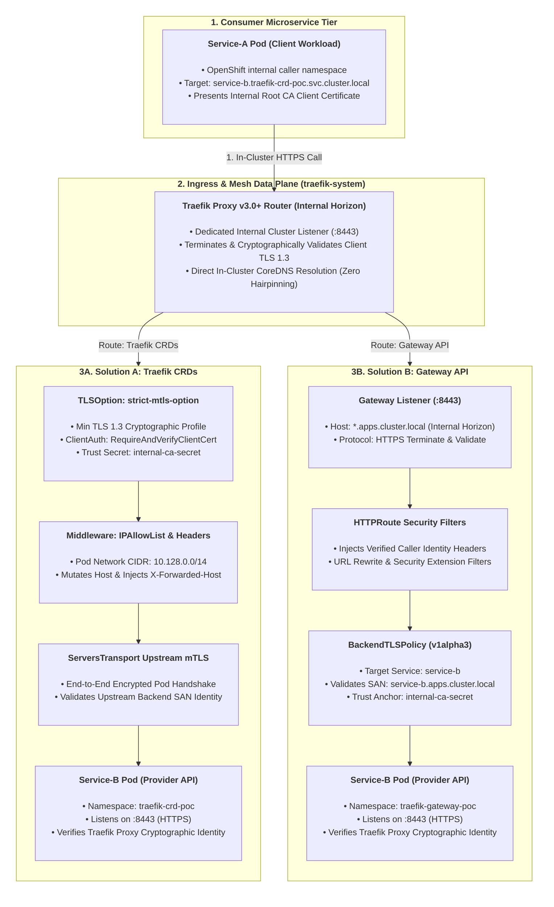
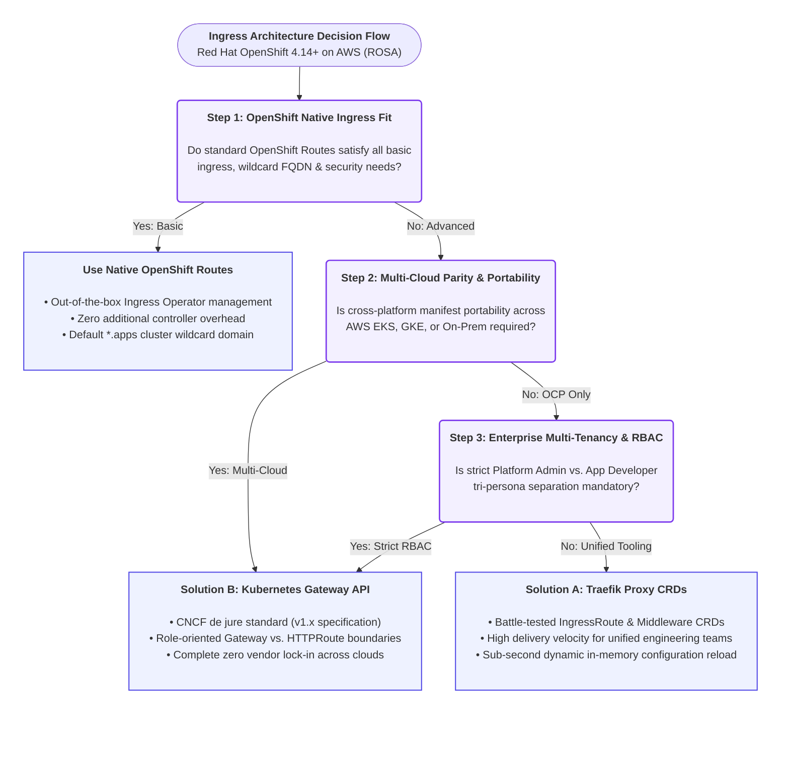

# Enterprise Traefik Proxy Ingress & FQDN Architecture on Red Hat OpenShift (AWS)

<!-- ======================================================================= -->
<!-- ARCHITECTURAL BADGES & CLUSTER TAXONOMY -->
<!-- ======================================================================= -->
<p align="center">
  <a href="https://www.redhat.com/en/technologies/cloud-computing/openshift"></a>
  <a href="https://aws.amazon.com/rosa/"></a>
  <a href="https://traefik.io/"></a>
  <a href="https://gateway-api.sigs.k8s.io/"></a>
  <a href="https://github.com/nubenetes/traefik-fqdn-management-poc-openshift-aws"></a>
</p>

<p align="center">
  
  
  
  
  
  <a href="https://youtube.com/@nubenetes"></a>
  
</p>

---

## 📑 Table of Contents

- [Executive Summary](#executive-summary)
- [Repository Overview Tags & Technical Taxonomy](#repository-overview-tags--technical-taxonomy)
- [Repository Structure & Direct Navigation](#repository-structure)
  - [Directory Tree](#directory-tree)
  - [Direct File & Manifest Navigation](#direct-file--manifest-navigation)
- [North-South Traffic Flow (Edge to Workload)](#north-south-traffic-flow-edge-to-workload)
  - [North-South Architecture Diagram](#north-south-architecture-diagram)
  - [Hop-by-Hop North-South Mechanics Breakdown](#hop-by-hop-north-south-mechanics-breakdown)
  - [Architectural Deep-Dive: HAProxy Router Bypass & PROXY Protocol v2](#architectural-deep-dive-haproxy-router-bypass--proxy-protocol-v2)
- [East-West Traffic Flow & Mutual TLS (mTLS)](#east-west-traffic-flow--mutual-tls-mtls)
  - [East-West Architecture Diagram](#east-west-architecture-diagram)
  - [Hop-by-Hop East-West & mTLS Mechanics Breakdown](#hop-by-hop-east-west--mtls-mechanics-breakdown)
  - [Architectural Deep-Dive: Split-Horizon Ingress vs. CoreDNS Immutability](#architectural-deep-dive-split-horizon-ingress-vs-coredns-immutability)
  - [Zero-Sidecar Efficiency vs. Service Mesh Overhead](#zero-sidecar-efficiency-vs-service-mesh-overhead)
- [Production Deployment Steps (OpenShift CLI `oc`)](#production-deployment-steps-openshift-cli-oc)
  - [Step 1: Clone Repository & Login to OpenShift](#step-1-clone-repository--login-to-openshift)
  - [Step 2: Provision Namespaces, RBAC, and OpenShift SCCs](#step-2-provision-namespaces-rbac-and-openshift-sccs)
  - [Step 3: Deploy Mock Workloads and TLS Certificates](#step-3-deploy-mock-workloads-and-tls-certificates)
  - [Step 4: Deploy Traefik Proxy v3.0+ Controller & AWS NLB](#step-4-deploy-traefik-proxy-v30-controller--aws-nlb)
  - [Step 5: Deploy Solution A (Traefik CRD Stack)](#step-5-deploy-solution-a-traefik-crd-stack)
  - [Step 6: Deploy Solution B (Kubernetes Gateway API Stack)](#step-6-deploy-solution-b-kubernetes-gateway-api-stack)
- [Validation & Verification Testing](#validation--verification-testing)
  - [1. Validating North-South HTTP to HTTPS Redirection](#1-validating-north-south-http-to-https-redirection)
  - [2. Validating Solution A (Traefik CRDs) HTTPS Route & Security Headers](#2-validating-solution-a-traefik-crds-https-route--security-headers)
  - [3. Validating Solution B (Gateway API) Native Header Filters & Rewrites](#3-validating-solution-b-gateway-api-native-header-filters--rewrites)
  - [4. Validating East-West Mutual TLS (mTLS) Enforcement](#4-validating-east-west-mutual-tls-mtls-enforcement)
- [Architectural Comparison & Ingress Decision Flow](#architectural-comparison--ingress-decision-flow)
  - [Architecture Decision Flowchart](#architecture-decision-flowchart)
  - [Comparative Analysis & Multi-Cloud Linkage](#comparative-analysis--multi-cloud-linkage)
- [🧭 Architectural Infographic & Holistic System Map](#-architectural-infographic--holistic-system-map)
  - [Holistic Architectural Blueprint Breakdown](#holistic-architectural-blueprint-breakdown)
- [🌐 Multi-Engine Companion Project: Cloud-Native Ingress & Mesh Lab](#-multi-engine-companion-project-cloud-native-ingress--mesh-lab)
- [📚 Authoritative References & Learning Resources](#-authoritative-references--learning-resources)
  - [1. Red Hat OpenShift & Enterprise Ingress Routing](#1-red-hat-openshift--enterprise-ingress-routing)
  - [2. Traefik Proxy v3 & Cloud-Native Ingress Data Planes](#2-traefik-proxy-v3--cloud-native-ingress-data-planes)
  - [3. CNCF Kubernetes Gateway API Specifications](#3-cncf-kubernetes-gateway-api-specifications)
  - [4. AWS Cloud Networking, NLB & DNS Automation](#4-aws-cloud-networking-nlb--dns-automation)
  - [5. Zero-Trust Architecture, mTLS & Security Standards](#5-zero-trust-architecture-mtls--security-standards)
  - [6. 🎬 YouTube Video Walkthroughs & Technical Masterclasses (@nubenetes)](#6--youtube-video-walkthroughs--technical-masterclasses-nubenetes)
    - [6.1 ⚡ Related YouTube Shorts](#61--related-youtube-shorts-quick-architectural-concepts--60-second-deep-dives)

---

## Executive Summary

This enterprise Proof of Concept (PoC) establishes a production-grade reference architecture and engineering benchmark for advanced Fully Qualified Domain Name (FQDN) management, automated edge ingress, and zero-trust microservice communication within **Red Hat OpenShift Container Platform v4.14+ (ROSA / self-managed OCP on AWS)**.

In mission-critical enterprise environments, default platform routing constructs often struggle to address the convergence of hybrid cloud domain delegation, sub-second route propagation without proxy reload overhead, multi-tenant RBAC boundaries, and East-West mutual TLS (mTLS) enforcement. This PoC implements and benchmark-tests two production-grade architectures:

1. **Solution A (Traefik CRD Stack):** A battle-tested architecture utilizing native Traefik v3.0+ Custom Resource Definitions (`IngressRoute`, `Middleware`, `TLSOption`, `ServersTransport`).
2. **Solution B (Kubernetes Gateway API Stack):** A forward-looking, standardized architecture implementing the official Kubernetes Gateway API specification (`GatewayClass`, `Gateway`, `HTTPRoute`, `BackendTLSPolicy`) driven by Traefik v3.0+'s native gateway controller.

Both solutions are integrated with **AWS Route 53** via automated ExternalDNS synchronization, terminate high-throughput edge traffic on **AWS Network Load Balancers (NLB)** with PROXY protocol v2, and strictly adhere to Red Hat OpenShift's default `restricted-v2` Security Context Constraints (SCC).

> [!NOTE]
> **Key Architecture Highlights:**
> - **Zero HAProxy Reloads:** Directly bypassing OpenShift's default router eliminates reload serialization and CPU spikes during high-frequency route deployments.
> - **Split-Horizon Ingress:** Internal microservices resolve internal FQDNs with end-to-end TLS 1.3 cryptographic validation without modifying immutable OpenShift CoreDNS configurations.
> - **Sidecar-Less Zero-Trust:** Achieves mutual TLS (mTLS) and micro-segmentation without the memory, CPU, and latency overhead of injecting Envoy sidecars into every pod.

---

## Repository Overview Tags & Technical Taxonomy

The repository is tagged and indexed with the following domain taxonomy:

| Category | Taxonomy Tags | Technical Scope & Implementation |
| :--- | :--- | :--- |
| **Data Plane & Ingress** | `traefik`, `traefik-proxy`, `ingressroute`, `gateway-api`, `httproute` | Dual-engine routing: Traefik v3.0+ Custom Resource Definitions vs. Standard Kubernetes Gateway API v1.x data planes. |
| **Platform & Cloud** | `openshift`, `redhat-openshift`, `ocp4`, `rosa`, `aws` | Engineered for Red Hat OpenShift 4.14+ on AWS (ROSA), enforcing non-root execution (`restricted-v2` SCC). |
| **DNS & L4 Ingress** | `external-dns`, `route53`, `fqdn`, `nlb`, `aws-load-balancer-controller` | Automated DNS record synchronization in AWS Route 53, fronted by AWS Network Load Balancer (NLB) with PROXY protocol v2. |
| **Security & Zero-Trust** | `mtls`, `zero-trust`, `scc-restricted-v2`, `hsts`, `tls-1.3` | Inter-service cryptographic authentication using internal CAs (`RequireAndVerifyClientCert` and `BackendTLSPolicy`). |
| **Architecture & Discipline** | `platform-engineering`, `cloud-native`, `proof-of-concept`, `haproxy`, `service-mesh` | Enterprise architectural benchmarks contrasting sidecar-less mesh ingress against traditional OpenShift HAProxy routes. |

---

## Repository Structure

### Directory Tree

```
.
├── README.md                                    # Architectural specification & deployment guide
├── COMPARATIVE_MATRIX.md                        # Deep-dive comparative matrix & OpenShift dilemma analysis
├── LINKEDIN_NEWSLETTER_ES.md                    # Análisis e informe profundo para LinkedIn Newsletter (Español)
├── LINKEDIN_NEWSLETTER_EN.md                    # Executive architecture & Ingress report for LinkedIn Newsletter (English)
├── assets/
│   └── traefik_openshift_advanced_fqdn_architecture.jpg # High-resolution architecture blueprint infographic
└── manifests/
    ├── common/
    │   ├── 00-namespaces-rbac-scc.yaml         # Namespaces, ServiceAccounts, RBAC, and SCC bindings
    │   ├── 01-mock-microservices.yaml          # Sample workloads (Service-A, Service-B) and TLS secrets
    │   └── 02-traefik-controller-deployment.yaml # Traefik Proxy v3.0+ controller & AWS NLB Service
    ├── solution-a-traefik-crds/
    │   ├── 01-ingressroute-north-south.yaml    # External edge IngressRoute for corporate FQDNs
    │   ├── 02-middleware-security.yaml         # HSTS, CORS, header mutations, and IP allowlist middlewares
    │   └── 03-ingressroute-east-west.yaml      # Internal mTLS IngressRoute & TLSOption configuration
    └── solution-b-gateway-api/
        ├── 01-gateway-class.yaml               # Cluster-scoped GatewayClass (traefik.io/gateway-controller)
        ├── 02-gateway-aws.yaml                 # AWS NLB Gateway with Route 53 ExternalDNS annotations
        ├── 03-httproute-north-south.yaml       # North-South HTTPRoute with native filters & URL rewrites
        └── 04-httproute-east-west.yaml         # East-West HTTPRoute with BackendTLSPolicy mTLS enforcement
```

### Direct File & Manifest Navigation

- 📄 [**COMPARATIVE_MATRIX.md**](./COMPARATIVE_MATRIX.md) — Comprehensive comparative matrix & OpenShift dilemma analysis
- 📰 [**LINKEDIN_NEWSLETTER_ES.md**](./LINKEDIN_NEWSLETTER_ES.md) — Edición especial de análisis arquitectónico para LinkedIn Newsletter (Español)
- 📰 [**LINKEDIN_NEWSLETTER_EN.md**](./LINKEDIN_NEWSLETTER_EN.md) — Executive Cloud-Native & Ingress Architecture Report for LinkedIn Newsletter (English)
- 📁 [**manifests/common/**](./manifests/common/)
  - [`00-namespaces-rbac-scc.yaml`](./manifests/common/00-namespaces-rbac-scc.yaml) — OpenShift SCC & RBAC
  - [`01-mock-microservices.yaml`](./manifests/common/01-mock-microservices.yaml) — Workloads & TLS secrets
  - [`02-traefik-controller-deployment.yaml`](./manifests/common/02-traefik-controller-deployment.yaml) — Traefik v3.0+ controller & AWS NLB
- 📁 [**manifests/solution-a-traefik-crds/**](./manifests/solution-a-traefik-crds/)
  - [`01-ingressroute-north-south.yaml`](./manifests/solution-a-traefik-crds/01-ingressroute-north-south.yaml) — Edge IngressRoute & Route 53 sync
  - [`02-middleware-security.yaml`](./manifests/solution-a-traefik-crds/02-middleware-security.yaml) — HSTS, CORS & IP allowlists
  - [`03-ingressroute-east-west.yaml`](./manifests/solution-a-traefik-crds/03-ingressroute-east-west.yaml) — Zero-Trust mTLS & TLSOption
- 📁 [**manifests/solution-b-gateway-api/**](./manifests/solution-b-gateway-api/)
  - [`01-gateway-class.yaml`](./manifests/solution-b-gateway-api/01-gateway-class.yaml) — GatewayClass definition
  - [`02-gateway-aws.yaml`](./manifests/solution-b-gateway-api/02-gateway-aws.yaml) — AWS NLB Gateway & listeners
  - [`03-httproute-north-south.yaml`](./manifests/solution-b-gateway-api/03-httproute-north-south.yaml) — Edge HTTPRoute with native filters
  - [`04-httproute-east-west.yaml`](./manifests/solution-b-gateway-api/04-httproute-east-west.yaml) — East-West HTTPRoute & BackendTLSPolicy

---

## North-South Traffic Flow (Edge to Workload)

North-South ingress handles external user requests entering the AWS cloud, traversing the network perimeter, and reaching backend microservices residing inside isolated OpenShift namespaces.

### North-South Architecture Diagram



### Hop-by-Hop North-South Mechanics Breakdown

1. **DNS Resolution & AWS Route 53 Automation:**
   - External clients issue DNS queries for `company.com` or `api.company.com`.
   - **ExternalDNS Integration:** The ExternalDNS controller running inside OpenShift continuously monitors annotations on the `IngressRoute` (Solution A) or the `Gateway` / `HTTPRoute` (Solution B). It automatically registers AWS Route 53 Alias A-records mapped to the canonical AWS NLB DNS name (`k8s-traefik-*.elb.amazonaws.com`). Changes in route definitions synchronize with Route 53 within 60 seconds without manual DNS tickets.

2. **Edge Ingestion at AWS Network Load Balancer (NLB):**
   - The AWS NLB operates at Layer 4 (TCP), listening on port 80 and port 443, routing traffic across multiple Availability Zones to OpenShift worker nodes.
   - **Real IP Preservation:** The NLB is configured via `service.beta.kubernetes.io/aws-load-balancer-proxy-protocol: "*"` to inject PROXY protocol v2 headers into the TCP stream. This ensures the client's original IPv4/IPv6 source address is preserved and not masked by AWS NAT or node IP translation.

3. **OpenShift Router Layer Bypass:**
   - In standard OpenShift, external traffic passes through the default HAProxy Router (`ingresscontroller.operator.openshift.io`). In this architecture, we **bypass the default OpenShift router** by binding the AWS NLB directly to Traefik's `LoadBalancer` Service.
   - *Advantage:* Bypassing eliminates double-proxying, minimizes packet latency, avoids HAProxy configuration reload penalties, and allows Traefik full ownership of SNI routing, TLS termination, and header mutation.

4. **Security Context Constraints (SCC) & Non-Root Execution:**
   - OpenShift 4.14+ enforces the strict `restricted-v2` SCC. Traefik runs entirely unprivileged under user UID `65532` and GID `65532`.
   - To adhere to non-root port binding restrictions (ports `< 1024` are forbidden for unprivileged pods), Traefik binds internally to unprivileged port `8000` (HTTP), port `8443` (HTTPS), and port `9000` (Ping/Metrics). The AWS NLB handles external port mapping (`80 -> 8000`, `443 -> 8443`).

5. **FQDN Matching & Evaluation (Solution A vs. Solution B):**
   - **Solution A (Traefik CRDs):** Traefik evaluates the incoming HTTP `Host` header and TLS SNI against `IngressRoute.spec.routes[].match` rules (e.g., `Host('api.company.com') && PathPrefix('/api')`). If matched, Traefik applies the chained `Middleware` CRDs (`middleware-security-headers`, `middleware-forwarded-host-mutation`) to inject HSTS headers, mutate `X-Forwarded-Host`, enforce CORS, and route to `service-b`.
   - **Solution B (Gateway API):** Traefik evaluates the `Gateway`'s listeners (`hostname: "*.company.com"`). The matched listener delegates routing decisions to attached `HTTPRoute` resources in permitted namespaces (`allowedRoutes.namespaces.from: Selector`). Standardized filters (`RequestHeaderModifier`, `ResponseHeaderModifier`, `URLRewrite`) execute in memory, modifying request/response headers natively without requiring custom controller-specific CRDs.

### Architectural Deep-Dive: HAProxy Router Bypass & PROXY Protocol v2

> [!IMPORTANT]
> **Why Bypass OpenShift's Native HAProxy Router?**
> - **The Reload Serialization Bottleneck:** OpenShift's native `IngressController` manages an underlying HAProxy process. Whenever an application team deploys, updates, or deletes an OpenShift `Route`, the router operator triggers a configuration reload (`haproxy -f ...`). In enterprise clusters with high-frequency GitOps deployments (e.g., hundreds of canary rollouts per day), frequent reloads serialize reload locks, spike CPU usage, and can cause dropped TCP SYN packets or transient 503 errors.
> - **In-Memory Configuration Updates in Traefik:** Traefik Proxy is written in Go and utilizes an internal dynamic configuration ring buffer. Route updates from Kubernetes CRDs or Gateway API resources are applied dynamically in memory within milliseconds, with zero process restarts, zero socket handovers, and zero dropped connections.
> - **L4 PROXY Protocol v2 Ingestion:** Operating the AWS NLB in Layer 4 TCP pass-through with PROXY protocol v2 preserves the client's actual IP address across AWS VPC NAT boundaries. Traefik parses the PROXY header and populates standard HTTP headers (`X-Forwarded-For`, `X-Real-IP`), enabling strict Layer 7 security policies, geo-fencing, and auditing without requiring costly L7 Application Load Balancers (ALB).

---

## East-West Traffic Flow & Mutual TLS (mTLS)

East-West traffic governs internal, secure communication between services across different namespaces within the OpenShift cluster (e.g., frontend `service-a` calling backend `service-b`).

### East-West Architecture Diagram



### Hop-by-Hop East-West & mTLS Mechanics Breakdown

1. **Targeting Internal Cluster FQDNs:**
   - Rather than communicating directly over ephemeral pod IPs or standard Kubernetes CoreDNS `service-b.namespace.svc.cluster.local` addresses without ingress visibility, `Service-A` routes through Traefik using dedicated internal FQDNs: `service-b.apps.cluster.local`.
   - CoreDNS or cluster `/etc/hosts` resolves `*.apps.cluster.local` to Traefik's internal cluster IP, establishing centralized observability, rate limiting, and access audit logging.

2. **mTLS Handshake Enforcement (`RequireAndVerifyClientCert`):**
   - When `Service-A` establishes an HTTPS connection to Traefik, Traefik initiates a TLS 1.3 handshake and requests a client certificate (`CertificateRequest`).
   - `Service-A` presents its X.509 certificate signed by the corporate internal Root CA (`internal-ca-secret`).
   - Traefik cryptographically verifies the entire certificate chain against `internal-ca-secret`. If the client certificate is missing, expired, or signed by an untrusted CA, the connection is instantly aborted with a TLS alert (`handshake failure`).

3. **Anti-Spoofing & Cross-Namespace Domain Validation:**
   - To prevent a rogue pod in an unprivileged namespace from intercepting or spoofing `service-b.apps.cluster.local`:
     - **SNI & Host Header Enforcement:** Traefik verifies that the TLS Server Name Indication (SNI) matches the HTTP `Host` header (`service-b.apps.cluster.local`). Mismatches result in an immediate `400 Bad Request`.
     - **IP Perimeter Filtering (Solution A Middleware):** Traefik applies the `middleware-internal-east-west-allowlist` ensuring the calling pod originates strictly within the OpenShift OVN-Kubernetes cluster pod network (`10.128.0.0/14`) or the AWS VPC subnet (`10.0.0.0/16`). External internet IPs hitting the internal listener are discarded.
     - **Gateway API Route Attachment Controls (Solution B):** The `aws-edge-gateway` explicitly restricts East-West listener attachments using `allowedRoutes.namespaces.from: Selector` with matching labels `solution: solution-b-gateway-api`. Workloads in unauthorized namespaces cannot bind routes to the internal domain.

4. **Zero-Trust Backend Encryption (Traefik to Upstream Pod):**
   - **Solution A (`ServersTransport`):** Traefik initiates an encrypted HTTPS connection to `service-b:8443`. It validates the backend pod's certificate against `internal-ca-secret` and verifies that the certificate's Subject Alternative Name (SAN) matches `service-b.apps.cluster.local`.
   - **Solution B (`BackendTLSPolicy`):** Gateway API's declarative `BackendTLSPolicy` configures Traefik to enforce strict TLS verification against `service-b`, anchoring trust directly to `internal-ca-secret` and rejecting any untrusted upstream endpoint.

### Architectural Deep-Dive: Split-Horizon Ingress vs. CoreDNS Immutability

> [!CAUTION]
> **The OpenShift CoreDNS Immutability Dilemma:**
> In Red Hat OpenShift and ROSA clusters, the internal CoreDNS deployment is owned and actively reconciled by the OpenShift DNS Operator (`dns.operator.openshift.io`).
> - **Operator Reversion:** Directly modifying the `dns-default` ConfigMap is an anti-pattern; the DNS operator detects out-of-band modifications and reverts them automatically within seconds.
> - **RBAC Privilege Barriers:** Customizing DNS zones via `dnses.operator.openshift.io/default` requires `cluster-admin` privileges, which are strictly forbidden to tenant application developers.
> - **Split-Brain DNS Risk:** Injecting cluster-wide overrides for corporate domains (`company.com`) risks hijacking public subdomains, causing cluster-wide outages for external API dependencies.

**The Traefik Split-Horizon Ingress Solution:**
Instead of modifying cluster DNS infrastructure, this architecture decouples traffic into two Layer 7 horizons:
1. **Internal Horizon Listener:** Traefik binds a dedicated internal listener on port `8443`. Intra-cluster microservices communicate using native service FQDNs (`service-b.traefik-crd-poc.svc.cluster.local`) or cluster conventions (`service-b.apps.cluster.local`). Traefik validates TLS certificates, verifies SNI, and executes header rewrites via `middleware-forwarded-host-mutation` ([`02-middleware-security.yaml`](./manifests/solution-a-traefik-crds/02-middleware-security.yaml)).
2. **Zero-Privilege Pod `hostAliases`:** For applications with hardcoded external domains (`api.company.com`), development teams add `spec.hostAliases` to their own pod `Deployment` spec, directing the public FQDN directly to Traefik's internal `ClusterIP`. This eliminates external hairpinning to the AWS NLB (saving 15–40ms latency and AWS cross-AZ data egress fees) with zero operator changes and zero cluster-admin privileges.

### Zero-Sidecar Efficiency vs. Service Mesh Overhead

> [!TIP]
> **Sidecar-Less Architecture Savings:**
> Traditional Zero-Trust architectures mandate installing a Service Mesh (e.g., Red Hat OpenShift Service Mesh / Istio), injecting an Envoy sidecar proxy into every application pod.
> - **Resource Penalty:** In a 500-pod cluster, allocating 100 MB RAM and 0.1 vCPU per Envoy sidecar consumes **50 GB of RAM** and **50 vCPUs** solely for sidecar routing.
> - **Latency Penalty:** Sidecars introduce 2 extra serialization hops per connection (Pod -> Client Sidecar -> Server Sidecar -> Pod), increasing p99 tail latency.
> - **Operational Simplicity:** Traefik Proxy provides centralized Layer 7 mTLS verification (`RequireAndVerifyClientCert`), upstream pod validation (`ServersTransport` / `BackendTLSPolicy`), and granular access logs **with zero sidecars**.

---

## Production Deployment Steps (OpenShift CLI `oc`)

Follow these concrete, step-by-step commands to deploy and test both solutions on a Red Hat OpenShift v4.14+ cluster on AWS.

### Step 1: Clone Repository & Login to OpenShift

```bash
# Clone the repository (local path context: /home/inaki/github/traefik-fqdn-management-poc-openshift-aws)
cd /home/inaki/github/traefik-fqdn-management-poc-openshift-aws

# Authenticate with your OpenShift cluster
oc login --server=https://api.my-cluster.example.opentlc.com:6443 -u admin
```

### Step 2: Provision Namespaces, RBAC, and OpenShift SCCs

```bash
# Deploy namespaces, ServiceAccount, ClusterRole, and ClusterRoleBinding
oc apply -f manifests/common/00-namespaces-rbac-scc.yaml

# Grant the Traefik ServiceAccount permission to use OpenShift nonroot-v2 SCC
oc adm policy add-scc-to-user nonroot-v2 -z traefik-ingress-controller -n traefik-system

# Verify namespace creation and pod security labels
oc get namespaces -l app.kubernetes.io/part-of=traefik-platform
oc get namespaces -l app.kubernetes.io/part-of=traefik-poc
```

### Step 3: Deploy Mock Workloads and TLS Certificates

```bash
# Provision mock backend workloads (service-a, service-b) and TLS secrets
oc apply -f manifests/common/01-mock-microservices.yaml

# Wait for backend deployments to become ready in both namespaces
oc rollout status deployment/service-b -n traefik-crd-poc --timeout=120s
oc rollout status deployment/service-b -n traefik-gateway-poc --timeout=120s
```

### Step 4: Deploy Traefik Proxy v3.0+ Controller & AWS NLB

```bash
# Deploy Traefik Proxy v3.0+ with dual CRD and Gateway API providers enabled
oc apply -f manifests/common/02-traefik-controller-deployment.yaml

# Verify Traefik deployment rollout
oc rollout status deployment/traefik-ingress-controller -n traefik-system --timeout=120s

# Retrieve the AWS NLB external hostname provisioned by AWS Load Balancer Controller
export NLB_HOSTNAME=$(oc get svc traefik-loadbalancer -n traefik-system -o jsonpath='{.status.loadBalancer.ingress[0].hostname}')
echo "Provisioned AWS NLB Hostname: ${NLB_HOSTNAME}"
```

### Step 5: Deploy Solution A (Traefik CRD Stack)

```bash
# Apply Solution A Middlewares (HSTS, CORS, Host mutations, IP allowlists)
oc apply -f manifests/solution-a-traefik-crds/02-middleware-security.yaml

# Apply Solution A North-South IngressRoute (captures company.com & api.company.com)
oc apply -f manifests/solution-a-traefik-crds/01-ingressroute-north-south.yaml

# Apply Solution A East-West IngressRoute & TLSOption (strict mTLS)
oc apply -f manifests/solution-a-traefik-crds/03-ingressroute-east-west.yaml

# Inspect Solution A IngressRoute statuses
oc get ingressroutes -n traefik-crd-poc
oc get middlewares -n traefik-crd-poc
oc get tlsoptions -n traefik-crd-poc
```

### Step 6: Deploy Solution B (Kubernetes Gateway API Stack)

```bash
# Ensure Kubernetes Gateway API CRDs are installed on OpenShift 4.14+
oc get crd gateways.gateway.networking.k8s.io || \
  oc apply -f https://github.com/kubernetes-sigs/gateway-api/releases/download/v1.1.0/standard-install.yaml

# Apply GatewayClass targeting Traefik Gateway Controller
oc apply -f manifests/solution-b-gateway-api/01-gateway-class.yaml

# Apply AWS Edge Gateway resource in traefik-system
oc apply -f manifests/solution-b-gateway-api/02-gateway-aws.yaml

# Apply Solution B North-South HTTPRoute with native filters (RequestHeaderModifier, URLRewrite)
oc apply -f manifests/solution-b-gateway-api/03-httproute-north-south.yaml

# Apply Solution B East-West HTTPRoute and BackendTLSPolicy
oc apply -f manifests/solution-b-gateway-api/04-httproute-east-west.yaml

# Inspect Gateway API statuses
oc get gatewayclass
oc get gateway aws-edge-gateway -n traefik-system
oc get httproutes -n traefik-gateway-poc
```

---

## Validation & Verification Testing

### 1. Validating North-South HTTP to HTTPS Redirection
```bash
# Test HTTP redirect on company.com (Resolution A / B via AWS NLB)
curl -sI -H "Host: company.com" "http://${NLB_HOSTNAME}" | grep -E "HTTP/|location:"
# Expected Output:
# HTTP/1.1 301 Moved Permanently
# location: https://company.com/
```

### 2. Validating Solution A (Traefik CRDs) HTTPS Route & Security Headers
```bash
# Test API route on api.company.com for Solution A
curl -k -sI -H "Host: api.company.com" "https://${NLB_HOSTNAME}/api/data" | grep -E "HTTP/|strict-transport-security|x-served-by|access-control-allow-origin"
# Expected Output:
# HTTP/2 200
# strict-transport-security: max-age=31536000; includeSubDomains; preload
# x-served-by-proxy: Traefik-v3-CRD-IngressRoute
# access-control-allow-origin: https://company.com
```

### 3. Validating Solution B (Gateway API) Native Header Filters & Rewrites
```bash
# Test API endpoint on Solution B verifying RequestHeaderModifier and ResponseHeaderModifier
curl -k -sI -H "Host: api.company.com" "https://${NLB_HOSTNAME}/api/v1/resource" | grep -E "HTTP/|strict-transport-security|x-gateway-engine|access-control-allow-origin"
# Expected Output:
# HTTP/2 200
# strict-transport-security: max-age=31536000; includeSubDomains; preload
# access-control-allow-origin: https://company.com
```

### 4. Validating East-West Mutual TLS (mTLS) Enforcement
```bash
# Execute internal test from Service-A Pod in traefik-crd-poc namespace
CLIENT_POD=$(oc get pod -l app=service-a -n traefik-crd-poc -o jsonpath='{.items[0].metadata.name}')

# Attempt 1: Call Service-B WITHOUT client certificate (Must Fail Handshake)
oc exec -n traefik-crd-poc "${CLIENT_POD}" -- \
  curl -k -s -o /dev/null -w "%{http_code}\n" "https://service-b.apps.cluster.local:8443/api/v1/internal" || echo "Handshake rejected as expected"

# Attempt 2: Call Service-B WITH valid internal client certificate (Must Succeed 200 OK)
oc exec -n traefik-crd-poc "${CLIENT_POD}" -- \
  curl -k -s --cert /var/run/secrets/tls/client.crt --key /var/run/secrets/tls/client.key \
  -H "Host: service-b.apps.cluster.local" \
  "https://traefik-loadbalancer.traefik-system.svc.cluster.local:8443/api/v1/internal"
```

---

## Architectural Comparison & Ingress Decision Flow

To guide platform engineering teams on whether to adopt Traefik CRDs (Solution A), Kubernetes Gateway API (Solution B), or stick with Native OpenShift Routes, evaluate the following architecture decision framework:

### Architecture Decision Flowchart



### Comparative Analysis & Multi-Cloud Linkage

| Architectural Capability | Solution A: Traefik CRDs (`IngressRoute`) | Solution B: Gateway API (`Gateway` / `HTTPRoute`) | Native OpenShift Routes (HAProxy) |
| :--- | :--- | :--- | :--- |
| **Industry Standard** | Proprietary to Traefik Proxy | CNCF Kubernetes De Jure Standard | Red Hat OpenShift Proprietary |
| **Portability Across Clouds** | Low (Traefik-specific manifests) | **100% Portable (EKS, GKE, OCP, AKS)** | Zero outside OpenShift |
| **RBAC / Persona Segregation** | Flat / Shared CRD ownership | **Strict Tri-Persona Role Separation** | Project-scoped only |
| **Dynamic Configuration** | In-Memory Sub-Second Hot Reload | In-Memory Sub-Second Hot Reload | HAProxy Process Reload (`-f`) |
| **East-West mTLS** | Native `TLSOption` & `ServersTransport` | Declarative `BackendTLSPolicy` (v1alpha3) | Requires Red Hat Service Mesh (Istio) |
| **Sidecar Overhead** | **0 Sidecars** (Centralized Gateway) | **0 Sidecars** (Centralized Gateway) | 1 Envoy sidecar per pod (Mesh mode) |

For an exhaustive architectural matrix comparing **Traefik CRDs**, **Kubernetes Gateway API**, and **Native OpenShift Routes (HAProxy)** across security, multi-tenancy, AWS integration, and performance — including our **Multi-Cloud Companion Case Study on Feature-Flagged FQDN & East-West Security in GKE ([jenkins-2026](https://github.com/nubenetes/jenkins-2026))** — see:  
👉 [**COMPARATIVE_MATRIX.md**](./COMPARATIVE_MATRIX.md)

---

## 🧭 Architectural Infographic & Holistic System Map

<p align="center">
  
</p>

### Holistic Architectural Blueprint Breakdown

The visual infographic above provides an executive architecture overview of the entire reference implementation. Below is the structured breakdown of each core component, traffic flow, and decision heuristic illustrated:

* **1. The OpenShift Routing Dilemma & HAProxy Router Bypass:**
  * **The Challenge:** OpenShift's native router (HAProxy) is optimal for basic web applications under the `*.apps` wildcard, but exhibits operational friction when handling sub-second dynamic route propagation, multi-tenant RBAC boundary segregation, and East-West intra-cluster mutual TLS (mTLS).
  * **Direct Router Bypass:** By binding the AWS Network Load Balancer (NLB) directly to Traefik Proxy's `LoadBalancer` Service, the architecture eliminates double-proxy hop latency and prevents HAProxy configuration reload events (`haproxy -f ...`) under high traffic volumes.
  * **Non-Root & Security Context Constraints (SCC):** Traefik runs entirely unprivileged under non-root UID `65532` in strict compliance with OpenShift's `restricted-v2` SCC, binding internally to unprivileged ports (`8000/8443`) mapped to external standard ports (`80/443`) by the AWS NLB.

* **2. North-South Traffic Flow (Edge to Workload):**
  * **Automated DNS & Edge Resolution:** The ExternalDNS operator monitors annotations on Ingress resources, synchronizing AWS Route 53 Alias A-records with the AWS NLB within 60 seconds with zero manual ticketing.
  * **Layer 4 TCP Ingestion (PROXY Protocol v2):** The AWS NLB operates at Layer 4 and injects PROXY protocol v2 headers into the TCP stream, ensuring downstream pods receive true client source IPs.
  * **Dual Ingress Engine Comparison:**
    * **Solution A (Traefik CRDs):** Evaluates `IngressRoute` and `Middleware` CRDs directly in memory, delivering sub-second hot-reloads and advanced pipeline chaining (HSTS, CSP, CORS, custom header manipulation).
    * **Solution B (Gateway API):** Implements the CNCF standard (`GatewayClass`, `Gateway`, `HTTPRoute`), separating infrastructure lifecycle from application developer routing rules with cross-namespace selector delegation.

* **3. East-West Traffic & Zero-Trust Architecture (Internal Horizon):**
  * **Cryptographic mTLS Enforcement:** Enforces strict TLS 1.3 mutual authentication (`clientAuthType: RequireAndVerifyClientCert`) validated against internal corporate Root CAs without injecting sidecar proxies.
  * **Anti-Spoofing & Network Perimeter Validation:** Traefik verifies that the TLS Server Name Indication (SNI) matches the HTTP `Host` header, while the `ipAllowList` middleware ensures callers originate strictly from within the OpenShift OVN-Kubernetes pod network (`10.128.0.0/14`) and VPC subnets (`10.0.0.0/16`).
  * **Internal FQDN Routing vs. Ephemeral Pod IPs:** Internal callers target stable in-cluster FQDNs (e.g., `service-b.traefik-crd-poc.svc.cluster.local`), avoiding fragile pod IP tracking and establishing centralized access logging.
  * **Declarative Upstream Trust Anchoring:** Solution A pins backend identities via `ServersTransport`; Solution B standardizes upstream pod TLS validation via the Gateway API `BackendTLSPolicy` (`gateway.networking.k8s.io/v1alpha3`).

* **4. Comparative Matrix & Ingress Decision Heuristics:**
  * **Native OpenShift Routes (1. Native Fit):** Best for day-1 basic web workloads utilizing the cluster wildcard (`*.apps`) where zero additional controller overhead is the priority.
  * **Traefik CRDs (Solution A / 3. Velocity):** Best for unified engineering teams seeking battle-tested middleware pipelines, rapid delivery velocity, and sub-second in-memory configuration updates.
  * **Kubernetes Gateway API (Solution B / 2. Portability & RBAC):** Best for multi-cloud parity (OpenShift, AWS EKS, Google GKE), strict RBAC separation between Platform Admins and App Developers, and long-term CNCF standardization.

---

## 🌐 Multi-Engine Companion Project: Cloud-Native Ingress & Mesh Lab

Within the **nubenetes** cloud-native engineering portfolio, this AWS ROSA / Traefik v3 implementation operates as the companion deep-dive to our multi-engine reference laboratory:  
👉 [**github.com/nubenetes/cloudnative-ingress-mesh-lab**](https://github.com/nubenetes/cloudnative-ingress-mesh-lab)

### Why These Two Repositories Are Closely Related:
* **The Shared OpenShift DNS Immutability Challenge**: Both repositories solve the core enterprise dilemma on **Red Hat OpenShift (OCP 4.14 – 4.20+)**, where the **Cluster DNS Operator strictly reconciles and locks down the cluster Corefile** (`dns-default` in `openshift-dns`), wiping out any manual DNS rewrite rules within seconds.
* **Dual-Plane (North-South & East-West) Scope**: Both projects decouple external ingress from OpenShift's default wildcard (`*.apps.<clustername>`), while enforcing cryptographic mutual TLS (mTLS) and Layer 7 policies on East-West microservice transit.
* **Gateway API v1 & Traefik v3 Standards Alignment**: Both repositories implement production Gateway API v1 (`GatewayClass`, `Gateway`, `HTTPRoute`) and Traefik v3 CRDs (`IngressRoute`, `Middleware`, `TLSOption`, `BackendTLSPolicy`).

### How They Differ (Two Distinct Architectural Philosophies):

```
┌────────────────────────────────────────────────────────────────────────────────────────┐
│  APPROACH 1: Split-Horizon Ingress via Traefik Service (This Repository)               │
├────────────────────────────────────────────────────────────────────────────────────────┤
│  Client Pod Syntax: `curl -H "Host: service-b.apps.cluster.local"                      │
│                           https://traefik.traefik-system.svc.cluster.local:8443`       │
│  • Client targets Traefik's native cluster Service FQDN (`*.svc.cluster.local`).       │
│  • L3/L4 Resolution: 100% native CoreDNS out-of-the-box! Zero forwarders, zero patches.│
│  • L7 Policy: Traefik inspects HTTP `Host` & SNI, validates client certs (`TLSOption`), │
│    checks OVN CIDRs (`middleware-internal-east-west-allowlist`), and routes to pod.    │
│  • Primary Focus: Production AWS ROSA with AWS NLB & Route 53 automation.              │
└────────────────────────────────────────────────────────────────────────────────────────┘

┌────────────────────────────────────────────────────────────────────────────────────────┐
│  APPROACH 2: Transparent In-Cluster DNS Interception (cloudnative-ingress-mesh-lab)   │
├────────────────────────────────────────────────────────────────────────────────────────┤
│  Client Pod Syntax: `curl http://backend.internal.corp/api`                            │
│  • Client is completely agnostic to gateway addresses; calls business FQDN directly.   │
│  • L3/L4 Resolution: Handled via OpenShift DNS Operator zone forward (`spec.servers`)  │
│    pointing to an unprivileged secondary CoreDNS (`infra-dns`), or in-kernel eBPF     │
│    socket proxy (Cilium), or node-level ztunnel DNS capture (Istio Ambient).           │
│  • Primary Focus: 6-Way Comparative Lab (Cilium vs Istio Ambient vs Traefik vs Linkerd│
│    vs Envoy Gateway vs Kong/Kuma) across OpenShift, EKS, AKS, GKE, and Bare-Metal.     │
└────────────────────────────────────────────────────────────────────────────────────────┘
```

### Architectural Comparison Matrix:

| Evaluation Dimension | `traefik-fqdn-management-poc-openshift-aws` (This Repository) | `cloudnative-ingress-mesh-lab` (Companion Project) |
| :--- | :--- | :--- |
| **Primary Scope** | **Production Deep-Dive**: Enterprise deployment on Red Hat OpenShift on AWS (ROSA v4.14+). | **Multi-Engine Comparative Lab**: 6-way benchmark (Cilium, Istio Ambient, Traefik, Linkerd, Envoy Gateway, Kong). |
| **East-West DNS Strategy** | **Split-Horizon Ingress Horizon**: Microservices call Traefik's native `svc.cluster.local` address carrying the business domain in `Host`, or resolve via AWS Route 53 Private Zones. | **Transparent In-Cluster Interception**: Microservices call `backend.internal.corp` directly; resolved via secondary resolver (`infra-dns`), pod `hostAliases`, or in-kernel eBPF. |
| **OpenShift DNS Operator Impact** | **0% Operator Changes**: No secondary CoreDNS forwarder and no pod `hostAliases` needed; utilizes native `svc.cluster.local` DNS. | Evaluates Pattern A (patching `dns.operator.openshift.io/default` `spec.servers`) and Pattern B (`hostAliases`). |
| **Infrastructure Portability** | **AWS Cloud-Native**: Optimized for AWS NLB (L4 PROXY protocol v2), ExternalDNS with Route 53, and ROSA VPC networking. | **Distribution-Agnostic**: Identical manifests for Bare-Metal, Kind, OpenShift, AWS EKS, Azure AKS, Google GKE, and SUSE RKE2. |
| **Zero-Trust mTLS Data Plane** | Centralized gateway mTLS via Traefik `TLSOption` (`RequireAndVerifyClientCert`) and `BackendTLSPolicy` (v1alpha3). | Compares in-kernel eBPF socket maps (Cilium), node-level ztunnel HBONE (Istio Ambient), and Gateway API proxies. |
| **Detailed Technical Reading** | See [`COMPARATIVE_MATRIX.md`](./COMPARATIVE_MATRIX.md). | See [`docs/FQDN_ROUTING.md`](https://github.com/nubenetes/cloudnative-ingress-mesh-lab/blob/main/docs/FQDN_ROUTING.md). |

---

## 📚 Authoritative References & Learning Resources

This proof of concept and its architectural blueprints are grounded in official enterprise engineering documentation, industry standards from the Cloud Native Computing Foundation (CNCF), and cloud provider reference architectures. The following curated references serve as foundational learning resources and evidence of the industry-proven patterns implemented throughout this repository.

### 1. Red Hat OpenShift & Enterprise Ingress Routing

- [Red Hat OpenShift Ingress Operator Documentation](https://docs.openshift.com/container-platform/latest/networking/ingress-operator.html)  
  *Context & Evidence:* Official specification of the OpenShift `IngressController` lifecycle, explaining HAProxy configuration generation, the `haproxy -f` reload process, and the architectural justification for bypassing the native router when sub-second dynamic routing is required.
- [Managing Security Context Constraints (SCCs) in OpenShift](https://docs.openshift.com/container-platform/latest/authentication/managing-security-context-constraints.html)  
  *Context & Evidence:* Authoritative guide on OpenShift's `restricted-v2` SCC enforcement, detailing why non-root execution (UID `65532`), dropping Linux capabilities (`ALL`), and binding unprivileged internal ports (`8000/8443`) are mandatory for enterprise compliance.
- [OpenShift DNS Operator & CoreDNS Architecture](https://docs.openshift.com/container-platform/latest/networking/dns-operator.html)  
  *Context & Evidence:* Official documentation on the operator-managed CoreDNS deployment (`dns.operator.openshift.io`), providing evidence of why modifying the CoreDNS `ConfigMap` directly is an anti-pattern (operator reconciliation), and justifying Traefik's Layer 7 Split-Horizon Ingress pattern.

### 2. Traefik Proxy v3 & Cloud-Native Ingress Data Planes

- [Traefik Proxy Official Documentation (v3.0+)](https://doc.traefik.io/traefik/)  
  *Context & Evidence:* Architectural overview of Traefik Proxy v3, its event-driven Go runtime, and how dynamic configuration updates are evaluated in memory without socket termination.
- [Traefik Kubernetes CRD Provider Specification](https://doc.traefik.io/traefik/routing/providers/kubernetes-crd/)  
  *Context & Evidence:* Complete syntax and behavioral reference for `IngressRoute`, `Middleware`, `TLSOption`, and `ServersTransport` Custom Resource Definitions utilized in Solution A.
- [Traefik Kubernetes Gateway API Provider](https://doc.traefik.io/traefik/routing/providers/kubernetes-gateway/)  
  *Context & Evidence:* Documentation for Traefik's native implementation of the CNCF Gateway API controller (`traefik.io/gateway-controller`), enabling `GatewayClass`, `Gateway`, and `HTTPRoute` reconciliation in Solution B.
- [Traefik PROXY Protocol EntryPoint Configuration](https://doc.traefik.io/traefik/routing/entrypoints/#proxyprotocol)  
  *Context & Evidence:* Technical specification on configuring `proxyProtocol.trustedIPs` on entrypoints (`web` / `websecure`) to preserve upstream client IP addresses forwarded by AWS NLBs.

### 3. CNCF Kubernetes Gateway API Specifications

- [Kubernetes Gateway API Official Project Documentation](https://gateway-api.sigs.k8s.io/)  
  *Context & Evidence:* The official CNCF SIG-Network project documentation establishing the declarative role-oriented routing model, API conventions, and versioning standards.
- [Gateway API Core Specifications (GatewayClass, Gateway, HTTPRoute)](https://gateway-api.sigs.k8s.io/concepts/api-overview/)  
  *Context & Evidence:* Detailed breakdown of the tri-persona RBAC separation model (Infrastructure Provider, Cluster Operator, Application Developer) implemented in Solution B.
- [Gateway API BackendTLSPolicy Specification (v1alpha3)](https://gateway-api.sigs.k8s.io/reference/spec/#gateway.networking.k8s.io/v1alpha3.BackendTLSPolicy)  
  *Context & Evidence:* Official specification for declarative upstream backend TLS validation and Subject Alternative Name (SAN) verification, establishing sidecar-free zero-trust pod handshakes.
- [Gateway API Mesh (GAMMA) Initiative](https://gateway-api.sigs.k8s.io/concepts/gamma/)  
  *Context & Evidence:* Explains the evolving CNCF standard for handling East-West service-to-service routing and mutual TLS using standard Gateway API resources.

### 4. AWS Cloud Networking, NLB & DNS Automation

- [AWS Load Balancer Controller Service Annotations](https://kubernetes-sigs.github.io/aws-load-balancer-controller/latest/guide/service/annotations/)  
  *Context & Evidence:* Complete reference for provisioning AWS Network Load Balancers (NLB) via Kubernetes `LoadBalancer` services, including `service.beta.kubernetes.io/aws-load-balancer-proxy-protocol: "*"` and cross-zone load balancing.
- [AWS Network Load Balancer Target Groups & PROXY Protocol v2](https://docs.aws.amazon.com/elasticloadbalancing/latest/network/load-balancer-target-groups.html#proxy-protocol)  
  *Context & Evidence:* Deep-dive AWS documentation on how Layer 4 TCP listeners encode client connection metadata (source IP, source port) into binary PROXY protocol v2 headers.
- [Kubernetes ExternalDNS Project Documentation](https://github.com/kubernetes-sigs/external-dns)  
  *Context & Evidence:* Official guide on how ExternalDNS watches Kubernetes Ingress, `IngressRoute`, and `Gateway` annotations to synchronize AWS Route 53 A and ALIAS DNS records in sub-minute convergence times.
- [AWS Route 53 Choosing Between Alias and Non-Alias Resource Record Sets](https://docs.aws.amazon.com/Route53/latest/DeveloperGuide/resource-record-sets-choosing-alias-non-alias.html)  
  *Context & Evidence:* Best practices for routing apex and subdomain FQDNs directly to AWS NLB DNS targets with zero-cost Route 53 query evaluation.

### 5. Zero-Trust Architecture, mTLS & Security Standards

- [NIST Special Publication 800-207: Zero Trust Architecture](https://csrc.nist.gov/publications/detail/sp/800-207/final)  
  *Context & Evidence:* The foundational United States Federal standard defining Zero Trust principles, establishing that perimeter location does not confer trust and mandating mutual cryptographic authentication (mTLS) on all East-West data transactions.
- [RFC 8446 - The Transport Layer Security (TLS) Protocol Version 1.3](https://datatracker.ietf.org/doc/html/rfc8446)  
  *Context & Evidence:* IETF standard defining the performance and cryptographic improvements of TLS 1.3, including 1-RTT handshakes, removal of legacy insecure ciphers, and mandatory certificate verification during `CertificateRequest`.
- [CNCF Cloud Native Security Whitepaper](https://github.com/cncf/tag-security/blob/main/security-whitepaper/cloud-native-security-whitepaper.md)  
  *Context & Evidence:* CNCF Security TAG best practices for securing container platforms, identity-centric microsegmentation, and mitigating the resource overhead of service-to-service encryption.

### 6. 🎬 YouTube Video Walkthroughs & Technical Masterclasses (@nubenetes)

The implementations, manifests, and architectural trade-offs demonstrated across this repository are thoroughly explained in technical video sessions published on the official [**nubenetes YouTube Channel (@nubenetes)**](https://youtube.com/@nubenetes):

> [!NOTE]
> **Multilingual Audio Settings:** All video masterclasses and shorts support **YouTube Multilingual Audio Tracks** / auto-dubbing (up to 21 languages available via player **Settings (⚙️) ➔ Audio track**). Content with English titles has **original English audio 🇺🇸**, and content with Spanish titles has **original Spanish audio 🇪🇸**.

| Video Masterclass | Original Audio | Architectural Scope & Focus | Watch on YouTube |
| :--- | :---: | :--- | :--- |
| **OpenShift con FQDN en north-south y east-west: Traefik vs Gateway API** | Spanish 🇪🇸 *(Multilingual ⚙️)* | Full architectural walkthrough of this repository: Traefik CRDs (`IngressRoute`) vs. Gateway API (`HTTPRoute`), AWS NLB integration with PROXY Protocol v2, strict mTLS (TLS 1.3), and `restricted-v2` SCC compliance on ROSA. | [▶️ Ver Vídeo (9:06)](https://www.youtube.com/watch?v=kIEqhHRf-Ks) |
| **FQDN unificado en OpenShift para north-south y east-west con Traefik y Gateway API** | Spanish 🇪🇸 *(Multilingual ⚙️)* | Deep dive into solving the OpenShift CoreDNS immutability barrier with Traefik Proxy v3 and Kubernetes Gateway API without paying the sidecar memory tax. Contrasting Pattern A (DNS Operator forwarding) with Pattern B (Split-Horizon Route 53). | [▶️ Ver Vídeo (9:25)](https://www.youtube.com/watch?v=zUq_CYC7vM8) |
| **Unified FQDN Routing with Traefik alternatives** | English 🇺🇸 *(Multilingual ⚙️)* | Alternatives to Traefik for unified FQDN routing: in-kernel eBPF Cilium vs. Istio Ambient mode, sidecarless data plane efficiency (0 MB pod RAM overhead), OpenShift CoreDNS immutability, and L4 vs. L7 packet flow analysis. | [▶️ Ver Vídeo (8:14)](https://www.youtube.com/watch?v=xuDtcUZYeHU) |
| **Gateway API y FQDNs** | Spanish 🇪🇸 *(Multilingual ⚙️)* | Evolution of the Kubernetes Gateway API standard (`gateway.networking.k8s.io/v1`) towards 2026, dual-plane FQDN resolution (North-South external ingress & East-West in-cluster microservices), and avoiding environment drift across EKS, AKS, GKE, and ROSA. | [▶️ Ver Vídeo (8:44)](https://www.youtube.com/watch?v=vay32AcPJ9Q) |
| **Podcast: FQDN Unificado y el Futuro de Ingress/Service Mesh** | Spanish 🇪🇸 *(Multilingual ⚙️)* | Technical audio podcast *(audio-only, no video/slides)*: Why forcing dual URLs (`INTERNAL_URL` / `EXTERNAL_URL`) is an anti-pattern, solving Unified FQDN with Traefik v3 and Gateway API, CoreDNS immutability, and engineering culture. | [🎙️ Escuchar Podcast (15:55)](https://www.youtube.com/watch?v=pUilWzKDgFQ) |
| **Podcast: Beyond Ingress with Dual Plane FQDN** | English 🇺🇸 *(Multilingual ⚙️)* | Comprehensive 1-hour technical audio podcast *(audio-only, no video/slides)*: Deep dive into Dual Plane FQDN architecture, eliminating HAProxy reload penalties, sidecarless data plane efficiency (0 MB pod RAM), Split-Horizon DNS, and platform engineering integrity. | [🎙️ Listen to Podcast (59:29)](https://www.youtube.com/watch?v=ID0YEJzv_4E) |

#### Video References & Deep-Dive Summaries:

- 🚀 [**OpenShift con FQDN en north-south y east-west: Traefik vs Gateway API** (9:06)](https://www.youtube.com/watch?v=kIEqhHRf-Ks) *(Original: Spanish 🇪🇸 • Multilingual Audio ⚙️)*  
  *Context & Evidence:* Step-by-step walkthrough of this repository on Red Hat OpenShift on AWS (ROSA). Explains how to deploy Solution A (`IngressRoute`, `Middleware`, `TLSOption`) and Solution B (`Gateway`, `HTTPRoute`, `BackendTLSPolicy`), configure AWS NLB with PROXY Protocol v2, bypass the default OpenShift HAProxy router, avoid public hairpinning, and enforce TLS 1.3 under `restricted-v2` SCC.  
  *Language & Audio Settings:* Generated in **Spanish (Español)** with **Multilingual Audio Tracks** enabled (switch audio language in YouTube player Settings ⚙️ ➔ Audio track).
- 🎯 [**FQDN unificado en OpenShift para north-south y east-west con Traefik y Gateway API** (9:25)](https://www.youtube.com/watch?v=zUq_CYC7vM8) *(Original: Spanish 🇪🇸 • Multilingual Audio ⚙️)*  
  *Context & Evidence:* Platform engineering analysis on bypassing the strict OpenShift CoreDNS `Corefile` immutability using Traefik Proxy v3 (~45MB RAM). Compares Pattern A (secondary unprivileged CoreDNS pod forwarded by OpenShift DNS Operator) vs. Pattern B (Split-Horizon Route 53 Private Hosted Zone pointing to Traefik's internal ClusterIP).  
  *Language & Audio Settings:* Generated in **Spanish (Español)** with **Multilingual Audio Tracks** enabled (switch audio language in YouTube player Settings ⚙️ ➔ Audio track).
- 🎙️ [**Unified FQDN Routing with Traefik alternatives** (8:14)](https://www.youtube.com/watch?v=xuDtcUZYeHU) *(Original: English 🇺🇸 • Multilingual Audio ⚙️)*  
  *Context & Evidence:* Analyzes how to implement Unified FQDN using alternatives to Traefik, specifically in-kernel eBPF (Cilium) and sidecarless Istio Ambient (`ztunnel`), comparing memory footprints and explaining why L7 proxies require successful L4 TCP connections before routing.  
  *Language & Audio Settings:* Generated in **English (Inglés 🇺🇸)** with **Multilingual Audio Tracks** enabled (switch audio language in YouTube player Settings ⚙️ ➔ Audio track).
- 🎙️ [**Gateway API y FQDNs** (8:44)](https://www.youtube.com/watch?v=vay32AcPJ9Q) *(Original: Spanish 🇪🇸 • Multilingual Audio ⚙️)*  
  *Context & Evidence:* Dissects the CNCF Gateway API v1.1 GA standard, why `HTTPRoute` does not resolve in-cluster DNS by default, and how to design dual-plane FQDN architectures that prevent configuration drift between external and internal environments.  
  *Language & Audio Settings:* Generated in **Spanish (Español)** with **Multilingual Audio Tracks** enabled (switch audio language in YouTube player Settings ⚙️ ➔ Audio track).
- 🎙️ [**Podcast: FQDN Unificado y el Futuro de Ingress/Service Mesh** (15:55)](https://www.youtube.com/watch?v=pUilWzKDgFQ) *(Original: Spanish 🇪🇸 • Multilingual Audio ⚙️ • Technical Audio Podcast / Audio-only)*  
  *Context & Evidence:* Technical audio podcast (audio-only format without video/slides). Analyzes why forcing dual endpoints (`INTERNAL_URL` vs. `EXTERNAL_URL`) into IDP applications (Backstage, Jenkins, Forgejo, DefectDojo) is a flawed anti-pattern, how Unified FQDN resolves North-South and East-West routing with Traefik Proxy v3 and Kubernetes Gateway API, OpenShift CoreDNS immutability, sidecarless alternatives (eBPF Cilium vs. Istio Ambient), and engineering culture/leadership.  
  *Language & Audio Settings:* Generated in **Spanish (Español 🇪🇸)** with **Multilingual Audio Tracks** enabled (switch audio language in YouTube player Settings ⚙️ ➔ Audio track).
- 🎙️ [**Podcast: Beyond Ingress with Dual Plane FQDN** (59:29)](https://www.youtube.com/watch?v=ID0YEJzv_4E) *(Original: English 🇺🇸 • Multilingual Audio ⚙️ • Technical Audio Podcast / Audio-only)*  
  *Context & Evidence:* Comprehensive 1-hour technical audio podcast (audio-only format without video/slides). Dissects Dual Plane FQDN architecture, overcoming OpenShift HAProxy route reload penalties, transparent in-cluster microservice routing without sidecar memory overhead (0 MB RAM), AWS Route 53 Split-Horizon DNS, and architectural integrity in platform engineering.  
  *Language & Audio Settings:* Generated in **English (Inglés 🇺🇸)** with **Multilingual Audio Tracks** enabled (switch audio language in YouTube player Settings ⚙️ ➔ Audio track).

---

#### 6.1 ⚡ Related YouTube Shorts (Quick Architectural Concepts & 60-Second Deep Dives)

In addition to the extended masterclasses, the following fast-paced video shorts provide visual and conceptual summaries of ingress mechanics, split-brain DNS, and Gateway API architectures on OpenShift:

> [!NOTE]
> **Multilingual Audio Settings:** All shorts feature **YouTube Multilingual Audio Tracks** enabled (21+ audio languages available via player **Settings (⚙️) ➔ Audio track**). The original audio language matches the title language (English 🇺🇸 for English titles, Spanish 🇪🇸 for Spanish titles).

| YouTube Short | Duration | Original Audio | Key Architectural Concept | Watch on YouTube |
| :--- | :---: | :---: | :--- | :---: |
| **How to Route East West unified FQDNs on OpenShift with Traefik or Gateway API** | 1m 23s | English 🇺🇸 *(Multilingual ⚙️)* | Layer 7 split-horizon routing on OpenShift 4.x, avoiding hairpinning out to public AWS NLB, and overcoming CoreDNS immutability. | [⚡ Ver Short](https://www.youtube.com/shorts/_YufQ7kv2xM) |
| **Cómo Enrutar Dominios Internos con Traefik con FQDN unificado** | 1m 34s | Spanish 🇪🇸 *(Multilingual ⚙️)* | Enrutamiento de microservicios internos con dominio canónico idéntico al externo usando Traefik y Gateway API sin peaje de sidecars. | [⚡ Ver Short](https://www.youtube.com/shorts/ZNo0BCIXlbA) |
| **The Ghost in the Server: East-West & Split-Brain DNS on Red Hat OpenShift 4.x** | 0m 58s | English 🇺🇸 *(Multilingual ⚙️)* | Unveils the hidden hairpinning problem when internal pods query canonical domains, adding 15–40ms latency and AWS egress bills. | [⚡ Ver Short](https://www.youtube.com/shorts/LX_SLw5ovVo) |
| **How Split Brain DNS Keeps Traffic Hidden** | 1m 09s | English 🇺🇸 *(Multilingual ⚙️)* | Explains split-horizon DNS: external callers traverse public WAF/NLB while internal cluster pods resolve directly to private ClusterIP. | [⚡ Ver Short](https://www.youtube.com/shorts/moT_HjQsuF4) |
| **Routing Internal URLs With Service Mesh** | 1m 17s | English 🇺🇸 *(Multilingual ⚙️)* | How Layer 7 transparent proxying intercepts `Host` headers and rewrites destinations to in-cluster services without DNS hacks. | [⚡ Ver Short](https://www.youtube.com/shorts/go_sCgyASe4) |
| **Traefik CRDs vs Gateway API on OpenShift** | 1m 16s | English 🇺🇸 *(Multilingual ⚙️)* | 60-second showdown between Traefik native CRDs (`IngressRoute`) and Kubernetes Gateway API (`HTTPRoute`) on OpenShift ROSA. | [⚡ Ver Short](https://www.youtube.com/shorts/ZykBWmE9Gd8) |

##### Shorts Reference Breakdown:

1. ⚡ [**How to Route East West unified FQDNs on OpenShift with Traefik or Gateway API** (1m 23s)](https://www.youtube.com/shorts/_YufQ7kv2xM) *(Original: English 🇺🇸 • Multilingual Audio ⚙️)*  
   *Context & Evidence:* Overcoming the OpenShift 4.14+ CoreDNS immutability lock by deploying Traefik v3 and Kubernetes Gateway API to achieve Layer 7 Split-Horizon routing. Eliminates inter-namespace AWS hairpinning and saves 50–100 GB RAM by dropping legacy Envoy sidecars.
2. ⚡ [**Cómo Enrutar Dominios Internos con Traefik con FQDN unificado** (1m 34s)](https://www.youtube.com/shorts/ZNo0BCIXlbA) *(Audio Original: Español 🇪🇸 • Pistas Multilingües ⚙️)*  
   *Context & Evidence:* Guía condensada sobre resolución de dominios idénticos (`api.empresa.com`) para llamadas internas y externas en Kubernetes y OpenShift. Demuestra cómo Traefik intercepta el tráfico sin modificar Corefiles globales.
3. ⚡ [**The Ghost in the Server: East-West & Split-Brain DNS on Red Hat OpenShift 4.x** (0m 58s)](https://www.youtube.com/shorts/LX_SLw5ovVo) *(Original: English 🇺🇸 • Multilingual Audio ⚙️)*  
   *Context & Evidence:* Highlights the latency hazards of default cluster networking where internal calls traverse external AWS NLB routers. Explains why declaring custom DNS zones requires `cluster-admin` and how L7 split-horizon ingress solves the dilemma cleanly.
4. ⚡ [**How Split Brain DNS Keeps Traffic Hidden** (1m 09s)](https://www.youtube.com/shorts/moT_HjQsuF4) *(Original: English 🇺🇸 • Multilingual Audio ⚙️)*  
   *Context & Evidence:* Architectural breakdown of Split-Brain / Split-Horizon DNS: outside requests flow through perimeter firewalls and WAF, while internal developers and microservices resolve the exact same URL to a private ClusterIP with zero internet egress costs.
5. ⚡ [**Routing Internal URLs With Service Mesh** (1m 17s)](https://www.youtube.com/shorts/go_sCgyASe4) *(Original: English 🇺🇸 • Multilingual Audio ⚙️)*  
   *Context & Evidence:* Explains transparent Layer 7 interception with Envoy/Cilium: dynamically inspecting HTTP `Host` headers and rewriting routes to `svc.cluster.local` without maintaining fragile DNS records or spoofing CoreDNS.
6. ⚡ [**Traefik CRDs vs Gateway API on OpenShift** (1m 16s)](https://www.youtube.com/shorts/ZykBWmE9Gd8) *(Original: English 🇺🇸 • Multilingual Audio ⚙️)*  
   *Context & Evidence:* Rapid architectural comparison on ROSA: Traefik CRDs (`IngressRoute`, zero 503 reload flaps) vs. CNCF Gateway API (`HTTPRoute`, zero vendor lock-in), direct OpenShift HAProxy router bypass, and strict non-root UID 65532 (`restricted-v2` SCC).


